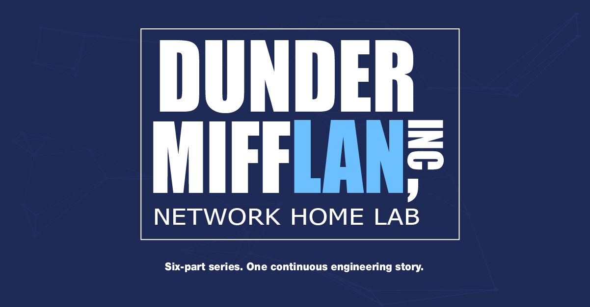

# 🎬 About Dunder MiffLAN

## ✏️ Why this name?

**Dunder MiffLAN** is a fictional company inspired by *The Office* (*Dunder Mifflin*), reframed through the lens of network infrastructure.

The tweak is tiny but deliberate:

**Dunder Mifflin → Dunder Miff*LAN***

The company stays the same office environment; the *LAN* suffix simply turns the camera toward the infrastructure that keeps it running. 

The goal is not to recreate the show's actual network. It's to build a **neutral fictional company**: familiar enough to feel like a real workplace, generic enough to map onto almost any organization.

## 👔 A company anyone recognizes

*The Office* works less through its characters than through its **setting**: a company you grasp instantly, with no niche business domain to learn. Sales, accounting, HR, IT are roles that exist almost everywhere.

For a network or IT professional, the frame reads at a glance: staff, departments, shared services, phones, Wi-Fi, servers, and the network tying it all together. 

That readability makes it a clean abstraction for a lab, where every technical building block carries a business meaning:

- 🧩 departments become **network segments**;
- 💻 users become **endpoints**;
- 🗄️ shared services become **servers**;
- 🔐 business needs become **connectivity and security requirements**.

The point is not to model a real company, but to create a context where technical decisions have a **meaning you can actually explain**.

## ✨ The contrast: an ordinary office on a not-so-ordinary network

Where *Dunder Mifflin* is just an office, *Dunder MiffLAN* exposes the infrastructure that could sit beneath it. What starts as a corporate LAN gradually brings in:

- 🏗️ [P1](./P1) VLANs, 802.1Q, STP, inter-VLAN routing;
- 🧭 [P2](./P2) HSRP, OSPF, DHCP and relay;
- 🛡️ [P3](./P3) ASA firewalling, DMZ, NAT/PAT, ACLs;
- 🖥️ [P4](./P4) datacenter switching, server tiers;
- 📞 [P5](./P5) VoIP;
- 📶 [P6](./P6) corporate and guest Wi-Fi.

The contrast is the whole idea: **a plain-looking office can rest on a surprisingly sophisticated network.** 

That is where the name lands, Dunder MiffLAN is the fictional company seen from the network engineer's seat.

## 🎨 An honest limit: still a skin, for now

At this stage the Dunder MiffLAN identity is deliberately a **light narrative layer**. 

The architecture stays the main subject, and that restraint is a choice, in the same spirit as the rest of the repo: name the limits instead of hiding them.

A future pass could push the business model further, letting the technical design reflect the fictional org more openly:

- 🏷️ Business-oriented VLAN names (`SALES`, `ACCOUNTING`, `HR`, `IT`) instead of generic ones;
- 🖥️ Meaningful hostnames in place of `PC1`, `PC2`;
- 🔐 ACL and firewall policies that spell out real business rules;
- 🔗 Inter-department connectivity scenarios driven by need;
- 🧪 Incidents that start from a **business impact** and trace back to a technical root cause.

The direction worth exploring is not more references to the show, but turning the fictional company from a visual theme into a real **business-to-technical traceability layer**: making every decision feel as if it were made **for an organization with actual users, departments and needs.**

---

📎 Back to [README](./README.md) · 📘 See the [TECHNICAL_OVERVIEW](./TECHNICAL_OVERVIEW.md)
