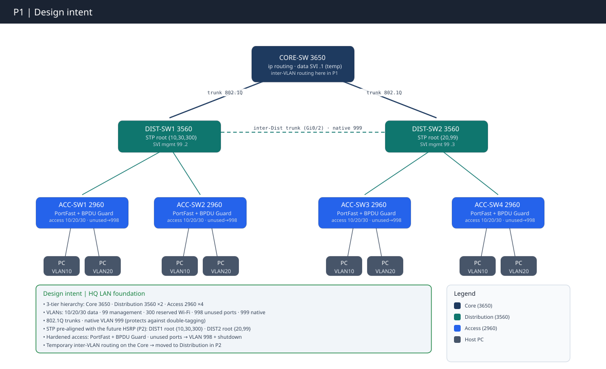

# Partie 1 : Fondations LAN du siège

**Concepts clés** : Modèle hiérarchique Cisco 3 niveaux · VLANs · 802.1Q · STP · routage inter-VLAN · SVI · **Certification :** CompTIA Network+  · **Outil** : Cisco Packet Tracer 9.0

- Plan d'adressage complet → [`IPAM.md`](../IPAM.md)
- Progression étape par étape →[`WORKFLOW P1`](./WORKFLOW.md).

---
## Objectif

Construire la fondation du LAN d'entreprise sur le modèle hiérarchique Cisco à trois niveaux : 

- Segmentation VLAN
- Plan de management dédié,
- Stabilisation STP
- Routage inter-VLAN *temporaire* sur le Core.

Tout ce qui suit — HSRP, OSPF, DMZ, datacenter, voix, Wi-Fi — dépend de la propreté de cette base.

**Contrainte structurante :**  

- Le root STP est positionné dès cette partie sur la **Distribution**, aligné sur le plan HSRP de P2 (DIST-SW1 root `{10,30}`, DIST-SW2 root `{20,99}`). 
- Root L2 et passerelle L3 finiront ainsi sur le même switch par VLAN à partir de P2 : le principe *« le service suit l'Active »*, posé ici pour être hérité par toute la suite.

**Pourquoi une base temporaire sur le core ?** 

Une passerelle `.1` redondante sur deux switches de Distribution est **impossible sans FHRP** (même IP sur deux boîtiers = conflit). Livrer d'abord une base mono-boîtier qui fonctionne, puis la durcir avec HSRP + `/30` routé + OSPF en P2, de manière délibéré.

---
## Topologie logique

---

## Couverture CompTIA Network+

| Domaine                | Concept                                | Statut                                                                                                                            |
| ---------------------- | -------------------------------------- | --------------------------------------------------------------------------------------------------------------------------------- |
| 🗺️ Topologie          | Hiérarchique 3 niveaux                 | ✅ (simplifié — SVI sur le Core)                                                                                                   |
| 🗺️ Topologie          | Star / hub-and-spoke ; collapsed core  | ✅ Access → Distribution ; comparé                                                                                                 |
| 🔌 Commutation         | Base de données VLAN (création locale) | ✅ sur chaque switch                                                                                                               |
| 🔌 Commutation         | Tag 802.1Q                             | ✅ tous les liens inter-switch                                                                                                     |
| 🔌 Commutation         | Durcissement du VLAN natif             | ✅ VLAN 999 des deux côtés                                                                                                         |
| 🔌 Commutation         | Spanning Tree                          | ✅ **Rapid PVST+ sur les 7 switches** · root primary/secondary par VLAN, pré-aligné sur HSRP                                       |
| 🔌 Commutation         | Voice VLAN                             | ⚠️ Démonstratif (poste en P5)                                                                                                     |
| 🔌 Commutation         | SVI (data + management)                | ✅ Core + management                                                                                                               |
| 🔌 Commutation         | Speed / duplex                         | ⚠️ Gigabit core/inter-Dist ; uplinks access 100M (le 3560 n'a que 2 ports Gig)                                                    |
| 🧭 Routage             | Routage inter-VLAN                     | ✅ via SVI du Core (temporaire)                                                                                                    |
| 🏷️ Adressage IP       | IPv4 classe C, subnetting              | ✅ 4× `/24`                                                                                                                        |
| 🏷️ Adressage IP       | Adressage hôte statique                | ✅ 8 PC, IP + passerelle par VLAN                                                                                                  |
| 🛡️ Sécurité           | Isolation de ports                     | ✅ VLAN 998 + shutdown                                                                                                             |
| 🛡️ Sécurité           | Durcissement de bordure                | ✅ PortFast + BPDU Guard sur les ports utilisateur uniquement ; trunks `nonegotiate`                                               |
| 🔁 Haute disponibilité | Dual-homing L2                         | ✅ **mécanisme de failover prouvé** · rapid-pvst confirmé (reconvergence sous-seconde attendue ; ping de timing direct à capturer) |

---

## Test & validation ✅

Cette section recense ce qui a été testé et validé : 

- Chaque ✅ cite un `[P-##]` de l**[Annexe — Captures de preuve du WORKFLOW P1](./WORKFLOW.md#annexe--captures-de-preuve)**. 
- Chaque flux (data-plane, management, failover) est prouvé par un **résultat, un appel ou un état,** pas par un timeout.

| **🗺️ Topologie**                 | Résultat / état                 | Preuve                                                                                           |
| --------------------------------- | ------------------------------- | ------------------------------------------------------------------------------------------------ |
| Topologie as-built + uplinks Core | liens Core en `connected trunk` | [P-00](https://claude.ai/chat/WORKFLOW.md#p-00), [P-01](https://claude.ai/chat/WORKFLOW.md#p-01) |

| 🔌 Commutation / VLAN**     | Résultat / état                                       | Preuve                                          |
| --------------------------- | ----------------------------------------------------- | ----------------------------------------------- |
| VLANs sur tous les switches | présents (création locale, base VLAN)                 | [P-02](https://claude.ai/chat/WORKFLOW.md#p-02) |
| Trunks 802.1Q               | natif 999, listes _allowed_ complètes                 | [P-03](https://claude.ai/chat/WORKFLOW.md#p-03) |
| Ports d'accès bordure       | `Fa0/3`=V10, `Fa0/4`=V20, inutilisés 998 / `disabled` | [P-04](https://claude.ai/chat/WORKFLOW.md#p-04) |

| **🌳 Spanning-tree** | Résultat / état                      | Preuve                                                                                           |
| -------------------- | ------------------------------------ | ------------------------------------------------------------------------------------------------ |
| Placement des roots  | DIST1 `{10,30,999}`, DIST2 `{20,99}` | [P-08](https://claude.ai/chat/WORKFLOW.md#p-08), [P-09](https://claude.ai/chat/WORKFLOW.md#p-09) |
| Mode STP             | Rapid PVST+ sur les 7 switches       | [P-10](https://claude.ai/chat/WORKFLOW.md#p-10)                                                  |

| **📦 Connectivité (data + management)** | Résultat / état                                                                   | Preuve                                                                                           |
| --------------------------------------- | --------------------------------------------------------------------------------- | ------------------------------------------------------------------------------------------------ |
| Ping data-plane                         | inter-VLAN PC1(V10) → `192.168.20.10` + intra-VLAN cross-switch → `192.168.10.12` | [P-05](https://claude.ai/chat/WORKFLOW.md#p-05)                                                  |
| Joignabilité management                 | ping → `192.168.99.1` ; SVI 99 de DIST-SW2 up/up sur `.99.12`                     | [P-06](https://claude.ai/chat/WORKFLOW.md#p-06), [P-07](https://claude.ai/chat/WORKFLOW.md#p-07) |

| **🔁 Haute disponibilité** | Résultat / état                                                       | Preuve                                                                                          |
| -------------------------- | --------------------------------------------------------------------- | ----------------------------------------------------------------------------------------------- |
| Failover STP (mécanisme)   | `Fa0/1` (`Root FWD`) coupé → `Fa0/2` (`Altn BLK`) promu, ping rétabli | [P-11](https://claude.ai/chat/WORKFLOW.md#p-11)→[P-14](https://claude.ai/chat/WORKFLOW.md#p-14) |

### ⚠️ Configuré / limité par PT

|Point|Limite|Réf.|
|---|---|---|
|Joignabilité management de **chaque** ACC|seuls PC → `.99.1` et DIST-SW2 montrés individuellement|—|
|**Timing de failover sous-seconde**|rapid-pvst prouvé donc _attendu_, mais le ping de mesure directe reste à tirer|[P-10](https://claude.ai/chat/WORKFLOW.md#p-10)|

> NB : Le timeout sur le tout premier paquet d'un ping inter-VLAN (25 % de perte, puis 0 %) est de la résolution ARP + convergence STP

---

## Conclusion

Une base propre n'est pas une étape « facile » qu'on expédie : c'est la dette de toutes les parties suivantes. Ici, on pose les fondations avant les murs porteurs : la base L2 doit être stable avant d'empiler la redondance.

Deux incidents attrapés dès ce niveau malgré une première build - comme quoi on apprend toujours : mismatch de VLAN natif, BPDU Guard sur un uplink, qui auraient contaminé HSRP, OSPF puis la voix s'ils étaient passés. 

L'apprentissage central reste le principe de séquençage : positionner le root STP _avant_ que la redondance existe, aligné sur le futur Active HSRP, parce qu'une passerelle `.1` redondée sur deux switches est **impossible sans FHRP**. 

---

⬆️ **Suivant : [Partie 2 — Routage, redondance & services](../P2/README.md)** — migration des SVIs sur la Distribution, HSRP, OSPF point-à-point, DHCP centralisé + relais. · [Vue d'ensemble du projet](../README.md)
