# Partie 1 : Workflow

**Concepts clés** : Modèle hiérarchique Cisco 3 niveaux · VLANs · 802.1Q · STP · routage inter-VLAN · SVI · **Certification :** CompTIA Network+  · **Outil** : Cisco Packet Tracer 9.0

Composants déployés et configurés : 

 - VLANs `10` RH · `20` IT · `30` VOIP · `99` MGMT · `998` quarantaine · `999` natif trou noir  
 - Passerelles `.1` **temporaires sur SVI du Core**
 - Mgmt VLAN 99 (`.99.11/.12` DIST, `.13–.16` ACC) 
 - Uplinks access `Fa0/1–2`
 - Root STP sur la Distribution.

## Sommaire

**1. Cadrage**

- [Topologie As-Built](#Topologie-As-Built)
- [Niveaux & équipements](#niveaux--équipements)

**2. Étapes de configuration**

- [Étape 1 : Déploiement physique](#étape-1--déploiement-physique)
- [Étape 2 : VLANs de base](#étape-2--vlans-de-base)
- [Étape 3 : Trunks 802.1Q](#étape-3--trunks-8021q)
- [Étape 4 : Ports d'accès + durcissement](#étape-4--ports-daccès--durcissement-de-bordure)
- [Étape 4b : Config IP des PC](#étape-4b--config-ip-des-pc-gui)
- [Étape 5 : SVIs + routage inter-VLAN](#étape-5--svis--routage-inter-vlan-core)
- [Étape 6 : VLAN de management 99](#étape-6--vlan-de-management-99)
- [Étape 7 : STP : Rapid PVST+](#étape-7--stp--rapid-pvst-root-sur-la-distribution)

**3. Preuves & clôtures**

- [Validation de bout en bout](#validation-de-bout-en-bout-gate-final)
- [Dépannage (incidents de session)](#dépannage-incidents-de-session)
- [Registre d'erreurs & dette technique](#registre-derreurs--dette-technique-état-final)
- [Annexe : Captures de preuve](#annexe--captures-de-preuve)

→ Plan d'adressage complet → [`IPAM.md`](../IPAM.md)

# 1. Cadrage

## **<a id="Topologie-As-Built"></a>Topologie As-Built**

Schéma PT : base L2, 3 niveaux, accès dual-homed, adressage statique

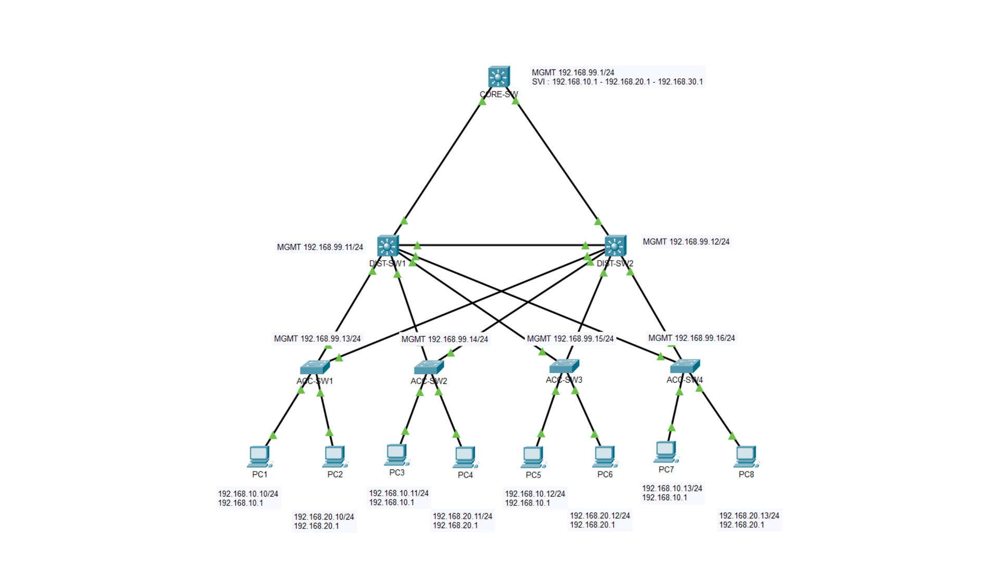

## <a id="niveaux--équipements"></a>Niveaux & équipements

| Niveau       | Équipement                | Rôle dans la partie                                              |
| ------------ | ------------------------- | ---------------------------------------------------------------- |
| Core         | Catalyst **3650** (L3)    | Transport + routage inter-VLAN temporaire (passerelles SVI `.1`) |
| Distribution | 2× Catalyst **3560**      | Agrégation L2, dual-homing, root STP par VLAN, management        |
| Access       | 4× Catalyst **2960** (L2) | Connectivité de 8 PC, uplinks dual-homed sur `Fa0/1–2`           |
| Postes       | 8× PC                     | IP statique + passerelle par VLAN (transitoire : DHCP en P2      |

# 2. Étapes de configuration

L'ordre n'est pas arbitraire : chaque étape dépend de la précédente. Créer un trunk avant que les VLANs existent localement, ou un SVI avant `ip routing`, produit des échecs silencieux diagnostiqués trop tard.

### <a id="étape-1--déploiement-physique"></a>Étape 1 : Déploiement physique

**Intention :** construire la topologie et le câblage dans Packet Tracer. Pas de CLI.

```
Core Gig1/0/1     <-> Gig0/1   DIST-SW1     (trunk, Gigabit)
Core Gig1/0/2     <-> Gig0/1   DIST-SW2     (trunk, Gigabit)
DIST-SW1 Gig0/2   <-> Gig0/2   DIST-SW2     (inter-Distribution — critique pour HSRP en P2)
ACC-SW(x) Fa0/1   <-> Fa0/1-4  DIST-SW1     (uplink primaire, 100M)
ACC-SW(x) Fa0/2   <-> Fa0/1-4  DIST-SW2     (uplink redondant, 100M)
ACC-SW(x) Fa0/3   <-> PC (impair)           (VLAN 10 — RH)
ACC-SW(x) Fa0/4   <-> PC (pair)             (VLAN 20 — IT)
ACC-SW(x) Gig0/1-2 : inutilisés -> VLAN 998 + shutdown
```

> Les uplinks d'accès sont sur **ACC `Fa0/1` / `Fa0/2`** ; les ports Gig du 2960 sont laissés inutilisés (→ 998). La CLI de trunk d'accès (étape 3) reflète les ports réellement câblés.

**Validation :** identifier les ports physiquement up *avant* de configurer.

```cisco
show interfaces status
```

**Attendu :** ports câblés (`Gig` uplinks Core/DIST, `Fa0/1-4` DIST, `Fa0/1-4` ACC) en `connected` ; le reste `notconnect`. 

À l'écran, chaque lien passe **ambre** (STP listening/learning) puis **vert** ; un uplink par ACC et un bout de l'inter-Distribution restent ambre = ports bloqués par STP (standby), attendu.

> 📷 **[P-01](#p-01)** CORE `show interfaces status` (Gi1/0/1-2 trunk).


### <a id="étape-2--vlans-de-base"></a>Étape 2 — VLANs de base

**Intention :** déclarer tous les VLANs sur chaque switch. Un VLAN autorisé sur un trunk mais absent de la base locale ne transporte **rien**.

```cisco
enable
configure terminal

vlan 10
 name RH
vlan 20
 name IT
vlan 30
 name VOIP
vlan 99
 name MGMT
vlan 998
 name QUARANTINE
vlan 999
 name NATIVE_BLACKHOLE

end
write memory
```

**Validation :**

```cisco
show vlan brief
```

**Attendu :** VLANs 10, 20, 30, 99, 998, 999 tous `active`, sur chaque switch.

> 📷 **[P-02](#p-02)** `show vlan brief` — CORE canonique (jumeaux par switch pour les 7).

### <a id="étape-3--trunks-8021q"></a>Étape 3 — Trunks 802.1Q

**Intention :** activer les liens inter-switch avec le VLAN natif trou noir et le VLAN 1 exclu. Sur PT 9.0, la liste `allowed vlan` se retape en entier (pas de `add`).

> ⚠️ **Limite PT / matériel :** `switchport trunk encapsulation dot1q` n'est valide **que** sur le 3560 (Distribution). Il est rejeté sur le 3650 et le 2960, qui gèrent le 802.1Q nativement.

**Core (3650) — les deux uplinks :**

```cisco
enable
configure terminal

interface range gigabitEthernet 1/0/1 - 2
 switchport mode trunk
 switchport trunk native vlan 999
 switchport trunk allowed vlan 10,20,30,99,999
 switchport nonegotiate

end
write memory
```

**Distribution (3560) — identique sur DIST-SW1 et DIST-SW2 :** 

```cisco
enable
configure terminal

! Uplink vers le Core
interface gigabitEthernet 0/1
 switchport trunk encapsulation dot1q
 switchport mode trunk
 switchport trunk native vlan 999
 switchport trunk allowed vlan 10,20,30,99,999
 switchport nonegotiate

! Lien inter-Distribution (Gigabit)
interface gigabitEthernet 0/2
 switchport trunk encapsulation dot1q
 switchport mode trunk
 switchport trunk native vlan 999
 switchport trunk allowed vlan 10,20,30,99,999
 switchport nonegotiate

! Downlinks vers les switches d'accès
interface range fastEthernet 0/1 - 4
 switchport trunk encapsulation dot1q
 switchport mode trunk
 switchport trunk native vlan 999
 switchport trunk allowed vlan 10,20,30,99,999
 switchport nonegotiate

end
write memory
```

> ⚠️ Sauter le bloc `Fa0/1-4` sur la Distribution laisse ces downlinks en **access VLAN 1** : ils jettent tout VLAN taggé et CDP lève un `%CDP-4-NATIVE_VLAN_MISMATCH` face à l'Access (natif 999). C'est exactement l'**incident #1** (§ Dépannage).

**Access (2960) — les deux uplinks :**

```cisco
enable
configure terminal

interface range fastEthernet 0/1 - 2
 switchport mode trunk
 switchport trunk native vlan 999
 switchport trunk allowed vlan 10,20,30,99,999
 switchport nonegotiate

end
write memory
```

**Validation :**

```cisco
show interfaces trunk
```

**Attendu :** Native vlan = 999 sur chaque trunk ; listes allowed complètes et identiques ; DIST `Fa0/1-4` présents en trunk.

> 📷 **[P-03](#p-03)** `show interfaces trunk` — DIST-SW1 + DIST-SW2, `Fa0/1-4` en trunk, natif 999.

### <a id="étape-4--ports-daccès--durcissement-de-bordure"></a>Étape 4 — Ports d'accès + durcissement de bordure

**Intention :** affecter les ports PC à leur VLAN, activer le Voice VLAN démonstratif, isoler les ports inutilisés, durcir les ports vers postes.

> ⚠️ PortFast + BPDU Guard sur les ports vers hôtes UNIQUEMENT (`Fa0/3`, `Fa0/4`), jamais sur les uplinks `Fa0/1-2`.
> 
> BPDU Guard err-disable un port dès qu'il reçoit une BPDU ; un uplink en échange en continu, donc le garder tue le lien à sa première BPDU normale (**incident #2**). 
> 
> La protection de boucle sur les uplinks redondants est le travail de STP (`Altn BLK`), pas de BPDU Guard.

```cisco
enable
configure terminal

! Port vers PC — VLAN 10 (RH)
interface fastEthernet 0/3
 switchport mode access
 switchport access vlan 10
 spanning-tree portfast
 spanning-tree bpduguard enable

! Port vers PC — VLAN 20 (IT) + Voice VLAN démonstratif
interface fastEthernet 0/4
 switchport mode access
 switchport access vlan 20
 switchport voice vlan 30
 spanning-tree portfast
 spanning-tree bpduguard enable

! Ports inutilisés -> quarantaine + shutdown (y compris les Gig uplink inutilisés)
interface range fastEthernet 0/5 - 24
 switchport mode access
 switchport access vlan 998
 shutdown
interface range gigabitEthernet 0/1 - 2
 switchport mode access
 switchport access vlan 998
 shutdown

end
write memory
```

**Validation :**

```cisco
show vlan brief
show spanning-tree interface fastEthernet 0/3 portfast   ! -> enabled
```

> 📷 **[P-04](#p-04)** ACC `show interfaces status` — `Fa0/3`=10, `Fa0/4`=20, inutilisés disabled/998.

### <a id="étape-4b--config-ip-des-pc-gui"></a>Étape 4b — Config IP des PC (GUI)

**Intention :** donner à chaque PC une IP statique, un masque `/24` et une passerelle par défaut cohérents avec son VLAN. 

Valeurs de build **transitoires** (remplacées par DHCP en P2) — plan de référence dans [`IPAM.md`](../IPAM.md).

Règle d'allocation P1 : PC **impairs** (1/3/5/7) → **VLAN 10**, IP `192.168.10.10–.13` ; PC **pairs** (2/4/6/8) → **VLAN 20**, IP `192.168.20.10–.13` ; masque `255.255.255.0` ; passerelle = `.1` du VLAN (SVI Core, transitoire).

**Validation** — depuis un PC → Desktop → Command Prompt :

```cisco
ipconfig
```

### <a id="étape-5--svis--routage-inter-vlan-core"></a>Étape 5 — SVIs + routage inter-VLAN (Core)

**Intention :** activer les passerelles inter-VLAN temporaires sur le Core.

> ⚠️ Dépendance : `ip routing` **doit** précéder les blocs `interface vlan`. Sans lui, le 3650 reste L2 et les SVIs ne routent jamais.
> 
> ⚠️ **Dette de conception :** ces adresses `.1` sont provisoires, elles migrent sur la Distribution en VIP HSRP en P2. **Ne jamais recréer un SVI `.1` sur le Core après P2** (conflit de VIP).

```cisco
enable
configure terminal

ip routing

interface vlan 10
 ip address 192.168.10.1 255.255.255.0
 no shutdown

interface vlan 20
 ip address 192.168.20.1 255.255.255.0
 no shutdown

interface vlan 30
 ip address 192.168.30.1 255.255.255.0
 no shutdown

interface vlan 99
 ip address 192.168.99.1 255.255.255.0
 no shutdown

end
write memory
```

**Validation :**

```cisco
show ip interface brief
show ip route            ! 4 routes connectées 'C' : 10/20/30/99
```

> 📷 **[P-05](#p-05)** PC1 ping inter-VLAN `.20.10` + intra-VLAN cross-switch `.10.12`.


### <a id="étape-6--vlan-de-management-99"></a>Étape 6 — VLAN de management 99

**Intention :** rendre chaque switch joignable pour l'administration depuis n'importe quel VLAN.

> ⚠️ En P1, les 3560 sont capables de L3 mais utilisés en **L2 pur** (le routage inter-VLAN vit uniquement sur le Core). 
> 
> Un switch L2 pur ne consulte pas de table de routage : il a besoin d'`ip default-gateway` pour que son propre trafic de management sorte du VLAN 99, comme les 2960. 
> 
> Note : `ip default-gateway` est ignoré si `ip routing` est actif, donc ne **pas** activer `ip routing` sur la Distribution en P1.

**Distribution (3560 utilisés en L2) :**

```cisco
! DIST-SW1

enable
configure terminal

interface vlan 99
 ip address 192.168.99.11 255.255.255.0
 no shutdown
ip default-gateway 192.168.99.1

end
write memory
```

```cisco
! DIST-SW2

enable
configure terminal
interface vlan 99
 ip address 192.168.99.12 255.255.255.0
 no shutdown
ip default-gateway 192.168.99.1
end
write memory
```

**Access (2960 — L2), adapter `.13/.14/.15/.16` par switch :**

```cisco
! ACC-SW1  (.14 / .15 / .16 pour SW2 / SW3 / SW4)

enable
configure terminal

interface vlan 99
 ip address 192.168.99.13 255.255.255.0
 no shutdown
ip default-gateway 192.168.99.1

end
write memory
```

**Validation — deux niveaux :**

```cisco
! Depuis le Core — les SVIs répondent dans le VLAN 99

ping 192.168.99.11
ping 192.168.99.12
ping 192.168.99.13
ping 192.168.99.14
ping 192.168.99.15
ping 192.168.99.16
```

Puis depuis un PC du VLAN 10 : `ping 192.168.99.1` — la passerelle de management doit répondre.

> 📷 **[P-06](#p-06)** DIST-SW2 `show ip interface brief` (Vlan99 `192.168.99.12` up/up) · **[P-07](#p-07)** PC1 ping `192.168.99.1`.

### <a id="étape-7--stp--rapid-pvst-root-sur-la-distribution"></a>Étape 7 — STP : Rapid PVST+, root sur la Distribution

**Intention :** faire tourner **Rapid PVST+** (RSTP par VLAN) sur tout le domaine L2, puis poser le Root Bridge sur la Distribution, aligné sur le split Active de P2.

> ⚠️ **Régler le mode sur CHAQUE switch, pas seulement les roots.** 
> 
> Rapid PVST+ négocie son handshake rapide (proposal/agreement) par lien ; un seul switch laissé en `pvst` classique sur ce lien fait retomber tout le segment sur les timers lents 802.1D. 

**Tous les switches : activer Rapid PVST+ (Core, DIST-SW1, DIST-SW2, chaque ACC-SW) :**

```cisco
enable
configure terminal

spanning-tree mode rapid-pvst

end
write memory
```

> ⚠️ **Le Core n'est PAS root, intentionnellement.** 
> 
> Ne pas lancer `root primary` sur le Core. Poser `root primary/secondary` sur la Distribution force des priorités (24576 / 28672) qui battent le 32768 par défaut du Core.

**DIST-SW1 : primary `{10,30,999}`, secondary `{20,99}` :**

```cisco
enable
configure terminal

spanning-tree vlan 10,30,999 root primary
spanning-tree vlan 20,99 root secondary

end
write memory
```

**DIST-SW2 : primary `{20,99}`, secondary `{10,30,999}` :**

```cisco
enable
configure terminal

spanning-tree vlan 20,99 root primary
spanning-tree vlan 10,30,999 root secondary

end
write memory
```

> ⚠️ **Portée du root.** Fixé de façon déterministe sur la Distribution pour 10, 20, 30, 99 **et 999**. 
> 
> Le VLAN 999 ne porte aucun hôte (natif trou noir), mais son root est épinglé sur DIST-SW1 par hygiène. Aucun switch d'accès ne doit être root de quoi que ce soit. 
> 
> **998** n'est pas dans la liste allowed des trunks : aucune BPDU 998 ne traverse les liens, chaque switch est root isolé de sa propre instance 998 locale.

**Validation :**

```cisco
show spanning-tree vlan 10     ! Root = DIST-SW1
show spanning-tree vlan 30     ! Root = DIST-SW1
show spanning-tree vlan 99     ! Root = DIST-SW2
show spanning-tree summary | include mode   ! rapid-pvst mode sur chaque boîtier
```

**Attendu :** root conforme au split ; `Switch is in rapid-pvst mode` sur les 7. Les ports edge PortFast (`Fa0/3–4`) montent immédiatement ; l'uplink redondant reste `Altn BLK` mais transitionne via proposal/agreement au lieu du cycle listen/learn de 30 s.

> 📷 **[P-08](#p-08)** DIST-SW1 root `{10,30,999}` (rapid-pvst) · **[P-09](#p-09)** DIST-SW2 root `{20,99}` (rapid-pvst) · **[P-10](#p-10)** les 7 switches en `rapid-pvst mode`.

# 3. Preuves et clôtures

## <a id="validation-de-bout-en-bout-gate-final"></a>Validation de bout en bout 

| Domaine         | Vérification     | Commande clé                                               | Attendu                                                                             | Preuve                       |
| --------------- | ---------------- | ---------------------------------------------------------- | ----------------------------------------------------------------------------------- | ---------------------------- |
| 🗺️ Topologie   | Uplinks Core     | `show interfaces status`                                   | Gi1/0/1-2 `connected trunk`                                                         | [P-01](#p-01)                |
| 🔌 Commutation  | VLANs            | `show vlan brief`                                          | 10/20/30/99/998/999 actifs sur les 7 switches                                       | [P-02](#p-02)                |
| 🔌 Commutation  | Trunks           | `show interfaces trunk`                                    | DIST `Fa0/1-4` + Gig en trunk, natif 999, liste allowed complète                    | [P-03](#p-03)                |
| 🔌 Commutation  | Bordure access   | `show interfaces status`                                   | `Fa0/3`=10, `Fa0/4`=20, inutilisés disabled/998                                     | [P-04](#p-04)                |
| 🌳 STP          | Root STP         | `show spanning-tree summary`                               | DIST1 root `{10,30,999}`, DIST2 root `{20,99}`                                      | [P-08](#p-08), [P-09](#p-09) |
| 🌳 STP          | Mode STP         | `show spanning-tree summary`                               | `rapid-pvst mode` sur les 7                                                         | [P-10](#p-10)                |
| 📦 Connectivité | Inter/intra-VLAN | PC1 `ping .20.10` + `.10.12`                               | réponse (1er paquet ARP toléré)                                                     | [P-05](#p-05)                |
| 📦 Connectivité | Management       | DIST-SW2 `show ip int brief` + PC `ping .99.1`             | Vlan99 `.99.12` up/up ; passerelle répond                                           | [P-06](#p-06), [P-07](#p-07) |
| 🔁 Haute dispo  | **Failover**     | couper l'uplink `Root FWD` d'un ACC, re-ping la passerelle | uplink bloqué (`Altn BLK`→`Root FWD`) promu, trafic repris ; `no shutdown` restaure | [P-11](#p-11)→[P-14](#p-14)  |

> ℹ️ Un unique `Request timed out` sur le **premier** paquet d'un nouveau flux (puis 0 %) est de la résolution ARP + convergence STP — pas une faute. Une perte persistante sur un flux établi est un vrai symptôme.
>
> ⚠️ **Timing du failover :** rapid-pvst confirmé ([P-10](#p-10)) → reconvergence sous-seconde attendue ; le ping de **mesure directe** sous rapid-pvst reste à capturer.

## <a id="dépannage-incidents-de-session"></a>Dépannage (incidents de session)

> Historique de build - incidents rencontrés et comment chacun a été attrapé. Ce ne sont **pas** des dettes : chacun a été corrigé dans la même session..

| # | Symptôme | Cause | Diagnostic | Correctif |
|---|---|---|---|---|
| 1 | Downlink DIST `connected 1` (pas `trunk`) ; `%CDP-4-NATIVE_VLAN_MISMATCH` face à l'Access | `Fa0/1-4` de la Distribution laissés en access VLAN 1 (bloc downlink de l'étape 3 non appliqué) | `show interfaces status` + `show interfaces trunk` | Appliquer la config trunk aux DIST `Fa0/1-4` (natif 999, allowed) · avant : [P-TS1](#p-ts1) · après : [P-03](#p-03) |
| 2 | Port uplink rouge / case GUI "On" qui se décoche | **BPDU Guard placé sur un uplink inter-switch** → err-disable à la 1re BPDU légitime | `show interfaces status err-disabled` (raison `bpduguard`) | `no spanning-tree bpduguard enable` + `no spanning-tree portfast` sur l'uplink ; `shutdown`/`no shutdown` pour récupérer ; guard sur `Fa0/3-4` uniquement |
| 3 | 1er ping inter-VLAN : 1 timeout puis réponses (25 % puis 0 %) | Résolution ARP + convergence STP sur le 1er paquet | Re-ping → 0 % confirme | Aucun — attendu. `clear mac address-table dynamic` seulement si ça persiste |

**Commandes de référence :**

```cisco
show interfaces trunk        show ip route            show mac address-table
show vlan brief              show spanning-tree vlan  show interfaces status
show ip interface brief      show arp                 show running-config
show interfaces status err-disabled                   clear mac address-table dynamic
write memory
```

## <a id="registre-derreurs--dette-technique-état-final"></a>Registre d'erreurs & dette technique

> État final de chaque point (clos / porté / différé). Le dépannage de session est ci-dessus. 
> 
> ⚠️ **Numérotation stable inter-parties.** Ces numéros sont des identifiants cités par d'autres docs

| # | Point | Domaine | Statut |
|---|---|---|---|
| 1 | SVIs sur le Core au lieu de la Distribution | 🟠 Architecture L3 | 🔜 P2 (HSRP) — simplification temporaire délibérée |
| 2 | Un seul Core = SPOF de routage inter-VLAN | 🟠 Haute disponibilité | 🔜 P2 (HSRP sur la Distribution) |
| 3 | Root STP sur la Distribution, réparti selon l'Active HSRP (DIST1 `{10,30}`, DIST2 `{20,99}`) | 🟠 STP | ✅ Fait |
| 4 | Liens Core + inter-Distribution en Gigabit | 🟢 Performance | ✅ Fait |
| 4b | Uplinks d'accès plafonnés à 100M (le 3560 n'a que 2 ports Gig, tous deux utilisés) | 🟢 Performance | 📋 Limite matérielle |
| 5 | Portée du root STP — VLANs trunkés incl. 999 ; 998 isolé par switch | 🟠 Durcissement STP | ✅ (998 par switch ⚠️) |
| 6 | VLAN 1 résiduel sur les ports inutilisés | 🟢 Sécurité | ✅ Fait (998 + shutdown, ports Gig inclus) |
| 7 | PortFast + BPDU Guard sur les ports utilisateur | 🟠 Sécurité bordure | ✅ Fait (ports utilisateur uniquement) |
| 8 | Port Security | 🟠 Sécurité | 🔜 P3 |
| 9 | Voice VLAN sans poste IP | 🟢 Démonstratif | 🔜 P5 |
| 10 | PC adressés statiquement (pas de DHCP) | 🟢 Scalabilité | 🔜 P2 (scopes DHCP + relais) |

## <a id="annexe--captures-de-preuve"></a>Annexe : Captures de preuve

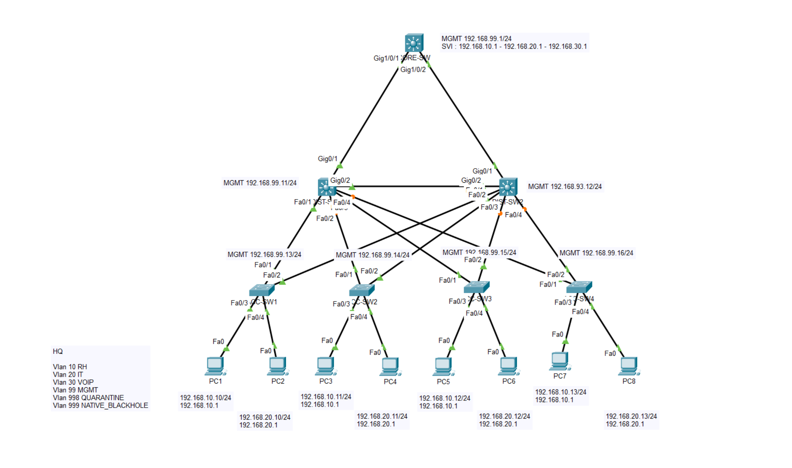

**<a id="p-01"></a> [P-01] · CORE `show interfaces status`** — Gi1/0/1-2 `connected trunk`


**<a id="p-02"></a> [P-02] · Base de données VLAN** — CORE canonique `show vlan brief`

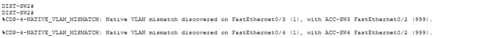

> Jumeaux par switch : DIST-SW1 `Capture_P1_25` · DIST-SW2 `Capture_P1_24` · ACC-SW1 `Capture_P1_23` · ACC-SW2 `Capture_P1_22` · ACC-SW3 `Capture_P1_21` · ACC-SW4 `Capture_P1_20`.

**<a id="p-03"></a> [P-03] · Trunks (clôt l'incident #1)** — DIST-SW1 + DIST-SW2 `show interfaces trunk`, `Fa0/1-4` en trunk, natif 999

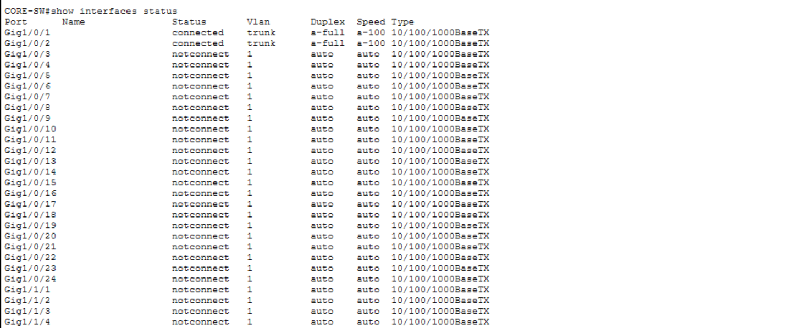

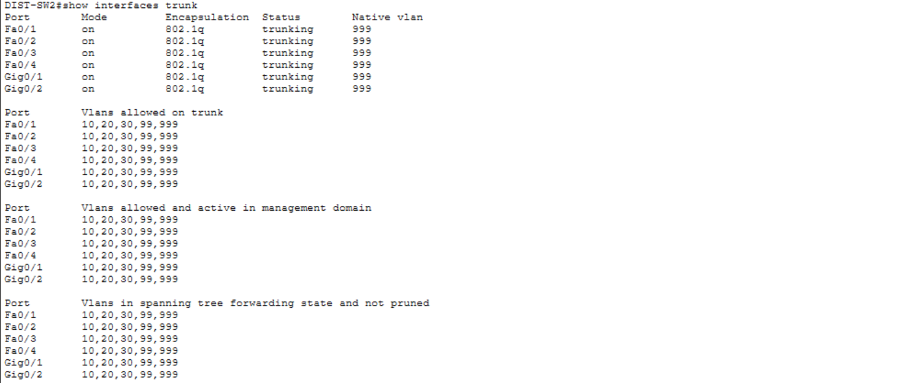

**<a id="p-04"></a> [P-04] · Bordure access + durcissement** — ACC-SW4 `show interfaces status` (`Fa0/3`=10, `Fa0/4`=20, inutilisés disabled/998)

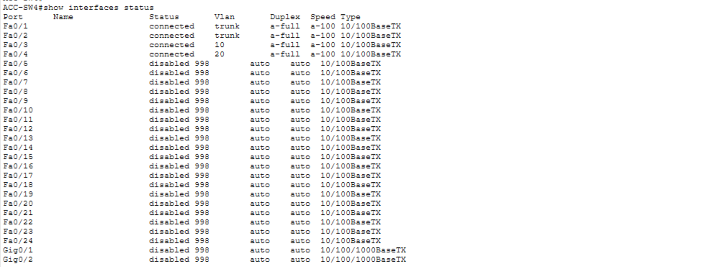

> Jumeaux : ACC-SW3 `Capture_P1_17` · ACC-SW2 `Capture_P1_18` · ACC-SW1 `Capture_P1_19`.

**<a id="p-05"></a> [P-05] · Inter- & intra-VLAN** — PC1 `ping .20.10` (routé) + `.10.12` (cross-switch)

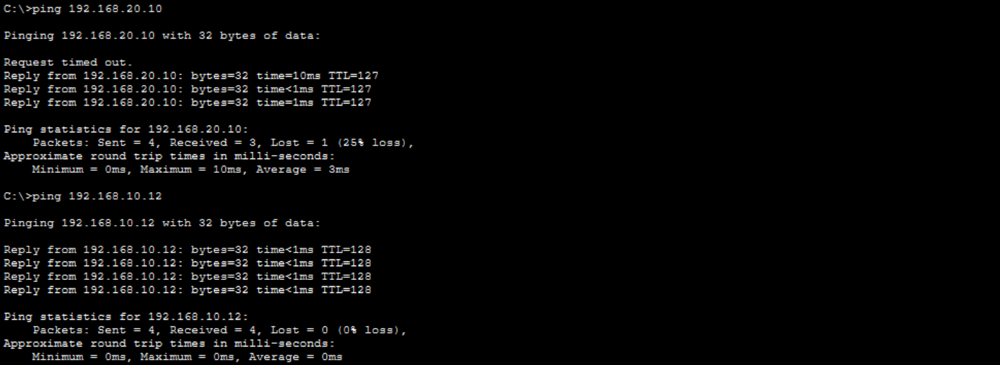

**<a id="p-06"></a> [P-06] · SVI de management** — DIST-SW2 `show ip interface brief`, Vlan99 `192.168.99.12` up/up

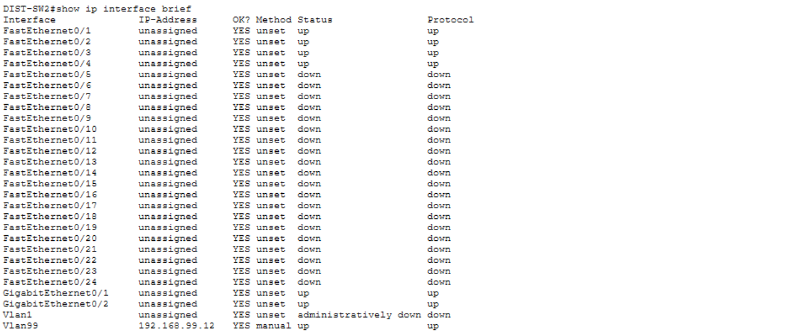

**<a id="p-07"></a> [P-07] · Joignabilité management** — PC1 `ping 192.168.99.1`

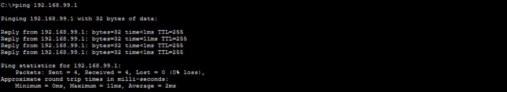

**<a id="p-08"></a> [P-08] · Root STP DIST-SW1 (rapid-pvst)** — `show spanning-tree summary` : `rapid-pvst mode`, Root pour RH (10) + VOIP (30) + NATIVE_BLACKHOLE (999)

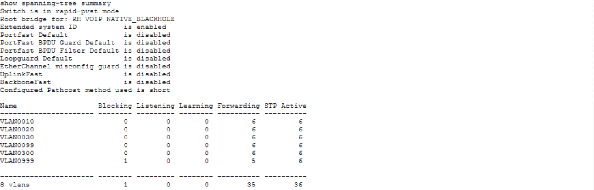

**<a id="p-09"></a> [P-09] · Root STP DIST-SW2 (rapid-pvst)** — `show spanning-tree summary` : `rapid-pvst mode`, Root pour IT (20) + MGMT (99)

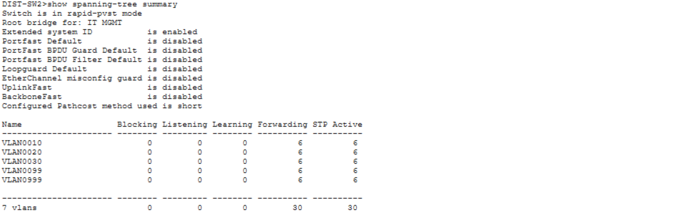

**<a id="p-10"></a> [P-10] · Rapid PVST+ sur chaque switch** — `show spanning-tree summary` = `Switch is in rapid-pvst mode`, CORE canonique


> Preuve tous-switches (7/7) : ACC-SW1 `Capture_P1_29` · ACC-SW2 `Capture_P1_37` · ACC-SW3 `Capture_P1_31` · ACC-SW4 `Capture_P1_32` · DIST-SW1 `Capture_P1_36` (root 10/30/999) · DIST-SW2 `Capture_P1_34` (root 20/99).

**<a id="p-11"></a> [P-11] · Failover — avant** — ACC-SW1 STP v10 : `Fa0/1` `Root FWD`, `Fa0/2` `Altn BLK`

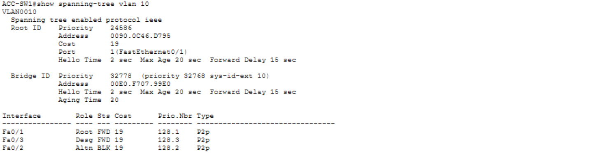

**<a id="p-12"></a> [P-12] · Failover — action** — ACC-SW1 `interface Fa0/1` → `shutdown`

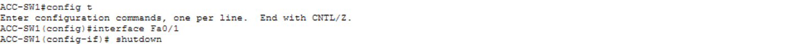

**<a id="p-13"></a> [P-13] · Failover — pendant** — PC1 `ping .10.1` : reprise après perte. ⚠️ Ping de mesure du timing sous rapid-pvst encore à re-tirer.

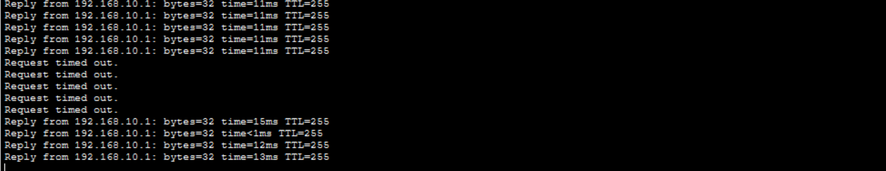

**<a id="p-14"></a> [P-14] · Failover — après** — ACC-SW1 STP v10 : `Fa0/2` promu `Root FWD` (coût 23 via DIST-SW2)

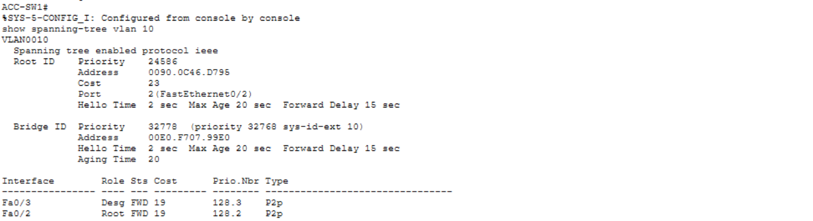

**<a id="p-ts1"></a> [P-TS1] · Incident #1 · Mismatch natif (AVANT correction)** — DIST-SW2 `%CDP-4-NATIVE_VLAN_MISMATCH` `Fa0/3-4
`


> Compagnons périmés (état *avant* correction, dépannage uniquement — jamais en validation) : DIST-SW2 `Capture_P1_14` · DIST-SW1 `Capture_P1_15` (`Fa0/1-4 connected 1`).

---

⬆️ [README de la partie](./README.md) · [Vue d'ensemble du projet](../README.md) — Suivant : [WORKFLOW Partie 2](../P2/WORKFLOW.md) (migration des SVIs sur la Distribution, HSRP, OSPF P2P, DHCP + relais).
