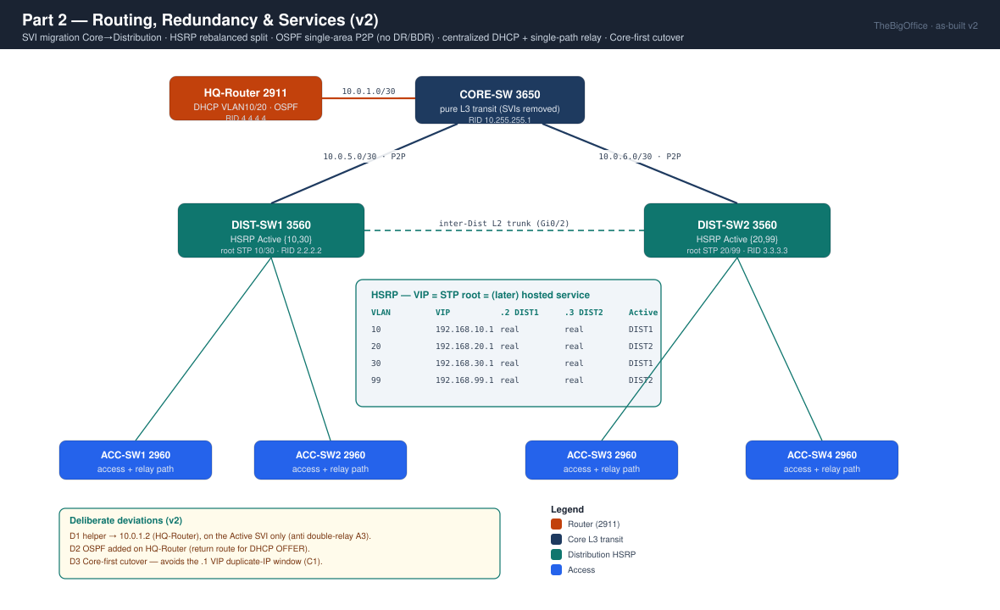

# Part 2: Routing & Redundancy

 **Key concepts**: Routing, HSRP, DHCP, point-to-point OSPF

- 💻 **Tool**: Cisco Packet Tracer 9.0
- 🏷️ Full addressing plan → [IPAM](../IPAM.md)
- 📝 Step-by-step progression → [WORKFLOW P2](./WORKFLOW.md)
- 🎓 **Certification:** CompTIA Network+

## Logical topology

## Objective

Turn P1's static LAN into a routed, redundant, self-addressing network, across four workstreams:

- Migrate the inter-VLAN default gateways from the Core to the Distribution layer as **dual-active HSRP** (VIP `.1`, physical `.2`/`.3`)
- Convert the Core↔Distribution uplinks into **routed `/30` links**, with **OSPF** running point-to-point as the campus IGP
- Centralize host addressing: a **single DHCP authority** on the HQ-Router + an `ip helper-address` relay
- **L2 hardening** of the access ports and **STP PVST+ balancing** aligned with the HSRP roles

This resolves the critical technical debt P1 left open: SVIs on the Core, an inter-VLAN SPOF, gateways without redundancy.

Everything that follows, DMZ, datacenter, voice, Wi-Fi, builds on this routed, redundant foundation.

## Structural constraint

- The HSRP split places the two heavy VLANs on different chassis: DIST-SW1 Active `{10,30}`, DIST-SW2 Active `{20,99}`.
- For each VLAN: **HSRP Active = STP root = hosted service** - *"the service follows the Active."*

## Continuity decision (inherited from P1)

- The STP root was placed on the Distribution layer in P1 along this split
- P2 aligns HSRP onto it, without touching STP again.
- The cutover is ordered **Core first**: route the Core's uplinks and pull its data SVIs *before* raising the Distribution's VIPs, so the `.1` gateway is never claimed by two chassis at once.

## CompTIA Network+ coverage

| Domain                 | Concepts covered                                                                                                        | Status                                                   |
| ---------------------- | ----------------------------------------------------------------------------------------------------------------------- | -------------------------------------------------------- |
| 🧭 OSPF routing        | point-to-point, no DR/BDR · single-area (area 0) · manual Router-ID · selective `passive-interface` · routed ports · ECMP | ✅ all neighbors `FULL`                                  |
| 🔁 High availability   | HSRP (VIP / priority / preempt) · Active/Standby distribution                                                           | ✅ DIST1 `{10,30}` · DIST2 `{20,99}` · failover both ways |
| 🔌 Switching           | **STP root aligned with the HSRP Active**: _the service follows the Active_                                             | ✅ 4 VLANs                                                |
| 🌐 Services            | DHCP (scopes, exclusions, options) · `ip helper-address` relay                                                         | ✅ VLAN 10 & 20 on the HQ-Router                          |
| 🏷️ Addressing         | `/30` transit subnetting                                                                                                | ✅ 3 P2P links, no overlap                                |

## Conclusion

The most transferable lesson isn't "configure HSRP," it's the **cutover order**: route the Core's uplinks and pull its data SVIs _before_ raising the Distribution's VIPs, or you'll watch the `.1` get claimed by two chassis (split-brain).

Second, counter-intuitive takeaway: most connectivity failures are **return-path** problems, not forward-path ones. The DHCP relay doesn't break on the request but on the OFFER that has no way home. You only understand that by debugging it.

The lesson: every component you add for resilience is also one more thing that can fail silently; redundancy is only real once you've verified the failure path, not just the nominal one.

---

⬅️ [Part 1: Three-Tier LAN Foundations](../P1/README.md) · ⬆️ [Project overview](../README.md) · 🔁 [Workflow P2](./WORKFLOW.md) · **Next: [Part 3: DMZ & Firewall](../P3/README.md)**: a 3-zone ASA, NAT/PAT, 3 ACLs, IDS/SPAN, default-route origination + summary/Null0 lock.
