# Partie 2 : Workflow 

 **Concepts clés** : Routage, HSRP, DHCP, OSFP P2P  ·  **Certification :** CompTIA Network+ · **Outil :** Cisco Packet Tracer 9.0

Composants déployés et configurés : 

- Uplinks routés `/30` (`10.0.1–3.0`)
- HSRP réparti : DIST-SW1 Active `{10,30}`, DIST-SW2 Active `{20,99}`
- SVI réels `.2`/`.3`, VIP `.1` 
- OSPF P2P aire 0 (RID `2.2.2.2`/`3.3.3.3`/`4.4.4.4`/`10.255.255.1`)
- DHCP sur HQ-Router `10.0.1.2`
- Core = transit L3 pur.
## Sommaire

**1. Cadrage**

- [Topologie As-Built](#topologie-as-built)
- [Niveaux & équipements](#niveaux--équipements)

**2. Étapes de configuration**

- [Étape 1 : Placement & câblage du HQ-Router](#étape-1--placement--câblage-du-hq-router)
- [Étape 2 : CORE : uplinks routés + retrait des SVIs](#étape-2--core--uplinks-routés--retrait-des-svis)
- [Étape 3 : DISTRIBUTION : ip routing + SVIs + HSRP](#étape-3--distribution--ip-routing--uplink-routé--svis--hsrp)
- [Étape 4 : OSPF point-à-point (aire 0)](#étape-4--ospf-point-à-point-mono-aire-0)
- [Étape 5 : DHCP centralisé](#étape-5--dhcp-centralisé-sur-le-hq-router)
- [Étape 6 : Relais DHCP : chemin unique](#étape-6--relais-dhcp--chemin-unique)

**3. Preuves & clôtures**

- [Validation de bout en bout)](#validation-de-bout-en-bout-gate-final)
- [Dépannage (incidents de session)](#dépannage-incidents-de-session)
- [Registre d'erreurs & dette technique](#registre-derreurs--dette-technique)
- [Annexe : Captures de preuve](#annexe--captures-de-preuve)

→  Plan d'adressage complet → [`IPAM.md`](../IPAM.md).

# 1. Cadrage

## <a id="topologie-as-built"></a>Topologie As-Built

Schéma PT : passage L3/HA - OSPF, HSRP par VLAN, STP root réparti, DHCP

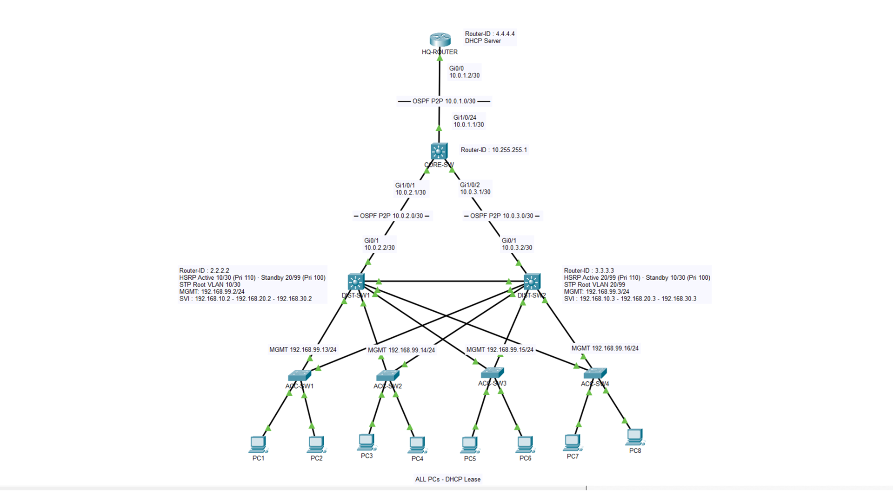

## <a id="niveaux--équipements"></a>Niveaux & équipements

| Rôle | Équipement | Rôle dans la partie |
|---|---|---|
| Edge/Services | **HQ-Router** (ISR 2911) — *nouveau* | Serveur DHCP centralisé ; OSPF aire 0 ; futur edge ASA-inside (P3) |
| Core | Catalyst **3650** (L3) | **Transit L3 pur** — SVIs data retirés, `/30` routés vers DIST + HQ, OSPF |
| Distribution | 2× Catalyst **3560** | **Passerelle L3** — SVIs + VIP HSRP par VLAN, uplink routé `/30`, OSPF, root STP |
| Access | 4× Catalyst **2960** (L2) | Inchangé — L2 dual-homed, VLANs trunkés vers la Distribution |
| Postes | 8× PC | Migrés en **DHCP** (VLAN 10 & 20) ; passerelle = VIP HSRP |

Rien n'est recâblé physiquement **sauf** le nouveau lien HQ-Router (`HQ Gi0/0` ↔ `Core Gi1/0/24`). 

Ce qui change, c'est le **rôle** des liens existants : les uplinks Core↔DIST passent de trunk à routé `/30` ; le lien inter-Distribution (`Gi0/2`) **reste un trunk L2** (les hellos HSRP ont besoin du domaine de broadcast partagé).

# 2. Étapes de configuration

C'est une **migration** depuis un P1 vivant, pas un greenfield. 

Lever les VIP pendant que le Core détient encore `.1` sur un trunk connecté provoque un conflit d'IP dupliquée. 

Router les uplinks du Core d'abord fait tomber ses SVIs data en `down/down` d'eux-mêmes, ce qui laisse la Distribution prendre `.1` proprement.

### <a id="étape-1--placement--câblage-du-hq-router"></a>Étape 1 — Placement & câblage du HQ-Router

**Intention :** introduire le routeur qui porte le DHCP (et, en P3, le lien ASA-inside). Pas de CLI.

**Câble** (straight-through) : **HQ `Gi0/0`** ↔ **Core `Gi1/0/24`**.

> ⚠️ Les interfaces routeur sont par défaut `administratively down`, le lien ne montera pas tant que `no shutdown` n'est pas fait sur HQ `Gi0/0` (**incident #1**).

**Validation** (sur le Core) : `show interfaces status | include 1/0/24` → `notconnect` jusqu'à ce que l'interface routeur soit montée à l'étape 3.

### <a id="étape-2--core--uplinks-routés--retrait-des-svis"></a>Étape 2 — CORE : uplinks routés + retrait des SVIs

**Intention :** transformer le Core en transit L3 pur et lui retirer son rôle de passerelle inter-VLAN. `default interface` efface la config trunk résiduelle de P1 avant que la config L3 n'arrive.

```cisco
enable
configure terminal

default interface GigabitEthernet1/0/1
interface GigabitEthernet1/0/1
 no switchport
 ip address 10.0.2.1 255.255.255.252
 ip ospf network point-to-point
 no shutdown

default interface GigabitEthernet1/0/2
interface GigabitEthernet1/0/2
 no switchport
 ip address 10.0.3.1 255.255.255.252
 ip ospf network point-to-point
 no shutdown

interface GigabitEthernet1/0/24
 no switchport
 ip address 10.0.1.1 255.255.255.252
 ip ospf network point-to-point
 no shutdown

! Retirer les SVIs data + mgmt temporaires (libère .1 pour la VIP)
no interface vlan 10
no interface vlan 20
no interface vlan 30
no interface vlan 99

end
write memory
```

> ⚠️ **Piège de conception #3 : Core d'abord.** Retirer les SVIs data du Core *avant* de lever les VIP évite la fenêtre où le SVI `.1` du Core et la VIP HSRP `.1` de la DIST sont vivants ensemble = conflit d'IP dupliquée / guerre d'ARP gratuit.
> 
> ⚠️ Ne jamais recréer un SVI `.1` sur le Core ensuite. `ip routing` reste activé, c'est un routeur de transit, managé in-band via ses `/30` + OSPF.

**Validation :** `show ip interface brief | include 10.0.` → `Gi1/0/1=10.0.2.1`, `Gi1/0/2=10.0.3.1`, `Gi1/0/24=10.0.1.1`, tous `up/up`. Les SVIs data/mgmt n'apparaissent plus.

> 📷 **[P-01](#p-01)** CORE `show ip interface brief` — uplinks routés up.

### <a id="étape-3--distribution--ip-routing--uplink-routé--svis--hsrp"></a>Étape 3 — DISTRIBUTION : ip routing + uplink routé + SVIs + HSRP

**Intention :** la Distribution devient la passerelle redondante. `ip routing` d'abord, sinon les SVIs ne routent pas. `Gi0/1` (uplink Core) → routé ; **`Gi0/2` (inter-Distribution) reste un trunk L2.**

**DIST-SW1 — Active `{10,30}`, Standby `{20,99}` :**

```cisco
enable
configure terminal

ip routing

default interface GigabitEthernet0/1
interface GigabitEthernet0/1
 no switchport
 ip address 10.0.2.2 255.255.255.252
 ip ospf network point-to-point
 no shutdown

interface vlan 10
 ip address 192.168.10.2 255.255.255.0
 standby 10 ip 192.168.10.1
 standby 10 priority 110
 standby 10 preempt
 no shutdown
 
interface vlan 20
 ip address 192.168.20.2 255.255.255.0
 standby 20 ip 192.168.20.1
 standby 20 priority 100
 no shutdown
 
interface vlan 30
 ip address 192.168.30.2 255.255.255.0
 standby 30 ip 192.168.30.1
 standby 30 priority 110
 standby 30 preempt
 no shutdown
 
interface vlan 99
 ip address 192.168.99.2 255.255.255.0
 standby 99 ip 192.168.99.1
 standby 99 priority 100
 no shutdown
 
end
write memory
```

**DIST-SW2 — miroir exact :** Active `{20,99}`, Standby `{10,30}` — IP réelles `.3`, priorité `110` + `preempt` sur 20 & 99, `100` sur 10 & 30, uplink `10.0.3.2/30`.

**Validation :** `show standby brief`
- DIST1 : `Active` sur Vl10/Vl30, `Standby` sur Vl20/Vl99, `P` (preempt) présent.
- DIST2 : le miroir exact. Colonne `Virtual IP` = `.1` de chaque VLAN.

> ⚠️ Si un VLAN montre `Active` sur les **deux** switches → le trunk inter-Dist `Gi0/2` ne porte pas ce VLAN (split-brain). Vérifier que sa liste allowed inclut `10,20,30,99,999` (retaper la liste complète — `add` rejeté sur PT 9.0).
> ⚠️ Sur un switch L3 (`ip routing` actif), `ip default-gateway` est ignoré — ne pas le poser sur la DIST ; elles apprennent leurs routes via OSPF.

> 📷 **[P-09](#p-09)** HSRP DIST-SW1 (Active V10/V30, Pri 110 P) · **[P-10](#p-10)** HSRP DIST-SW2 miroir (Active V20/V99).

### <a id="étape-4--ospf-point-à-point-mono-aire-0"></a>Étape 4 — OSPF point-à-point (mono-aire 0)

**Intention :** une aire, tous les liens point-à-point (pas d'élection DR/BDR), RID codé en dur, SVIs annoncés mais passifs.

**CORE (transit uniquement, aucun SVI à annoncer) :**

```cisco
configure terminal

router ospf 1
 router-id 10.255.255.1
 network 10.0.1.0 0.0.0.3 area 0
 network 10.0.2.0 0.0.0.3 area 0
 network 10.0.3.0 0.0.0.3 area 0
 
end
clear ip ospf process        ! répondre "yes" — requis pour que le RID prenne
```

**DIST-SW1 (RID `2.2.2.2`) / DIST-SW2 (RID `3.3.3.3`) :**

```cisco
configure terminal

router ospf 1
 router-id 2.2.2.2
 passive-interface default
 no passive-interface GigabitEthernet0/1     ! SEUL le transit /30 forme une adjacence
 network 10.0.2.0 0.0.0.3 area 0             ! DIST2 : 10.0.3.0 0.0.0.3
 network 192.168.10.0 0.0.0.255 area 0
 network 192.168.20.0 0.0.0.255 area 0
 network 192.168.30.0 0.0.0.255 area 0
 network 192.168.99.0 0.0.0.255 area 0
 
end
clear ip ospf process
```

> `passive-interface default` = les sous-réseaux VLAN sont **annoncés** mais ne forment jamais d'adjacence sur un SVI (tue l'OSPF parasite sur le VLAN 99). `Gi0/2` inter-Dist étant L2, DIST1 et DIST2 n'ont **aucune** adjacence OSPF directe, ils apprennent leurs préfixes mutuels via le Core.

**HQ-Router (RID `4.4.4.4`) :**

```cisco
enable
configure terminal

interface GigabitEthernet0/0
 ip address 10.0.1.2 255.255.255.252
 ip ospf network point-to-point
 no shutdown
 
router ospf 1
 router-id 4.4.4.4
 network 10.0.1.0 0.0.0.3 area 0
 
end
clear ip ospf process
```

> ⚠️ **Piège de conception #2 — le HQ-Router doit tourner OSPF.** 
> 
> Sans route de retour vers les sous-réseaux VLAN, l'OFFER DHCP est généré mais jamais routé en retour — échec silencieux. Même classe de piège « chemin de retour » que la route par défaut en P3.

**Validation :**

```cisco
show ip ospf neighbor        ! tous FULL/ -, pas de DR/BDR
show ip ospf interface brief ! chaque interface = P2P
show ip route ospf           ! Core : ECMP vers les VLANs via les deux /30 ; HQ : tous les VLANs présents
```

**Attendu :** le Core voit `4.4.4.4` (Gi1/0/24), `2.2.2.2` (Gi1/0/1), `3.3.3.3` (Gi1/0/2), tous `FULL/ -`. HQ `show ip route ospf` liste `10.0.2/3` et `192.168.10/20/30/99`.

> 📷 **[P-02](#p-02)** OSPF neighbor Core (3 voisins `FULL`) · **[P-03](#p-03)** ECMP Core vers VLANs · **[P-04](#p-04)/[P-05](#p-05)** DIST-SW1 adjacence + routes · **[P-06](#p-06)** DIST-SW2 · **[P-07](#p-07)/[P-08](#p-08)** HQ-Router propagation + adjacence.

### <a id="étape-5--dhcp-centralisé-sur-le-hq-router"></a>Étape 5 — DHCP centralisé sur le HQ-Router

**Intention :** une autorité DHCP pour les VLANs utilisateur. VLAN 30 = CME (P5) ; VLAN 99 = statique.

**HQ-Router :**

```cisco
configure terminal

ip dhcp excluded-address 192.168.10.1 192.168.10.49
ip dhcp excluded-address 192.168.20.1 192.168.20.49

ip dhcp pool VLAN10
 network 192.168.10.0 255.255.255.0
 default-router 192.168.10.1        ! = VIP HSRP (survit à un failover)
 dns-server 192.168.99.1
exit

ip dhcp pool VLAN20
 network 192.168.20.0 255.255.255.0
 default-router 192.168.20.1
 dns-server 192.168.99.1
 
end
write memory
```

### <a id="étape-6--relais-dhcp--chemin-unique"></a>Étape 6 — Relais DHCP : chemin unique

**Intention :** le helper vit sur le SVI de l'**Active** du VLAN, et sur lui seul.

> **Cible du helper :** le serveur DHCP est **HQ-Router = `10.0.1.2`**, pas le Core `10.0.1.1`.

```cisco
! DIST-SW1 — Active du VLAN 10

interface vlan 10
 ip helper-address 10.0.1.2

! DIST-SW2 — Active du VLAN 20

interface vlan 20
 ip helper-address 10.0.1.2
```

> ⚠️ **Piège de conception #1 — helper sur l'Active seul, pas les deux DIST.** 
> 
> Le VLAN 10 s'étend sur DIST1 et DIST2 (trunk inter-Dist). Un DISCOVER est entendu par les deux SVI 10 ; deux helpers → deux relais → deux OFFERs. Le helper sur l'Active garantit un chemin unique.
> 
> 📋 **Dette #16 (acceptée) :** après un failover DIST1→DIST2, le SVI 10 de DIST2 n'a pas de helper → pas de *nouveau* bail en VLAN 10 tant que DIST1 est down (les baux existants tiennent). Compromis anti-double-relais délibéré.

**Validation :** passer un PC du VLAN 10 en DHCP → `show ip dhcp binding` sur le HQ-Router. Confirmé ce build : baux `.10.50–.53` et `.20.51–.54`, serveur unique.

> 📷 **[P-20](#p-20)** baux DHCP centralisés (serveur unique).

# 3. Preuves & clôtures

## <a id="validation-de-bout-en-bout-gate-final"></a>Validation de bout en bout 

| Domaine | Vérification | Commande clé | Attendu | Preuve |
|---|---|---|---|---|
| 🔗 Transit L3 | Uplinks routés `/30` | Core `show ip interface brief` | Gi1/0/1=10.0.2.1 · Gi1/0/2=10.0.3.1 · Gi1/0/24=10.0.1.1, tous up | [P-01](#p-01) |
| 🌐 OSPF | Adjacences Core | Core `show ip ospf neighbor` | 3× `FULL/ -` (2.2.2.2, 3.3.3.3, 4.4.4.4), pas de DR/BDR | [P-02](#p-02) |
| 🌐 OSPF | ECMP Core → VLANs | Core `show ip route ospf` | ECMP vers tous les VLANs via 10.0.2.2 **et** 10.0.3.2 | [P-03](#p-03) |
| 🌐 OSPF | Adjacence + routes DIST1 | DIST1 `show ip ospf neighbor` + `route ospf` | 10.255.255.1 via 10.0.2.1 | [P-04](#p-04), [P-05](#p-05) |
| 🌐 OSPF | Adjacence + routes DIST2 | DIST2 `show ip ospf neighbor` + `route ospf` | 10.255.255.1 via 10.0.3.1 | [P-06](#p-06) |
| 🌐 OSPF | Propagation HQ-Router | HQ `show ip route ospf` + `neighbor` | transits + VLANs via 10.0.1.1 | [P-07](#p-07), [P-08](#p-08) |
| 🔁 Haute dispo | Répartition HSRP | `show standby brief` (les deux DIST) | DIST1 Active 10/30 · DIST2 Active 20/99 | [P-09](#p-09), [P-10](#p-10) |
| 🌳 STP | Root aligné sur l'Active | `show spanning-tree vlan 10/20/30/99` | root = l'Active du VLAN (4× `This bridge is the root`) | [P-11](#p-11)→[P-14](#p-14) |
| 📦 Connectivité | Inter-VLAN routé | PC V10 `ping <PC V20>` | routé, TTL=127 (1er paquet ARP puis OK) | [P-21](#p-21) |
| 📡 Services | Baux DHCP | HQ `show ip dhcp binding` | serveur unique, baux .10.50–.53 / .20.51–.54 | [P-20](#p-20) |
| 🔁 Haute dispo | **Failover** | DIST1 `int vlan 10 / shutdown` + ping VIP `-t` | DIST2 promu Active, ping repris (~3 perdus) | [P-15](#p-15)→[P-17](#p-17) |
| 🔁 Haute dispo | **Preempt** | DIST1 `int vlan 10 / no shutdown` | priorité 110 reprend l'Active sur DIST1 | [P-18](#p-18), [P-19](#p-19) |

## <a id="dépannage-incidents-de-session"></a>Dépannage (incidents de session)

> Incidents rencontrés pendant le build, avec le diagnostic qui a attrapé chacun. Historiques de session, **pas** des dettes ; chacun corrigé le jour même.

| # | Symptôme | Cause | Diagnostic | Correctif |
|---|---|---|---|---|
| 1 | Core `Gi1/0/24` reste `Down` malgré `10.0.1.1/30` + `no switchport` | HQ-Router `Gi0/0` encore `administratively down` (les routeurs bootent interfaces éteintes) | `show ip interface brief` sur HQ | `interface Gi0/0 / no shutdown` (+ IP + `ip ospf network p2p`) |
| 2 | DIST-SW2 `show ip ospf neighbor` vide ; le Core ne voit jamais `3.3.3.3` | `network 10.0.3.0 0.0.0.3 area 0` manquant — OSPF jamais activé sur le transit | `show ip ospf neighbor` (DIST2 vs DIST1) + recoupement sur le Core | Ajouter la ligne `network` + `clear ip ospf process` |

**Commandes de référence :**

```cisco
show ip ospf neighbor        show ip ospf interface brief    show ip route ospf
show standby brief           show spanning-tree vlan         show ip dhcp binding
show ip interface brief      show interfaces trunk           show running-config
clear ip ospf process        write memory
```

## <a id="registre-derreurs--dette-technique"></a>Registre d'erreurs & dette technique

> État final de chaque point (clos / porté / différé). Le dépannage de session est ci-dessus. 
> 
> ⚠️ **Numérotation stable inter-parties.** Ces numéros sont des identifiants cités par d'autres docs

| # | Point | Domaine | Statut |
|---|---|---|---|
| 1 | SVIs sur le Core au lieu de la Distribution | 🟠 Architecture L3 | ✅ **Clos** (HSRP sur la Distribution) |
| 2 | Un seul Core = SPOF de routage inter-VLAN | 🟠 Haute disponibilité | ✅ **Clos** (double passerelle HSRP) |
| 10 | PC adressés statiquement | 🟢 Scalabilité | ✅ **Clos** (DHCP + relais) |
| 15 | Core = transit L3 nord-sud unique | 🟠 Haute disponibilité | 📋 Dette — l'inter-VLAN local survit à la perte du Core ; l'externe non |
| 15b | Core & HQ-Router sans IP de management dédiée | 🟢 Ops | 📋 Dette — managés in-band via leurs `/30` (joignables OSPF) ; Loopback0 différé |
| 16 | Relais DHCP mono-chemin (helper côté Active seul) | 🟢 Services | 📋 Dette — anti-double-relais délibéré ; pas de nouveau bail tant que l'Active est down |
| 8 | Port Security | 🟠 Sécurité | 🔜 P3 |
| 9 | Voice VLAN 30 sans poste IP | 🟢 Démonstratif | 🔜 P5 |
| 19 | Liens transit `/30` au lieu de `/31` | 🟢 IPAM | 📋 Dette — choix lisibilité/parité |
| 20 | Aire OSPF 0 unique | 🟢 Scalabilité | 📋 Dette — multi-aire = durcissement ultérieur |

## <a id="annexe--captures-de-preuve"></a>Annexe : Captures de preuve

> Une capture **canonique** par affirmation ; jumeaux périmés/dupliqués écartés au triage. Les validations d'étape et le gate citent le `[P-##]` pertinent. Embeds Obsidian.
> ⚠️ **Préfixe de nom non uniforme entre lots** (préservé verbatim) : les captures `08–23` sont `Capture_P2_##`, les `25–36` sont `Captures_P2_##` (avec un « s »).

**<a id="p-01"></a> [P-01] · Uplinks routés du Core up** — CORE-SW `show ip interface brief | include 10.0` → Gi1/0/1=10.0.2.1, Gi1/0/2=10.0.3.1, Gi1/0/24=10.0.1.1, tous up

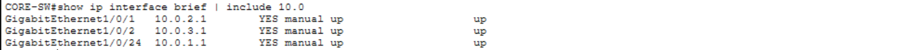

**<a id="p-02"></a> [P-02] · Adjacences OSPF du Core (3 voisins)** — `show ip ospf neighbor` → 2.2.2.2 via 10.0.2.2, 3.3.3.3 via 10.0.3.2, 4.4.4.4 via 10.0.1.2, tous `FULL/ -`

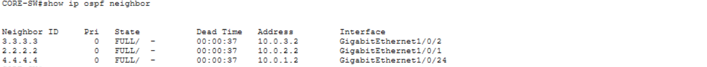

**<a id="p-03"></a> [P-03] · ECMP du Core vers les VLANs** — `show ip route ospf` → 192.168.10/20/30/99 via 10.0.2.2 **et** 10.0.3.2

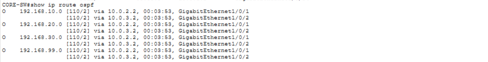

**<a id="p-04"></a> [P-04] · Adjacence DIST-SW1** — `show ip ospf neighbor` → 10.255.255.1 via 10.0.2.1 `FULL/ -`

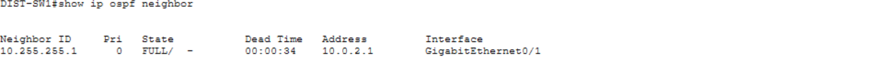

**<a id="p-05"></a> [P-05] · Routes DIST-SW1** — `show ip route ospf` → transits via 10.0.2.1

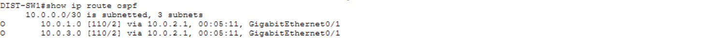

**<a id="p-06"></a> [P-06] · Adjacence + routes DIST-SW2** — `show ip ospf neighbor` + `route ospf` → 10.255.255.1 via 10.0.3.1

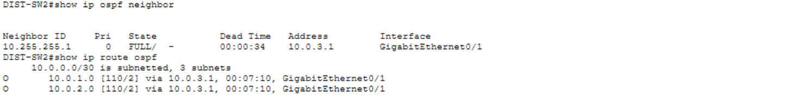

**<a id="p-07"></a> [P-07] · Propagation HQ-Router** — `show ip route ospf` → transits 10.0.2/3 + VLANs via 10.0.1.1

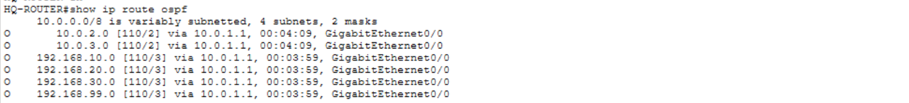

**<a id="p-08"></a> [P-08] · Adjacence HQ-Router (Core↔HQ)** — `show ip ospf neighbor` → 10.255.255.1 via 10.0.1.1

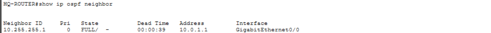

**<a id="p-09"></a> [P-09] · Répartition HSRP DIST-SW1** — `show standby brief` → Active V10/V30 (Pri 110 P), Standby V20/V99

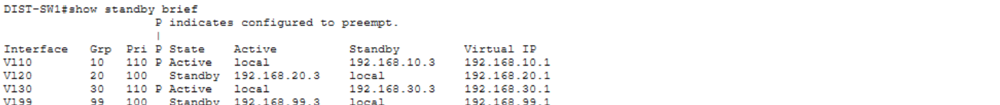

**<a id="p-10"></a> [P-10] · Répartition HSRP DIST-SW2 (miroir)** — `show standby brief` → Active V20/V99 (Pri 110 P), Standby V10/V30

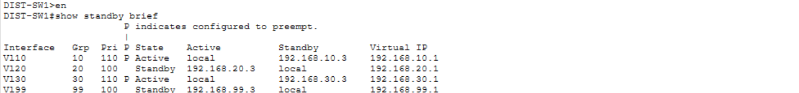

**<a id="p-11"></a> [P-11] · Root STP VLAN 10 = DIST1** — `show spanning-tree vlan 10` → `This bridge is the root`

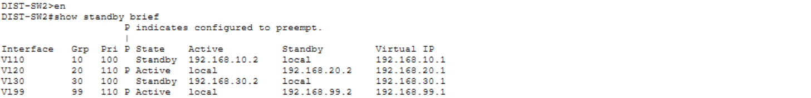

**<a id="p-12"></a> [P-12] · Root STP VLAN 20 = DIST2** — `show spanning-tree vlan 20` → `This bridge is the root`

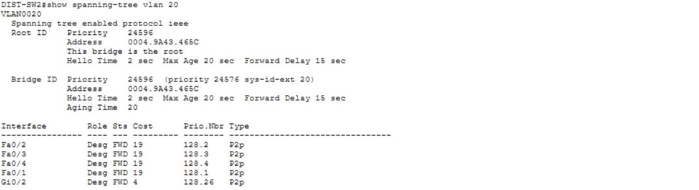

**<a id="p-13"></a> [P-13] · Root STP VLAN 30 = DIST1** — `show spanning-tree vlan 30` → `This bridge is the root`

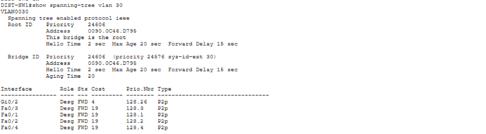

**<a id="p-14"></a> [P-14] · Root STP VLAN 99 = DIST2** — `show spanning-tree vlan 99` → `This bridge is the root`

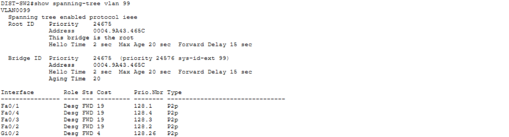

**<a id="p-15"></a> [P-15] · Déclenchement du failover** — DIST-SW1 `interface vlan 10 / shutdown` → SVI down

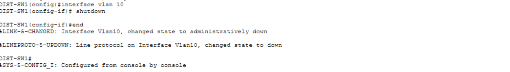

**<a id="p-16"></a> [P-16] · Promotion du failover** — DIST-SW2 `show standby brief` → V10 `Active`, Standby `unknown` (DIST1 parti)

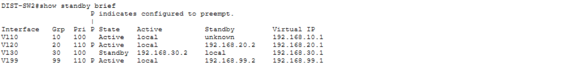

**<a id="p-17"></a> [P-17] · Data-plane du failover** — PC `ping -t 192.168.10.1` → 3 timeouts puis reprise

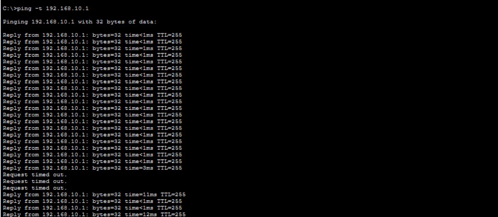

**<a id="p-18"></a> [P-18] · Preempt (log de transition)** — DIST-SW1 `interface vlan 10 / no shutdown` → `%HSRP-6-STATECHANGE: Vlan10 Grp 10 Standby -> Active`

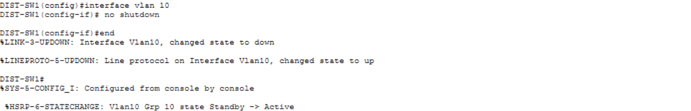

**<a id="p-19"></a> [P-19] · Preempt confirmé** — DIST-SW1 `show standby brief` → V10 `Active`/local, Standby 192.168.10.3

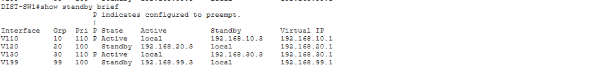

**<a id="p-20"></a> [P-20] · Baux DHCP centralisés** — HQ-ROUTER `show ip dhcp binding` → .10.50–.53 / .20.51–.54, serveur unique

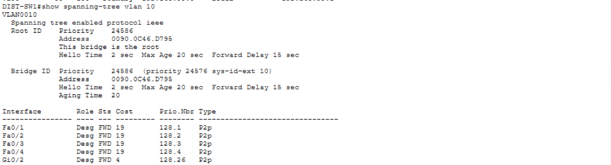

**<a id="p-21"></a> [P-21] · Inter-VLAN routé** — PC campus `ping .10.51` (0 %) + `ping .20.51` (TTL=127, un saut)

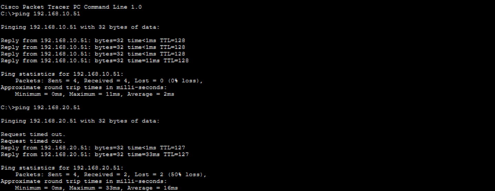

**<a id="p-22"></a> [P-22] · Topologie as-built** — schéma PT : `/30` en 10.0.2/3, labels HSRP par VLAN, MGMT `.2`/`.3`, « ALL PCs – DHCP Lease »

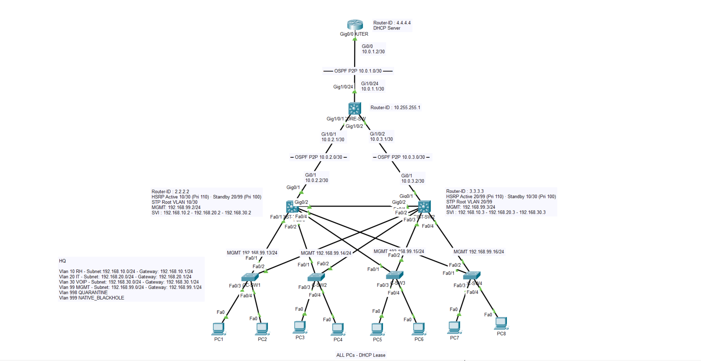

---

⬆️ [README de la partie](./README.md) · [Vue d'ensemble du projet](../README.md) — Suivant : [WORKFLOW Partie 3](../P3/WORKFLOW.md) (périmètre ASA, DMZ en tiers, NAT/PAT, routes internes exactes — pas de résumé qui bouclerait).
