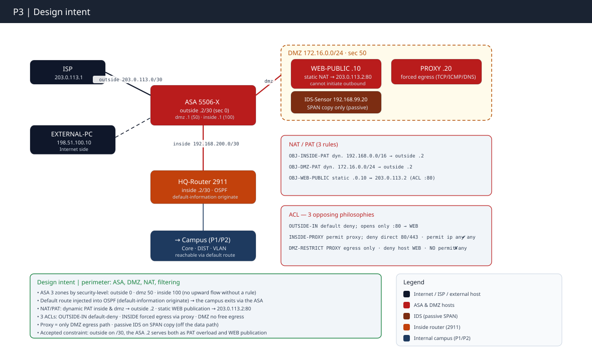

# Partie 3 : DMZ & Pare-feu

**Concepts clés** : ASA, DMZ, NAT/PAT & filtrage

- 💻**Outil** : Cisco Packet Tracer 9.0
- 🏷️ Plan d'adressage complet → [IPAM](../IPAM.md)
- 📝 Progression étape par étape → [WORKFLOW P3](./WORKFLOW.md)
- 🎓 **Certification :** CompTIA Network+

## Topologie logique

## Objectif

Construire la frontière entre le réseau interne et Internet : 

- pare-feu ASA à trois zones, DMZ hébergeant les services exposés + un proxy, politique de sortie qui force le web interne par le proxy, 
- confinement reverse-shell sur le serveur publié, 
- sonde IDS passive. 

Le but n'est **pas** « faire passer du trafic » (c'était P2) — c'est de définir **ce qui a le droit de traverser, et dans quel sens**, et de prouver chaque règle par un **compteur**, pas par une capture.

## Contrainte structurante : l'ordre de build. 

- Routage et NAT sont vérifiés sur un ASA **sans ACL** (les security-levels autorisent déjà inside→outside) *avant* toute ACL. 
- Déboguer un problème de routage à travers trois ACL à la fois est le gouffre de temps classique. 
- Les trois ACL portent trois philosophies opposées : le `permit ip any any` final est **obligatoire sur inside** et **interdit sur DMZ**.

## Décision de continuité (héritée de P2)  

- À la fin de P2, le campus n'atteignait Internet par personne. 
- P3 l'introduit via le lien HQ-Router → ASA inside. 
- Une route par défaut statique **ne suffit pas** : elle doit être poussée dans OSPF par `default-information originate`, même classe de piège « chemin de retour » que l'OFFER DHCP de P2.

## Couverture CompTIA Network+

| Domaine      | Concepts couverts                                                                                                                                             | Statut                            |
| ------------ | ------------------------------------------------------------------------------------------------------------------------------------------------------------- | --------------------------------- |
| 🛡️ Sécurité | Pare-feu 3 zones + security-levels · DMZ trusted/untrusted · ACL étendues + deny implicite · proxy de sortie forcé · prévention reverse-shell · port-security | ✅ 3 zones (0/50/100) · 3 ACL      |
| 📡 Détection | IDS passif (SPAN) · IPS simulé par signatures ACL · IDS vs IPS                                                                                                | ✅ · ⚠️ source SPAN limitée par PT |
| 🌐 Services  | NAT/PAT · DNS TCP/53 · inspection ICMP stateful                                                                                                               | ✅ PAT ×2 + statique 1:1           |
| 🧭 Routage   | Route par défaut OSPF · LPM vs AD · résumé + verrou trou noir                                                                                                 | ✅ résumés /20 + /16 · Null0       |

## Conclusion

Le vrai apprentissage : l'ASA ne raisonne pas en ports mais en niveaux de confiance. Un changement de modèle mental qui ne s'intériorise pas dans la théorie, seulement en le vivant. 

Le reste en découle, à mes dépens : route par défaut injectée dans OSPF, `deny` ICMP nuancé pour préserver le PMTUD, agrégation verrouillée par Null0, règles prouvées au compteur de hits et non à la capture qui « a l'air de marcher ». 

Le moindre privilège est un scalpel, pas un mur où trop bloquer devient aussi une erreur de configuration.

---

⬆️ Progression étape par étape → [Workflow P3](./WORKFLOW.md) **Suivant : [Partie 4 : Datacenter Spine-Leaf](../P4/README.md)** - fabric routée, 2 Border Leafs sur le Core (ECMP N-S), tiers applicatif + stockage, VIP de load balancer. · [Vue d'ensemble du projet](../README.md)
