# Partie 3 : Workflow 

**Concepts clés** : ASA, DMZ, NAT/PAT & filtrage

- 💻**Outil** : Cisco Packet Tracer 9.0
- 🏷️ Plan d'adressage complet → [IPAM](../IPAM.md)
- 📄 Progression étape par étape → [WORKFLOW P3](./WORKFLOW.md)
- 🎓 **Certification :** CompTIA Network+
## Sommaire

**1. Cadrage**

- [Topologie As-Built](#topologie-as-built)
- [Niveaux & équipements](#niveaux--équipements)
- [Limites de commande PT / ASA 9.6](#limites-de-commande-pt--asa-96-source-unique)

**2. Étapes de configuration**

- [Étape 1 : Équipements & câblage](#étape-1--équipements--câblage)
- [Étape 2 : Interfaces ASA + security-levels](#étape-2--interfaces-asa--security-levels)
- [Étape 3 : HQ-Router : origination du défaut](#étape-3--hq-router--lien-inside--origination-du-défaut-le-déblocage)
- [Étape 4 : ISP-Router : Internet + test externe](#étape-4--isp-router--internet--segment-de-test-externe)
- [Étape 5 : Routage ASA](#étape-5--routage-asa-prouver-la-joignabilité-avant-toute-acl)
- [Étape 6 : NAT / PAT](#étape-6--nat--pat)
- [Étape 7 : Inspection ICMP stateful](#étape-7--inspection-icmp-stateful)
- [Étape 8 : ACL OUTSIDE-IN](#étape-8--acl-outside-in-deny-par-défaut-exceptions-chirurgicales)
- [Étape 9 : ACL INSIDE-FORCED-PROXY](#étape-9--acl-inside-forced-proxy-le-permit-final-est-obligatoire)
- [Étape 10 : ACL DMZ-RESTRICT](#étape-10--acl-dmz-restrict-deny-implicite--pas-de-permit-final)
- [Étape 11 : Durcissement : port-security + SPAN](#étape-11--durcissement--port-security-access--span-core)

**3. Preuves & clôtures**

- [Validation de bout en bout](#validation-de-bout-en-bout-gate-final)
- [Dépannage (incidents de session)](#dépannage-incidents-de-session)
- [Registre d'erreurs & dette technique](#registre-derreurs--dette-technique)
- [Annexe — Captures de preuve](#annexe--captures-de-preuve)

# 1. Cadrage

## <a id="topologie-as-built"></a>Topologie As-Built

Schéma PT : périmètre & sécurité - ASA, DMZ, peering ISP, IDS

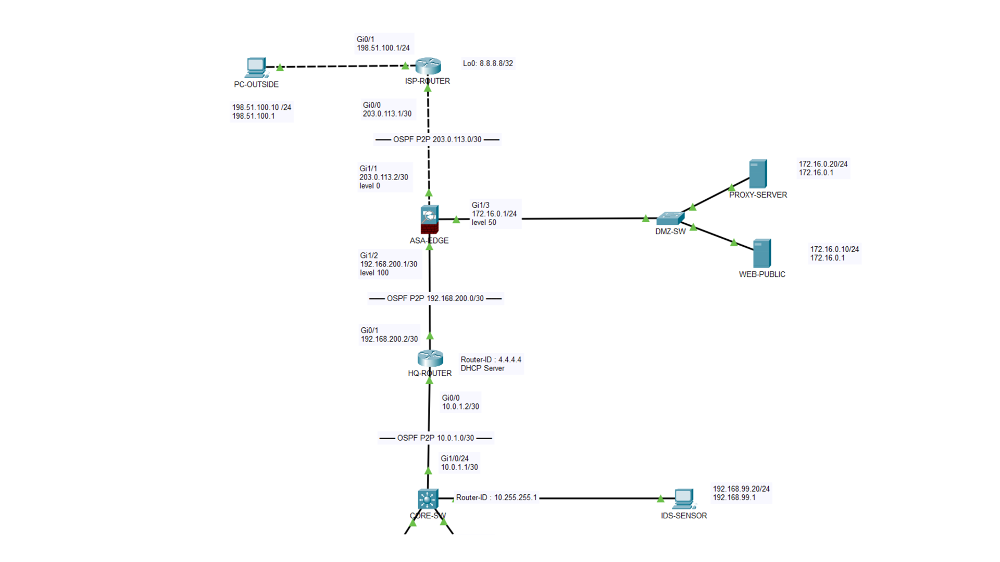

## <a id="niveaux--équipements"></a>Niveaux & équipements

| Rôle | Équipement | Rôle dans la partie |
|---|---|---|
| Pare-feu edge | **ASA-EDGE** (ASA 5506-X) — *nouveau* | 3 zones (outside 0 / dmz 50 / inside 100) ; NAT/PAT ; 3 ACL ; inspection ICMP stateful |
| Internet | **ISP-Router** (2911) — *nouveau* | Internet simulé : loopback `8.8.8.8` ; outside `/30` ; porte le PC de test externe |
| Services (routage) | **HQ-Router** (ISR 2911) | Gagne le `/30` ASA-inside, la route par défaut, et **origine `0.0.0.0/0` dans OSPF** ; verrous Null0 |
| Switch DMZ | **DMZ-SW** (2960) — *nouveau* | L2 pour les deux serveurs DMZ |
| Serveurs DMZ | **WEB-PUBLIC** `.10` / **PROXY** `.20` — *nouveaux* | Front publié / point de sortie proxy forcé |
| Détection | **IDS-Sensor** (`.99.20`) — *nouveau* | Destination SPAN de l'uplink edge du Core (passif) |
| Access | 4× Catalyst **2960** | **Port-security fermée** — sticky, `maximum 2`, `violation restrict` |

Tout le campus P1/P2 est **inchangé** — P3 ne fait que bouler le périmètre sur le HQ-Router existant (qui garde `Gi0/0`=Core ; l'ASA arrive sur `Gi0/1`, libre).

### <a id="limites-de-commande-pt--asa-96-source-unique"></a>Limites de commande PT / ASA 9.6 

| Commande standard | Comportement PT | À utiliser à la place |
|---|---|---|
| `show nameif` | ✗ invalide | `show running-config` (lire nameif dans les blocs interface) |
| `show access-list NAME` | ✗ invalide | `show access-list` (scroller jusqu'à l'ACL) |
| `show service-policy` | ✗ invalide | `show running-config policy-map` |
| `no access-list NAME` (ACL entière) | ✗ incomplet | retirer ligne par ligne : `no access-list NAME extended <règle complète>` |
| `nat … static X service tcp 80 80` | ✗ invalide à `service` | NAT statique 1:1 + ACL filtre à `:80` |
| `access-list … log` | ✗ invalide à `log` | omettre — SIEM = item P8 |
| `… time-exceeded` | ✗ non supporté | omettre — traceroute seul ; PMTUD préservé par `unreachable` |
| `! commentaire` inline après une commande | ✗ invalide à `!` | commentaires sur leur propre ligne uniquement |

# 2. Étapes de configuration

Le pare-feu se construit de l'intérieur vers l'extérieur : joignabilité, puis traduction, puis filtrage. L'étape 3 (origination du défaut) est le vrai déblocage, à faire avant les routes de l'ASA, sinon l'ASA a un next-hop qu'aucun hôte n'atteint.


---
### <a id="étape-1--équipements--câblage"></a>Étape 1 — Équipements & câblage

**Intention :** ajouter le périmètre ; le campus est intouché.

- **ASA `Gi1/1`** ↔ **ISP `Gi0/0`** (`203.0.113.0/30`)
- **ASA `Gi1/2`** ↔ **HQ `Gi0/1`** (`192.168.200.0/30`) — HQ `Gi0/0` reste sur le Core
- **ASA `Gi1/3`** ↔ **DMZ-SW `Gi0/1`** ; DMZ-SW `Fa0/1`/`Fa0/2` → WEB-PUBLIC / PROXY
- **ISP `Gi0/1`** ↔ **PC-EXTERIEUR** (`198.51.100.0/24`)
- **CORE `Gi1/0/5`** ↔ **IDS-Sensor** (destination SPAN, VLAN 99)

Serveurs (Desktop → IP Configuration) : 

- WEB-PUBLIC `172.16.0.10/24` GW `.1` 
- PROXY `172.16.0.20/24` GW `.1` 
- IDS-Sensor `192.168.99.20/24` GW `192.168.99.1`
- PC-EXTERIEUR `198.51.100.10/24` GW `198.51.100.1`.

> ⚠️ Sur WEB-PUBLIC et PROXY : **Services → HTTP → On** (pour distinguer un flux autorisé qui rend une page d'un flux refusé).

---

### <a id="étape-2--interfaces-asa--security-levels"></a>Étape 2 — Interfaces ASA + security-levels

**Intention :** sans `nameif`, l'ASA traite un port comme inexistant — aucune ACL ni NAT ne peut le référencer.

```cisco
enable
configure terminal

interface GigabitEthernet1/1
 nameif outside
 security-level 0
 ip address 203.0.113.2 255.255.255.252
 no shutdown
 
interface GigabitEthernet1/2
 nameif inside
 security-level 100
 ip address 192.168.200.1 255.255.255.252
 no shutdown
 
interface GigabitEthernet1/3
 nameif dmz
 security-level 50
 ip address 172.16.0.1 255.255.255.0
 no shutdown
 
end
write memory
```

> **Règle d'asymétrie :** supérieur→inférieur passe par défaut (inside→outside OK) ; inférieur→supérieur est bloqué par défaut (outside→inside nécessite une ACL explicite).

**Validation :** `show running-config` → lire nameif/security-level dans chaque bloc interface (`show nameif` invalide en PT). `show interface ip brief` → `Gi1/1`, `Gi1/2`, `Gi1/3` tous `up up`.

---

### <a id="étape-3--hq-router--lien-inside--origination-du-défaut-le-déblocage"></a>Étape 3 — HQ-Router : lien inside + origination du défaut (LE déblocage)

**Intention :** pousser la route par défaut dans OSPF et verrouiller l'espace résumé vide.

```cisco
enable
configure terminal

interface GigabitEthernet0/1
 ip address 192.168.200.2 255.255.255.252
 no shutdown
 
ip route 0.0.0.0 0.0.0.0 192.168.200.1
ip route 192.168.0.0 255.255.0.0 Null0 254
ip route 10.0.0.0 255.255.240.0 Null0 254

router ospf 1
 default-information originate
 
end
write memory
```

> **Pourquoi les deux verrous Null0.**
> 
> - L'ASA résume l'inside en `10.0.0.0/20` **et** `192.168.0.0/16`. 
> - Un résumé n'est sûr que si chaque bloc vide qu'il couvre a un trou noir flottant (AD 254). 
> 
> Sans le verrou `/16`, un paquet vers `192.168.150.1` (VLAN vide) rebondit ASA↔HQ jusqu'à expiration du TTL ; 
> 
> sans le `/20`, idem sur `10.0.14.x`. Le LPM fait qu'un vrai préfixe OSPF gagne toujours ; Null0 n'attrape que les trous.

**Validation :**

```cisco
show ip route static | include 0.0.0.0    ! S* 0.0.0.0/0 via 192.168.200.1
```

Puis sur **DIST-SW1** et **CORE-SW** : `show ip route ospf | include 0.0.0.0` → `O*E2 0.0.0.0/0`. **C'est la preuve que l'origination fonctionne.**

> 📷 Preuve du défaut originé consolidée dans la matrice (groupe A). Voir annexe.

---

### <a id="étape-4--isp-router--internet--segment-de-test-externe"></a>Étape 4 — ISP-Router : Internet + segment de test externe

**Intention :** simuler Internet (loopback `8.8.8.8`) et le PC externe.

```cisco
enable
configure terminal

hostname ISP-Router

interface GigabitEthernet0/0
 ip address 203.0.113.1 255.255.255.252
 no shutdown
 
interface GigabitEthernet0/1
 ip address 198.51.100.1 255.255.255.0
 no shutdown
 
interface Loopback0
 ip address 8.8.8.8 255.255.255.255
 
end
write memory
```

> Aucune route de retour nécessaire pour le trafic NAT'é : les hôtes internes sortent en `203.0.113.2` (connecté à l'ISP). PC-EXTERIEUR atteint le serveur publié sur `203.0.113.2`, l'interface outside de l'ASA.

---

### <a id="étape-5--routage-asa-prouver-la-joignabilité-avant-toute-acl"></a>Étape 5 — Routage ASA (prouver la joignabilité AVANT toute ACL)

**Intention :** l'ASA utilise `route <nameif>`, jamais `ip route`. Transits contigus → un seul résumé `/20`, verrouillé par le Null0 de l'étape 3.

```cisco
configure terminal

route outside 0.0.0.0 0.0.0.0 203.0.113.1
route inside 192.168.0.0 255.255.0.0 192.168.200.2
route inside 10.0.0.0 255.255.240.0 192.168.200.2

end
write memory
```

**Validation (fenêtre sans ACL — tout doit passer) :**

```cisco
show route                       ! Gateway of last resort = 203.0.113.1 ; S* 0.0.0.0/0
ping 172.16.0.10                 ! WEB-PUBLIC -> !!!!!
ping 172.16.0.20                 ! PROXY      -> !!!!!
```

Puis depuis **PC1** : `ping 8.8.8.8` → réponse après une perte ARP. Si PC1 échoue encore ici, la faute est aux étapes 3–5, pas au NAT.

---

### <a id="étape-6--nat--pat"></a>Étape 6 — NAT / PAT

**Intention :** deux PAT dynamiques (inside, dmz) + une publication statique 1:1.

```cisco
configure terminal

object network OBJ-INSIDE-PAT
 subnet 192.168.0.0 255.255.0.0
 nat (inside,outside) dynamic interface
 
object network OBJ-DMZ-PAT
 subnet 172.16.0.0 255.255.255.0
 nat (dmz,outside) dynamic interface
 
object network OBJ-WEB-PUBLIC
 host 172.16.0.10
 nat (dmz,outside) static 203.0.113.2
 
end
write memory
```

> Sur un `/30` outside nu, aucune IP publique de rechange : WEB-PUBLIC est publié sur l'adresse d'interface `.2`, la même que PAT overload. 
> 
> Cette publication sur adresse partagée est la racine de la limitation de rendu entrant (dette #22). `service tcp 80 80` étant non supporté, OUTSIDE-IN (étape 8) filtre l'entrant à `:80`.

**Validation :** depuis **PC1** `ping 8.8.8.8`, puis sur l'ASA `show xlate` → une entrée **dynamique** : `ICMP PAT from inside:192.168.10.50 to outside:203.0.113.2 flags i`. L'entrée statique s'affiche en permanence et ne prouve rien seule — l'entrée **dynamique** est la preuve.

> ⚠️ Si tu changes un mapping NAT, lance `clear xlate` — l'ancienne traduction est en cache.
> 
> 📷 **[P-05](#p-05)** `show xlate` (dynamique `flags i` + statique `flags s`).

---

### <a id="étape-7--inspection-icmp-stateful"></a>Étape 7 — Inspection ICMP stateful

**Intention :** TCP/UDP sont suivis par défaut ; l'ICMP non. Sans inspection, un echo-reply sur outside (niveau 0) est un entrant non sollicité, jeté.

```cisco
configure terminal

class-map inspection_default
 match default-inspection-traffic
 
policy-map global_policy
 class inspection_default
  inspect icmp
  
service-policy global_policy global

end
write memory
```

**Validation :** `show running-config policy-map` → `inspect icmp` sous `policy-map global_policy` (`show service-policy` invalide en PT). Cette étape est ce qui crée le xlate ICMP de l'étape 6.

---

### <a id="étape-8--acl-outside-in-deny-par-défaut-exceptions-chirurgicales"></a>Étape 8 — ACL OUTSIDE-IN (deny par défaut, exceptions chirurgicales)

**Intention :** zone non fiable — tout deny, n'ouvrir que HTTP→WEB-PUBLIC et l'ICMP nécessaire.

```cisco
configure terminal

access-list OUTSIDE-IN extended deny tcp any any eq 23
access-list OUTSIDE-IN extended deny tcp any any eq 22
access-list OUTSIDE-IN extended deny tcp any any eq 445
access-list OUTSIDE-IN extended deny icmp any any echo
access-list OUTSIDE-IN extended permit icmp any any echo-reply
access-list OUTSIDE-IN extended permit icmp any any unreachable
access-list OUTSIDE-IN extended permit tcp any host 172.16.0.10 eq www
access-group OUTSIDE-IN in interface outside

end
write memory
```

> **ICMP chirurgical :** `deny icmp any any` casserait le PMTUD (bloque le Type-3). Bloquer echo (stoppe les ping sweeps), garder echo-reply et unreachable. 
> 
> Le permit HTTP référence l'IP **réelle** post-NAT (`172.16.0.10`), jamais la publique. `time-exceeded` (Type 11) non supporté en PT → omis (dette #24).

**Validation : non-régression d'abord :** re-lancer PC1 `ping 8.8.8.8`. Il doit **survivre** (compteur `permit … echo-reply` monte). S'il casse maintenant, c'est **cette** ligne echo-reply qui manque, pas une ajoutée plus tard.

---

### <a id="étape-9--acl-inside-forced-proxy-le-permit-final-est-obligatoire"></a>Étape 9 — ACL INSIDE-FORCED-PROXY (le permit final est OBLIGATOIRE)

**Intention :** permit proxy d'abord, puis deny 80/443 direct, DNS autorisé, `permit ip any any` final.

```cisco
configure terminal

access-list INSIDE-FORCED-PROXY extended permit tcp 192.168.0.0 255.255.0.0 host 172.16.0.20 eq www
access-list INSIDE-FORCED-PROXY extended permit udp 192.168.0.0 255.255.0.0 any eq domain
access-list INSIDE-FORCED-PROXY extended permit tcp 192.168.0.0 255.255.0.0 any eq domain
access-list INSIDE-FORCED-PROXY extended deny tcp 192.168.0.0 255.255.0.0 any eq www
access-list INSIDE-FORCED-PROXY extended deny tcp 192.168.0.0 255.255.0.0 any eq 443
access-list INSIDE-FORCED-PROXY extended permit ip any any
access-group INSIDE-FORCED-PROXY in interface inside

end
write memory
```

> **Deux absolus.** Ordre : le `permit` proxy doit précéder le `deny` 80/443, sinon le deny attrape d'abord le trafic vers le proxy. 
> 
> Ligne finale : `permit ip any any` **obligatoire** — sans lui, le deny implicite tue OSPF, le mgmt, l'ICMP, tout. Le DNS sur **TCP/53** est ajouté à côté de l'UDP/53 (réponses > 512 o).

---

### <a id="étape-10--acl-dmz-restrict-deny-implicite--pas-de-permit-final"></a>Étape 10 — ACL DMZ-RESTRICT (deny implicite — PAS de permit final)

**Intention :** zone hostile — seul PROXY sort ; WEB-PUBLIC ne peut rien initier (anti reverse-shell).

```cisco
configure terminal

access-list DMZ-RESTRICT extended permit icmp any host 172.16.0.1
access-list DMZ-RESTRICT extended permit tcp host 172.16.0.20 any
access-list DMZ-RESTRICT extended permit udp host 172.16.0.20 any eq domain
access-list DMZ-RESTRICT extended permit tcp host 172.16.0.20 any eq domain
access-list DMZ-RESTRICT extended deny ip host 172.16.0.10 any
access-list DMZ-RESTRICT extended permit icmp host 172.16.0.20 any
access-group DMZ-RESTRICT in interface dmz

end
write memory
```

> La DMZ est hostile-par-défaut : le deny implicite **est** la protection, ne jamais terminer par `permit ip any any`. `deny ip host 172.16.0.10 any` (noter `ip`, couvre TCP/UDP/ICMP) empêche WEB-PUBLIC d'**initier** quoi que ce soit ; les réponses aux requêtes entrantes légitimes passent via la table de connexions. 
> 
> **Ordre :** `permit icmp any host 172.16.0.1` doit précéder le `deny host .10`, sinon le self-ping de l'ASA vers le serveur web est jeté. Si tu ajoutes dans le désordre, retirer et re-ajouter :
> ```cisco
> no access-list DMZ-RESTRICT extended deny ip host 172.16.0.10 any
> no access-list DMZ-RESTRICT extended permit icmp any host 172.16.0.1
> access-list DMZ-RESTRICT extended permit icmp any host 172.16.0.1
> access-list DMZ-RESTRICT extended deny ip host 172.16.0.10 any
> ```

---

### <a id="étape-11--durcissement--port-security-access--span-core"></a>Étape 11 — Durcissement : port-security (Access) + SPAN (Core)

**Intention :** fermer la couche d'accès (clôt P2 #8) et poser la sonde IDS passive.

```cisco
! Chaque switch d'accès, ports utilisateur Fa0/3 et Fa0/4

configure terminal

interface range fastEthernet 0/3 - 4
 switchport nonegotiate
 switchport port-security
 switchport port-security maximum 2
 switchport port-security violation restrict
 switchport port-security mac-address sticky
 
end
write memory
```

> `maximum 2`, pas 1 : un port de bureau VoIP voit deux MAC (téléphone en Voice VLAN 30 + PC data).

```cisco
! CORE-SW — destination SPAN vers l'IDS

configure terminal

interface GigabitEthernet1/0/5
 no shutdown
 switchport mode access
 switchport access vlan 99
 description IDS-SENSOR-SPAN-DEST
 exit
 
monitor session 1 source interface GigabitEthernet1/0/24
monitor session 1 destination interface GigabitEthernet1/0/5

end
write memory
```

> ⚠️ **Limite PT (#23) :** la ligne `source` est silencieusement ignorée — `show monitor session 1` ne montre que la destination. IDS = passif hors-chemin ; le blocage inline est l'IPS *simulé* par les deny OUTSIDE-IN.

**Validation :** sur un switch d'accès — `show port-security address` (2 MAC `SecureSticky`, V10 `Fa0/3` / V20 `Fa0/4`), `show port-security interface fa0/3` (`Secure-up`, `maximum 2`, `Restrict`). Sur CORE-SW — `show monitor session 1` (destination `Gi1/0/5` ; source absente, attendu).

> 📷 **[P-11](#p-11)** port-security · **[P-12](#p-12)** SPAN/IDS.
# 3. Preuves & clôtures

## <a id="validation-de-bout-en-bout-gate-final"></a>Validation de bout en bout

Le **protocole du groupe B** : noter le hitcnt de la ligne cible, lancer le flux une fois, relire `show access-list`, confirmer que **cette ligne précise** a incrémenté. Un timeout a dix causes ; un compteur qui monte n'en a qu'une.

**✅ Groupe A — flux qui doivent passer**

| # | Depuis | Action | Attendu | Preuve |
|---|---|---|---|---|
| A1 | PC1 | `ping 8.8.8.8` | réponse 4/4 (TTL=251) | OUTSIDE-IN `echo-reply` hitcnt monte — survit à l'ACL — [P-01](#p-01), [P-06](#p-06) |
| A2 | PC1 | `http://172.16.0.20` | page (via proxy) | INSIDE ligne 1 permit hit — [P-02](#p-02) |
| A4 | ASA | `ping 172.16.0.10` / `.20` | 5/5 | DMZ `permit icmp any host .1` hit — ordre OK — [P-03](#p-03), [P-06](#p-06) |
| A5 | PROXY | `ping 8.8.8.8` | 4/4 | DMZ `permit icmp host .20` hit — [P-04](#p-04) |
| A6 | PC1 | `ping 8.8.8.8` puis `show xlate` | `ICMP PAT … flags i` dynamique + statique `flags s` | l'entrée dynamique est la preuve NAT — [P-05](#p-05) |

> **A3 reclassé, bloqué par conception, pas un échec.** PC1 → `http://172.16.0.10` (WEB-PUBLIC direct) timeout : la réponse est jetée par DMZ-RESTRICT `deny host .10`. Cohérent avec le proxy forcé — les hôtes internes atteignent le web via `.20` (A2), jamais le serveur DMZ. A3 prouve une seconde fois que `deny host .10` fonctionne. [P-13](#p-13)

**⛔ Groupe B — flux qui doivent échouer (prouvés par compteur)**

| # | Depuis | Action | Règle qui doit incrémenter | Preuve |
|---|---|---|---|---|
| B1 | PC1 | `http://8.8.8.8` | INSIDE `deny … eq www` | hitcnt 24 — [P-06](#p-06) ; visuel [P-07](#p-07) |
| B2 | PC1 | `https://8.8.8.8` | INSIDE `deny … eq 443` | hitcnt 12 — [P-08](#p-08) ; visuel [P-07](#p-07) |
| B3 | PC-EXTERIEUR | `telnet 203.0.113.2` | OUTSIDE-IN `deny … eq 23` | hitcnt 12 — [P-08](#p-08) ; visuel [P-09](#p-09) |
| B4 | PC-EXTERIEUR | `ping 203.0.113.2` | OUTSIDE-IN `deny icmp echo` | hitcnt 9 — [P-06](#p-06) ; visuel [P-09](#p-09) |
| B5 | WEB-PUBLIC | `ping 8.8.8.8` | DMZ `deny ip host .10` | hitcnt 80 — [P-06](#p-06), [P-10](#p-10) |

**🔒 Groupe C — durcissement**

| # | Où | Commande | Attendu | Preuve |
|---|---|---|---|---|
| C1 | Switch Access | `show port-security address` | 2 MAC sticky, `maximum 2`, `Secure-up` | V10 `Fa0/3` / V20 `Fa0/4` — [P-11](#p-11) |
| C2 | CORE-SW | `show monitor session 1` | dest `Gi1/0/5` ; source absente (limite PT) | [P-12](#p-12) |

---

## <a id="dépannage-incidents-de-session"></a>Dépannage (incidents de session)

### 3a — Incidents de build

> Incidents rencontrés pendant le build, avec le diagnostic qui a attrapé chacun. Historiques de session, **pas** des dettes ; chacun corrigé le jour même.

| # | Symptôme | Cause | Diagnostic | Correctif |
|---|---|---|---|---|
| 1 | PC1 `ping 8.8.8.8` → `Destination host unreachable` | DIST-SW1 sans `0.0.0.0/0` ; HQ montrait `Gateway of last resort is not set` | `show ip route` sur HQ + `show ip route ospf` sur DIST | `ip route 0.0.0.0/0` **et** `default-information originate` sur HQ — **le vrai blocage** |
| 2 | `show xlate` ne montre que la statique ; PC1 timeout | `inspect icmp` pas encore appliqué → aucun xlate ICMP | `show run policy-map` | appliquer la policy d'inspection globale (étape 7) |
| 3 | Ping ASA→`8.8.8.8` = 0/5 malgré route | ping control-plane depuis l'ASA + l'ASA ignore l'echo sur outside — test trompeur | `ping 203.0.113.2` depuis l'ISP ; L2 OK | tester dans le **sens du flux** (PC1 → xlate), pas device-to-device |
| 4 | `http://203.0.113.2` depuis PC-EXTERIEUR timeout malgré SYN arrivé | Server-PT ne complète pas l'HTTP à travers un NAT statique entrant en PT | OUTSIDE-IN ligne 7 hitcnt monte pendant que le navigateur timeout | laissé en dette #22 ; mécanisme prouvé par le compteur |
| 5 | CDP vide ASA↔ISP, lien up/up, 100 Mb/s sur Gigabit | auto-câblage crossover + CDP off sur l'ASA — deux fausses pistes ; L2 sain (ARP résolu) | `show arp` sur l'ISP + compteurs `show interface` | aucun — L2 sain ; le blocage était l'incident #1 |

> **Leçon :** un flux NAT'é se juge par `show xlate` et le compteur de hits d'ACL, **jamais** par un ping vers/depuis un équipement intermédiaire.

### 3b — Commandes de référence (compatibles ASA 9.6)

```cisco
show running-config            ! zones, nameif, security-levels
show route                     ! table ASA + gateway of last resort
show nat                       ! règles NAT
show run object network        ! sous-réseaux/hôtes des objets
show xlate                     ! traductions actives (l'entrée dynamique = la preuve)
show access-list               ! TOUTES les ACL + compteurs
show running-config policy-map ! statut inspect icmp
clear xlate                    ! purger le cache après un changement NAT
show port-security address     ! MAC sticky
show monitor session 1         ! dest SPAN
show ip route ospf             ! DIST/Core : O*E2 0.0.0.0/0 = défaut originé
```

---

## <a id="registre-derreurs--dette-technique"></a>Registre d'erreurs & dette technique

> État final de chaque point (clos / porté / différé). Le dépannage de session est ci-dessus. 
> 
> ⚠️ **Numérotation stable inter-parties.** Ces numéros sont des identifiants cités par d'autres docs

| # | Point | Domaine | Statut |
|---|---|---|---|
| 8 | Port Security absente sur la couche d'accès | 🟠 Sécurité | ✅ **Close** (sticky, `maximum 2`, restrict) |
| 22 | Rendu HTTP entrant via NAT statique échoue en PT | 🟠 Services | 📋 Dette PT — SYN prouvé (ligne 7 hitcnt) ; ASA physique uniquement |
| 23 | Source de la session SPAN ignorée | 🟠 Détection | 📋 Dette PT — concept prouvé ; Catalyst physique |
| 24 (?) | ACL `log` / `time-exceeded` non supportés en PT | 🟢 Observabilité | 📋 Dette PT — `log` → SIEM (P8) ; PMTUD préservé via `unreachable`. *Numéro à confirmer (voir en-tête).* |
| 25 | Proxying HTTPS non fonctionnel | 🟠 Services | 📋 Dette PT — Squid `:3128` + `deny … eq 443` en prod |
| 26 | `service tcp 80 80` non supporté | 🟢 Services | 📋 Dette PT — NAT statique + ACL `:80` |
| 15 | Core = transit L3 nord-sud unique | 🟠 Haute disponibilité | 📋 Dette portée |
| 9 | Voice VLAN 30 sans poste IP | 🟢 Démonstratif | 🔜 P5 |
| L4 | 802.1X manquant (port-security basique seule) | 🟠 Sécurité | 🔜 P9 (RADIUS + 802.1X) |

---

## <a id="annexe--captures-de-preuve"></a>Annexe : Captures de preuve

**<a id="p-01"></a> [P-01] · A1 campus → Internet** — PC1 `ping 8.8.8.8` = 4/4, `TTL=251`

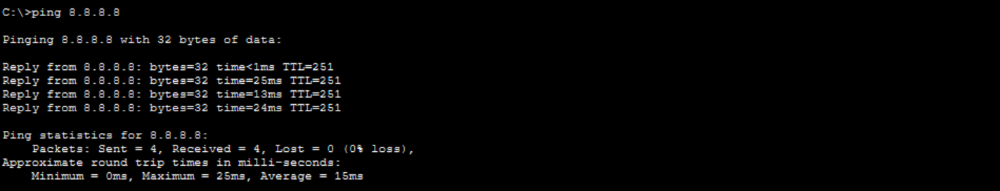

**<a id="p-02"></a> [P-02] · A2 sortie proxy forcé** — PC1 `http://172.16.0.20` = page servie

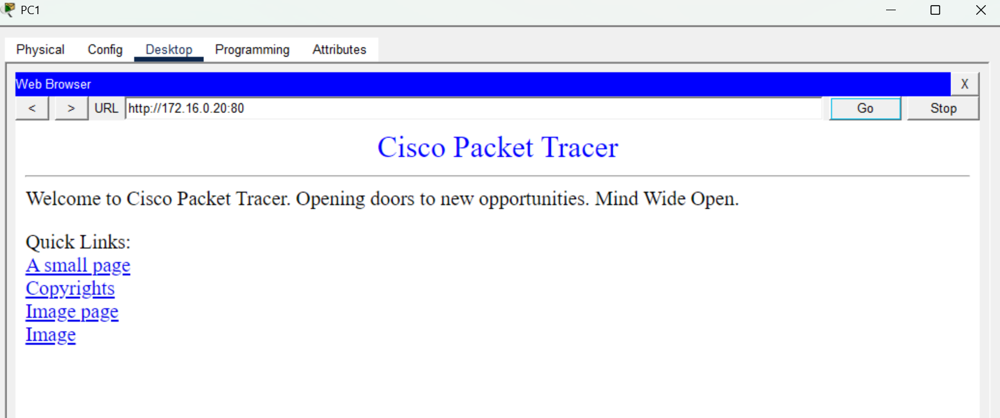

**<a id="p-03"></a> [P-03] · A4 ASA → DMZ** — ASA `ping 172.16.0.10` + `.20` = 5/5 chacun

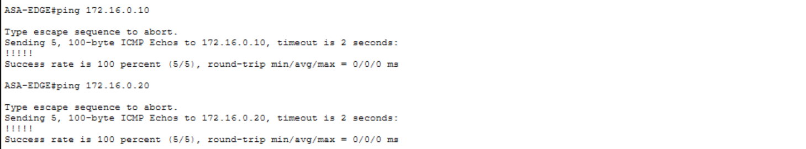

**<a id="p-04"></a> [P-04] · A5 sortie proxy** — PROXY-SERVER `ping 8.8.8.8` = 4/4

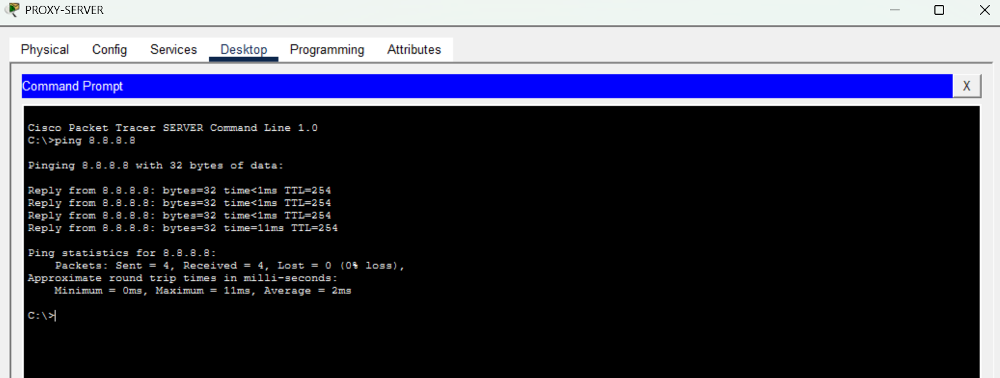

**<a id="p-05"></a> [P-05] · A6 preuve NAT (la durable)** — ASA `show xlate` : dynamique `ICMP PAT inside:192.168.10.50 → outside:203.0.113.2 flags i` + statique `dmz:172.16.0.10 → 203.0.113.2 flags s`

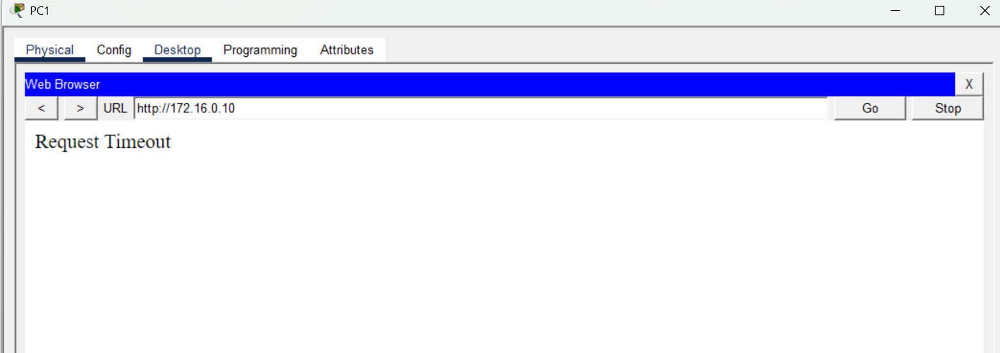

**<a id="p-06"></a> [P-06] · compteurs maîtres** — ASA `show access-list` : OUTSIDE-IN `echo-reply`=16 / ligne 7 `www`=5 / `echo`=9 ; INSIDE `deny www`=24 / `permit ip`=8 ; DMZ `deny host .10`=80 / `permit icmp .1`=10

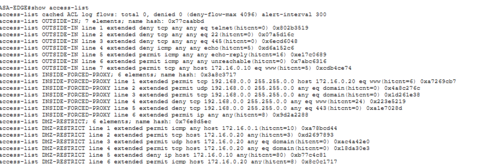

**<a id="p-07"></a> [P-07] · B1+B2 web direct bloqué (visuel)** — PC1 `http://8.8.8.8:80 / :443` = Request Timeout (forcé au proxy)

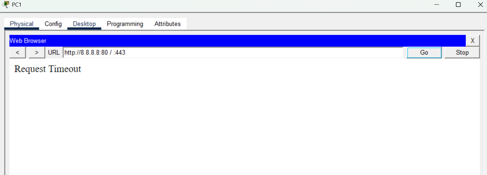

**<a id="p-08"></a> [P-08] · B2+B3 compteurs** — ASA `show access-list` : INSIDE `deny 443`=12 ; OUTSIDE-IN `deny telnet`=12

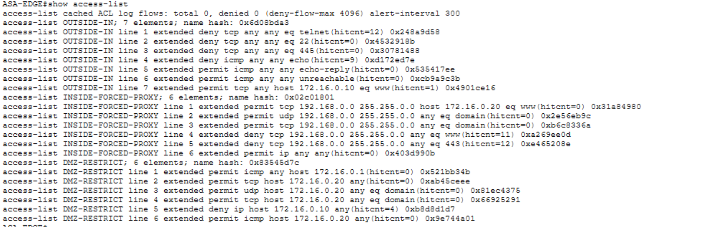

**<a id="p-09"></a> [P-09] · B3+B4 tentatives externes (visuel)** — PC-EXTERIEUR `ping 203.0.113.2` = 100 % loss + `telnet 203.0.113.2` = Connection timed out

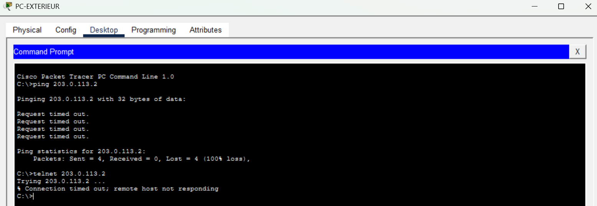

**<a id="p-10"></a> [P-10] · B5 blocage reverse-shell** — WEB-PUBLIC `ping 8.8.8.8` = 100 % loss (ne peut pas initier de sortie)

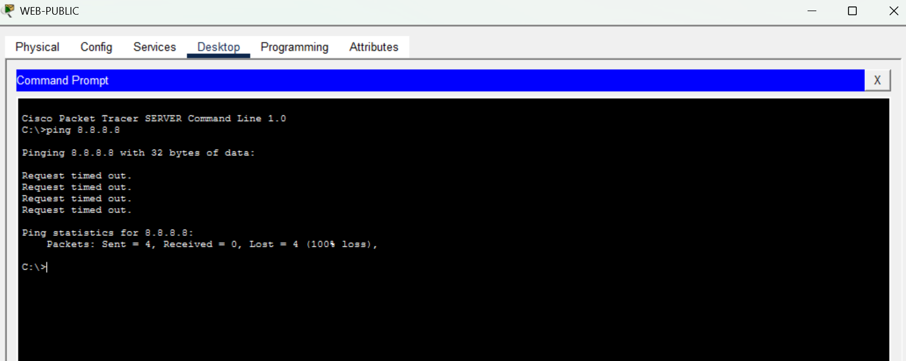

**<a id="p-11"></a> [P-11] · C1 port-security** — ACC-SW1 `show port-security address` : 2× `SecureSticky` (V10 `Fa0/3`, V20 `Fa0/4`), `maximum 2`, `Secure-up`, `Restrict`

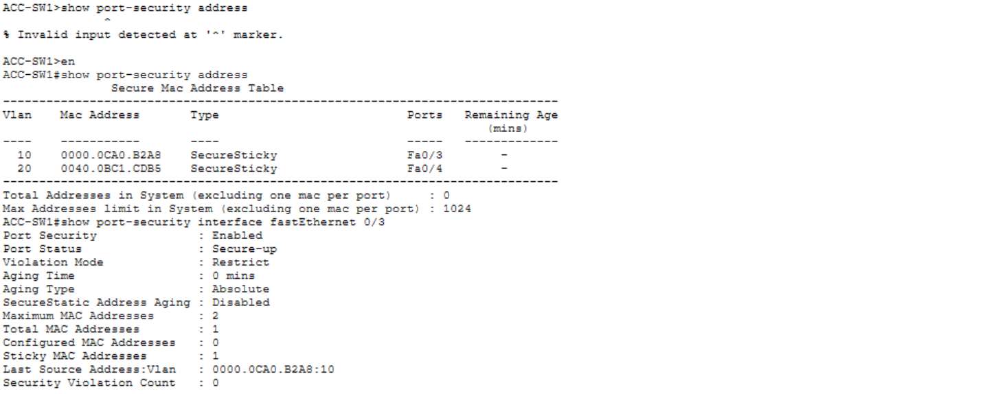

**<a id="p-12"></a> [P-12] · C2 SPAN / IDS** — CORE-SW `show monitor session 1` : destination `Gi1/0/5` ; source silencieusement absente (dette #23)

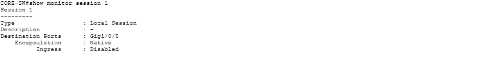

**<a id="p-13"></a> [P-13] · A3 bloqué-par-conception** — PC1 `http://172.16.0.10` = Request Timeout : réponse jetée par DMZ-RESTRICT `deny host .10` (pas une faute)

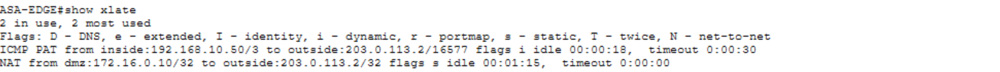

**<a id="p-14"></a> [P-14] · dette #22 — rendu HTTP entrant** — PC-EXTERIEUR `http://203.0.113.2` = Request Timeout ; le SYN atteint le serveur (OUTSIDE-IN ligne 7 hitcnt, [P-06]), rendu bloqué par PT. Fonctionne sur un ASA physique

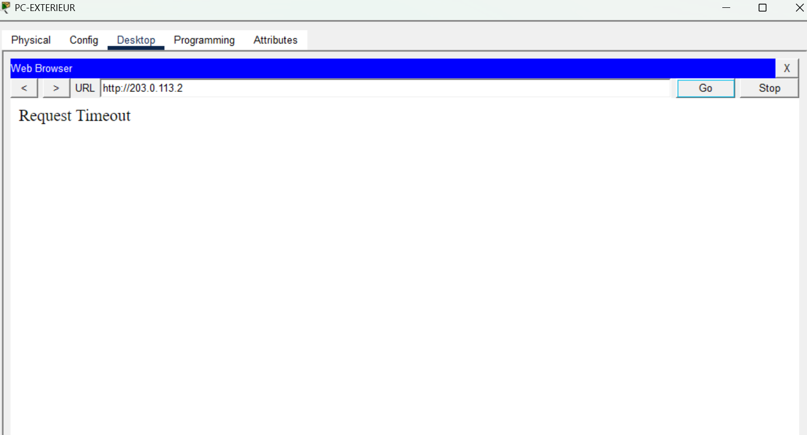

---

⬆️ [README de la partie](./README.md) · [Vue d'ensemble du projet](../README.md)  Suivant : [WORKFLOW Partie 4](../P4/WORKFLOW.md) (Datacenter Spine-Leaf, Border Leafs, fabric routée, tiers serveurs).
