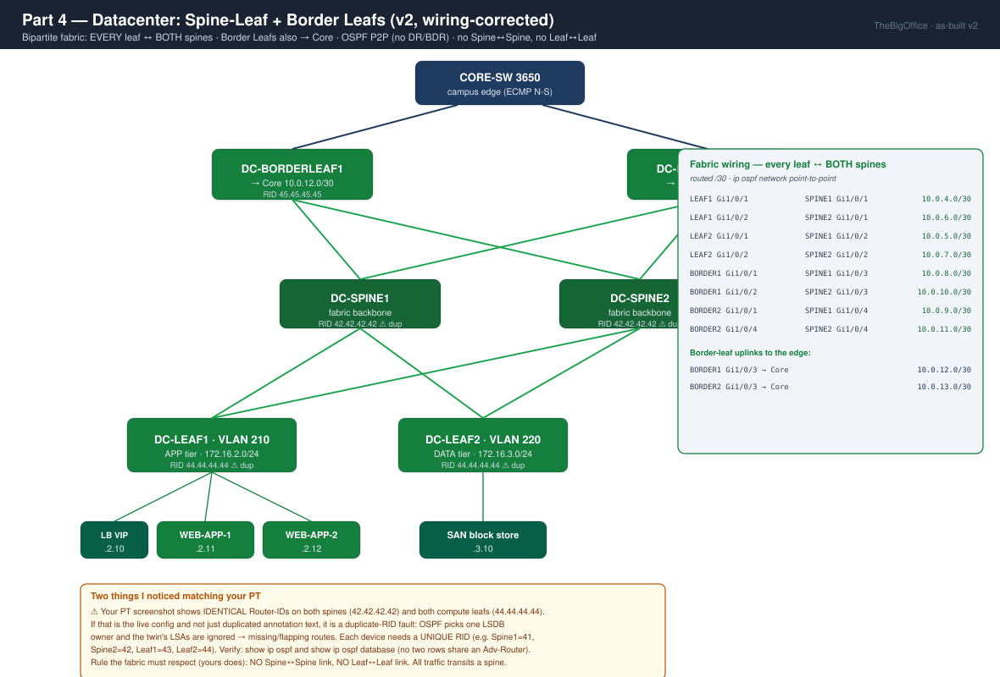

# Partie 4 : Datacenter 

**Outil :** Cisco Packet Tracer (Catalyst 3650) 
**Concepts clés** : Spine-Leaf, Border Leafs, tiers serveurs & load balancer 
**Certification :** CompTIA Network+

- Plan d'adressage complet → [`IPAM.md`](../IPAM.md)
- Progression étape par étape → [`WORKFLOW P4`](./WORKFLOW.md)

---
## Objectif

Construire le datacenter comme une fabric Spine-Leaf **routée**, boulée sur le campus **à travers le Core, pas le HQ-Router**. Le but n'est pas « faire pinguer les serveurs », c'est de prouver une forme de trafic précise : 

- **Est-Ouest** uniforme (`Leaf→Spine→Leaf`)
- **Nord-Sud** symétrique (`Leaf→Spine→BorderLeaf→Core→edge`), 
- Et une **application trois tiers** où les serveurs applicatifs sortent mais ne sont jamais joignables en entrée, chaque sens prouvé par un compteur.

**Contrainte structurante. :** 

- Les deux Border Leafs terminent sur le **Core** (`10.0.12.0/30`, `10.0.13.0/30`), pas un sur le Core et un sur le HQ-Router comme j'avais pu produire dans mon premier build. 
- Les deux chemins N-S sont de longueur identique → le Core apprend les sous-réseaux DC via BL1 **et** BL2 en **ECMP**, et le HQ-Router reste un pur edge campus.

**Décision de continuité (héritée de P3).** Le campus atteint déjà Internet. Le DC a seulement besoin qu'OSPF porte `172.16.2.0/24` + `172.16.3.0/24` jusqu'à l'edge, plus un objet PAT dédié. La route ASA + NAT se fait **en dernier**, une fois la fabric prouvée.

---
## Topologie logique

---
## Couverture CompTIA Network+

| Domaine                | Concept                                         | Statut                                       |
| ---------------------- | ----------------------------------------------- | -------------------------------------------- |
| 🏗️ Architecture       | Fabric Spine-Leaf (leaf-spine)                  | ✅ 2×2 + 2 border leafs                       |
| 🏗️ Architecture       | Trafic Est-Ouest vs Nord-Sud                    | ✅ E-O `Leaf→Spine→Leaf`, N-S via Border Leaf |
| 🏗️ Architecture       | Application trois tiers (présentation/app/data) | ✅ DMZ / VLAN 210 / VLAN 220                  |
| 🧭 Routage             | Accès routé (pas de VLAN étiré dans la fabric)  | ✅ chaque port fabric `no switchport` + `/30` |
| 🧭 Routage             | OSPF point-à-point (pas de DR/BDR)              | ✅ tous les voisins `FULL/ -`                 |
| 🧭 Routage             | ECMP / partage de charge équi-coût              | ✅ Core → DC via BL1 **et** BL2               |
| 🧭 Routage             | Réutilisation du résumé (P3 `/20`)              | ✅ la fabric entre dans le résumé existant    |
| 🌐 Services            | NAT/PAT pour un nouveau bloc interne            | ✅ objet PAT `DC-NET`                         |
| 🛡️ Sécurité           | Exposition en tiers (backend sortie-seule)      | ✅ sortie prouvée, entrée refusée par hitcnt  |
| 🛡️ Sécurité           | Confinement des ports inutilisés (VLAN 998)     | ✅ sur tous les switches de fabric            |
| 🔁 Haute disponibilité | Concept load balancer / VIP                     | ✅ documenté (LB fonctionnel = prod)          |

---

## Test & validation ✅

Cette section recense ce qui a été testé et validé par résultat ou par compteur

> - Fabric Spine-Leaf routée 2×2, 
> - **2 Border Leafs sur le Core** (symétrie N-S, HQ-Router hors du chemin DC) 
> - Tiers applicatif + data joignables, 
> - **E-O et N-S prouvés par résultat**, 
> - **Sortie Internet prouvée par compteur NAT**
> - Isolation DMZ→APP prouvée par compteur d'ACL 
> - Ports inutilisés en VLAN 998 

Chaque preuves cite un `[P-##]` de l'[Annexe — Captures de preuve du WORKFLOW P4](./WORKFLOW.md#annexe--captures-de-preuve). Chaque flux (sortie, isolation) est prouvé par un **compteur**, pas par un timeout.

| 🧭 **Routage / underlay**                  | Résultat / compteur                                                      | Preuve                              |
| ------------------------------------------ | ------------------------------------------------------------------------ | ----------------------------------- |
| Adjacences OSPF toutes `FULL/ -`, 0 DR/BDR | Spine ×4, BL ×3, Leaf ×2, Core ×5                                        | [`P-01`](./WORKFLOW.md#p-01) [`P-03`](./WORKFLOW.md#p-03) [`P-04`](./WORKFLOW.md#p-04) [`P-05`](./WORKFLOW.md#p-05) |
| ECMP nord-sud au Core                      | `route 172.16.2.0` via `10.0.12.1` (BL1) + `10.0.13.1` (BL2)             | [`P-06`](./WORKFLOW.md#p-06)                            |
| Propagation DC → edge                      | HQ-Router `O 172.16.2.0` + `O 172.16.3.0` ; ASA `show route` = 3 subnets | [`P-07`](./WORKFLOW.md#p-07) [`P-20`](./WORKFLOW.md#p-20)                   |

| **📦 Flux data-plane**                   | Résultat / compteur                                    | Preuve            |
| ---------------------------------------- | ------------------------------------------------------ | ----------------- |
| Est-ouest : APP-WEB1 → SAN `172.16.3.10` | 4/4 (2ᵉ run)                                           | [`P-10`](./WORKFLOW.md#p-10)          |
| Nord-sud : PC campus → APP-WEB1          | 4/4 ; `tracert` = DIST→Core(BL1)→Spine→Leaf1           | [`P-11`](./WORKFLOW.md#p-11)          |
| Sortie Internet : APP-WEB1               | `ping 8.8.8.8` TTL=249 ; ASA `DC-NET translate_hits=3` | [`P-13`](./WORKFLOW.md#p-13) [`P-12`](./WORKFLOW.md#p-12) |

| **🌐 Services**               | Résultat / compteur                                        | Preuve            |
| ----------------------------- | ---------------------------------------------------------- | ----------------- |
| Pages applicatives distinctes | `http://.11` = « Web-App 1 », `http://.12` = « Web-App 2 » | [`P-14`](./WORKFLOW.md#p-14) [`P-15`](./WORKFLOW.md#p-15) |

| **🛡️ Sécurité / durcissement**    | Résultat / compteur                                   | Preuve   |
| ---------------------------------- | ----------------------------------------------------- | -------- |
| Isolation WEB-PUBLIC → APP bloquée | `DMZ-RESTRICT` deny hitcnt=4 (paquet mort à l'ACL P3) | [`P-17`](./WORKFLOW.md#p-17) |
| Ports fabric inutilisés désactivés | `disabled` + VLAN 998                                 | [`P-09`](./WORKFLOW.md#p-09) |
### ⚠️ Dette — configuré mais limité par Packet Tracer

|Point|Limite|Réf.|
|---|---|---|
|Round-robin LB|`http://172.16.2.10` sert toujours la page du LB, jamais `.11`/`.12` (pas de moteur LB)|[`P-16`](./WORKFLOW.md#p-16)|
|SAN block-store|seule une réponse ping/HTTP (rôle conceptuel)|—|
|DMZ → APP|intentionnellement bloqué jusqu'à l'ajout du `permit` P3 (au-dessus de `DMZ-RESTRICT` ligne 5)|[`P-17`](./WORKFLOW.md#p-17)|

> Un `Request timed out` en tête (jusqu'à 3 sur les longs flux N-S/sortie) sur le **premier** paquet est un build ARP + xlate/CEF, **pas** une faute. Les ports campus qui flashent ambre puis vert (0 % de perte) sont une reconvergence STP cosmétique, artefact PT.

---

## Conclusion

La première build m'a appris deux fautes pour une seule cause : le défaut d'anticipation. 

D'abord des /30 dupliqués entre P2 et P4, qui produisaient un routage faux pingant correctement une fois sur deux : aucun message d'erreur, juste des bugs silencieux, les plus coûteux. Ensuite, faute d'avoir compté les ports des Spines, plus aucune interface libre pour des Border Leafs : HQ et Core branchés directement dessus, Nord-Sud et Est-Ouest mélangés. 

La leçon tient en une ligne : plan d'adressage et budget de ports s'anticipent avant de câbler, jamais après. 

C'est cet œil-là que j'ai mis à profit ici, pour valider la partie au fil de micro-erreurs et de dépannages plutôt que d'une grosse panne.

---

⬆️ **Suivant : [Partie 5 — Téléphonie IP](../P5/README.md)** — CME co-localisé avec l'Active/root du VLAN 30, DHCP Option 150, SCCP, TFTP, frontière QoS. · [Vue d'ensemble du projet](../README.md)
