# Part 4: Workflow 

 **Key concepts**: Spine-Leaf, Border Leafs, server tiers & load balancer

- 💻 **Tool**: Cisco Packet Tracer 9.0
- 🏷️ Full addressing plan → [IPAM](../IPAM.md)
- 📄 Part 4 overview → [README P4](./README.md)
- 🎓 **Certification:** CompTIA Network+

## <a id="sommaire"></a>Contents

**1. Scope**

- [As-Built Topology](#topologie-as-built)
- [Tiers & equipment](#niveaux--équipements)

**2. Configuration steps**

- [Step 1: DC-Spine1 & DC-Spine2 (routed fabric)](#étape-1--dc-spine1--dc-spine2-fabric-routée-pas-de-vlan)
- [Step 2: DC-Leaf1 & DC-Leaf2 (per-tier SVI)](#étape-2--dc-leaf1-vlan-210-applicatif--dc-leaf2-vlan-220-data)
- [Step 3: DC-BorderLeaf1 & DC-BorderLeaf2 (N-S junction)](#étape-3--dc-borderleaf1--dc-borderleaf2-jonction-n-s)
- [Step 4: CORE-SW (North-South connection)](#étape-4--core-sw-le-raccord-nord-sud--seul-équipement-campus-touché)
- [Step 5: Servers & Load Balancer](#étape-5--serveurs--load-balancer)
- [Step 6: Hardening](#étape-6--durcissement)
- [Step 7: Edge (ASA): DC reachability + egress](#étape-7--edge-asa-p3--joignabilité-dc--sortie)

**3. Evidence & closure**

- [End-to-end validation](#validation-de-bout-en-bout-gate-final)
- [Troubleshooting (session incidents)](#dépannage-incidents-de-session)
- [Error log & technical debt](#registre-derreurs--dette-technique)
- [Appendix: Evidence captures](#annexe--captures-de-preuve)

# 1. Scope

## <a id="topologie-as-built"></a>As-Built Topology

PT diagram: datacenter core – spine-leaf fabric, server farms

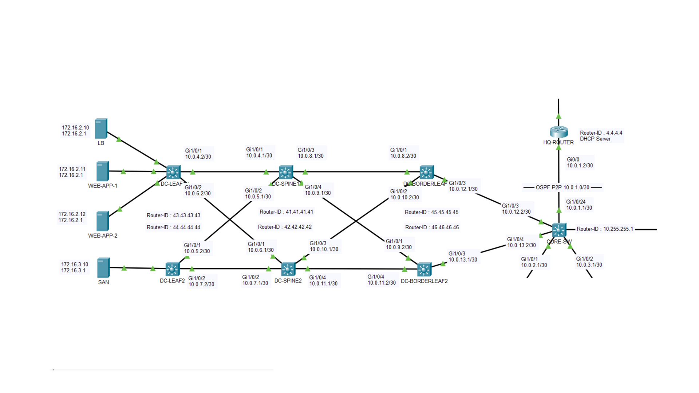

## <a id="niveaux--équipements"></a>Tiers & equipment

| Role            | Equipment                                               | Role in this part                                                                        |
| --------------- | ------------------------------------------------------- | ---------------------------------------------------------------------------------------- |
| Spine (fabric)  | **DC-Spine1 / DC-Spine2** (3650) - *new*                | Routed core; 4 routed downlinks each (2 Leafs + 2 Border Leafs); no VLAN/SVI             |
| Leaf compute    | **DC-Leaf1 / DC-Leaf2** (3650) - *new*                  | Server-facing; per-tier SVI gateway; 2 routed uplinks                                    |
| Leaf border     | **DC-BorderLeaf1 / DC-BorderLeaf2** (3650) - *new*      | N-S junction; 2 routed uplinks (Spines) + 1 routed downlink (Core)                       |
| Application tier| **APP-WEB1 `.11` / APP-WEB2 `.12`** - *new*             | Internal web backend (HTTP); egress via ASA, **never inbound**                           |
| Load balancer   | **LB-APP** (`.10` VIP) - *new*                          | Presents the application VIP (conceptual round-robin: PT debt)                           |
| Data tier       | **SAN-Server** (`.10` in `172.16.3.0/24`) - *new*       | Block-store role; reachable from the application tier only                               |
| Campus edge     | **CORE-SW** (3650)                                      | Gains 2 routed `/30` links to the Border Leafs + 2 OSPF networks; nothing else touched   |

The whole P1/P2/P3 campus is **unchanged**: P4 only adds the fabric and two links on the Core. The HQ-Router is untouched (its two GigE already in use; off the DC path by design).

# 2. Configuration steps

The fabric is built from the inside out: fabric routing (Spines → Leafs → Border Leafs), then the Core connection, then the servers, then egress. The control plane (OSPF adjacencies) is verified **before** any ping: a data-plane failure debugged across six devices is the classic time sink.

**As-built cabling** (`/30` subnets → [`IPAM.md §2`](../IPAM.md)): 

- Spine1 `Gi1/0/1–4` → Leaf1 / Leaf2 / BL1 / BL2; 
- Spine2 `Gi1/0/1–4` → Leaf1 / Leaf2 / BL1 / BL2; 
- BL1 `Gi1/0/3` ↔ **CORE `Gi1/0/3`**; 
- BL2 `Gi1/0/3` ↔ **CORE `Gi1/0/4`**; 
- Leaf1 `Gi1/0/5–7` → APP-WEB1/2 + LB (VLAN 210); 
- Leaf2 `Gi1/0/5` → SAN (VLAN 220). 
- Core `Gi1/0/1/2/5/24` untouched.

---
### <a id="étape-1--dc-spine1--dc-spine2-fabric-routée-pas-de-vlan"></a>Step 1: DC-Spine1 & DC-Spine2 (routed fabric, no VLAN)

**Intent:** a Spine is pure transit — every port `no switchport` + `/30` + `point-to-point`, no SVI.

```cisco
! ===== DC-Spine1 =====

enable
configure terminal

hostname DC-Spine1

ip routing

interface GigabitEthernet1/0/1
 no switchport
 ip address 10.0.4.1 255.255.255.252
 ip ospf network point-to-point
 no shutdown
 
interface GigabitEthernet1/0/2
 no switchport
 ip address 10.0.5.1 255.255.255.252
 ip ospf network point-to-point
 no shutdown
 
interface GigabitEthernet1/0/3
 no switchport
 ip address 10.0.8.1 255.255.255.252
 ip ospf network point-to-point
 no shutdown
 
interface GigabitEthernet1/0/4
 no switchport
 ip address 10.0.9.1 255.255.255.252
 ip ospf network point-to-point
 no shutdown
 
router ospf 1
 router-id 41.41.41.41
 network 10.0.4.0 0.0.0.3 area 0
 network 10.0.5.0 0.0.0.3 area 0
 network 10.0.8.0 0.0.0.3 area 0
 network 10.0.9.0 0.0.0.3 area 0
 
end
clear ip ospf process      ! confirm "yes" to apply the RID
write memory
```

**DC-Spine2 =** identical, RID `42.42.42.42`, addresses `10.0.6.1 / 10.0.7.1 / 10.0.10.1 / 10.0.11.1`.

**Validation:** `show ip interface brief` → all four `Gi1/0/1–4` `up/up`. (Neighbors come up in step 3.)

---

### <a id="étape-2--dc-leaf1-vlan-210-applicatif--dc-leaf2-vlan-220-data"></a>Step 2: DC-Leaf1 (VLAN 210, application) & DC-Leaf2 (VLAN 220, data)

**Intent:** order matters here (SVI down/down). Create the VLAN → put a server port in it → the server brings the link up → **then** the SVI goes `up/up`. An SVI with no up port in its VLAN stays `down/down` and is never advertised.

```cisco
! ===== DC-Leaf1: APPLICATION tier =====

enable
configure terminal

hostname DC-Leaf1

ip routing

interface GigabitEthernet1/0/1
 no switchport
 ip address 10.0.4.2 255.255.255.252
 ip ospf network point-to-point
 no shutdown
 
interface GigabitEthernet1/0/2
 no switchport
 ip address 10.0.6.2 255.255.255.252
 ip ospf network point-to-point
 no shutdown
 
vlan 210
 name DC-SERVERS
exit

interface vlan 210
 ip address 172.16.2.1 255.255.255.0
 no shutdown
 
interface range GigabitEthernet1/0/5 - 7
 switchport mode access
 switchport access vlan 210
 spanning-tree portfast
 spanning-tree bpduguard enable
 no shutdown
 
router ospf 1
 router-id 43.43.43.43
 passive-interface default
 no passive-interface GigabitEthernet1/0/1
 no passive-interface GigabitEthernet1/0/2
 network 10.0.4.0 0.0.0.3 area 0
 network 10.0.6.0 0.0.0.3 area 0
 network 172.16.2.0 0.0.0.255 area 0
 
end
clear ip ospf process
write memory
```

```cisco
! ===== DC-Leaf2: DATA tier =====

enable
configure terminal

hostname DC-Leaf2

ip routing

interface GigabitEthernet1/0/1
 no switchport
 ip address 10.0.5.2 255.255.255.252
 ip ospf network point-to-point
 no shutdown
 
interface GigabitEthernet1/0/2
 no switchport
 ip address 10.0.7.2 255.255.255.252
 ip ospf network point-to-point
 no shutdown
 
vlan 220
 name DC-STORAGE
exit

interface vlan 220
 ip address 172.16.3.1 255.255.255.0
 no shutdown
 
interface GigabitEthernet1/0/5
 switchport mode access
 switchport access vlan 220
 spanning-tree portfast
 spanning-tree bpduguard enable
 no shutdown
 
router ospf 1
 router-id 44.44.44.44
 passive-interface default
 no passive-interface GigabitEthernet1/0/1
 no passive-interface GigabitEthernet1/0/2
 network 10.0.5.0 0.0.0.3 area 0
 network 10.0.7.0 0.0.0.3 area 0
 network 172.16.3.0 0.0.0.255 area 0
 
end
clear ip ospf process
write memory
```

**Validation:** `show ip interface brief | include Vlan210` → `172.16.2.1 up up` (Leaf1); same for `Vlan220` on Leaf2. The SVI is **advertised but passive**: no neighbor forms on the server VLAN.

---

### <a id="étape-3--dc-borderleaf1--dc-borderleaf2-jonction-n-s"></a>Step 3: DC-BorderLeaf1 & DC-BorderLeaf2 (N-S junction)

**Intent:** three routed links each (Spine1, Spine2, Core). No server VLAN.

```cisco
! ===== DC-BorderLeaf1 =====
enable
configure terminal

hostname DC-BorderLeaf1

ip routing

interface GigabitEthernet1/0/1
 no switchport
 ip address 10.0.8.2 255.255.255.252     ! Spine1
 ip ospf network point-to-point
 no shutdown
 
interface GigabitEthernet1/0/2
 no switchport
 ip address 10.0.10.2 255.255.255.252    ! Spine2
 ip ospf network point-to-point
 no shutdown
 
interface GigabitEthernet1/0/3
 no switchport
 ip address 10.0.12.1 255.255.255.252    ! Core
 ip ospf network point-to-point
 no shutdown
 
router ospf 1
 router-id 45.45.45.45
 network 10.0.8.0 0.0.0.3 area 0
 network 10.0.10.0 0.0.0.3 area 0
 network 10.0.12.0 0.0.0.3 area 0
 
end
clear ip ospf process
write memory
```

**DC-BorderLeaf2 =** identical, RID `46.46.46.46`, addresses `10.0.9.2` (Spine1) / `10.0.11.2` (Spine2) / `10.0.13.1` (Core).

**Validation (this is where the fabric proves itself):**

- On each **Spine**: `show ip ospf neighbor` → **4** neighbors, all `FULL/ -`. [P-01](#p-01)
- On each **Border Leaf**: **3** neighbors (2 Spines + Core, once step 4 is done), all `FULL/ -`; `show ip route 172.16.2.0` = ECMP via both Spines. [P-03](#p-03)
- On each **Leaf**: **2** neighbors, all `FULL/ -`. [P-04](#p-04)
- Everywhere: the State column is `FULL/  -` (**dash**, never `FULL/DR`/`FULL/BDR`). The dash is the proof of `point-to-point`.

---

### <a id="étape-4--core-sw-le-raccord-nord-sud--seul-équipement-campus-touché"></a>Step 4: CORE-SW (the North-South connection: only campus device touched)

**Intent:** add two routed ports + two OSPF networks. Do **not** recreate a `.1` SVI on the Core.

```cisco
! ===== CORE-SW (add only) =====

enable
configure terminal

interface GigabitEthernet1/0/3
 no switchport
 ip address 10.0.12.2 255.255.255.252     ! BorderLeaf1
 ip ospf network point-to-point
 no shutdown
 
interface GigabitEthernet1/0/4
 no switchport
 ip address 10.0.13.2 255.255.255.252     ! BorderLeaf2
 ip ospf network point-to-point
 no shutdown
 
router ospf 1
 network 10.0.12.0 0.0.0.3 area 0
 network 10.0.13.0 0.0.0.3 area 0
 
end
write memory
```

**Validation:**

- `show ip ospf neighbor` (Core) → **5** neighbors: `2.2.2.2` (DIST1), `3.3.3.3` (DIST2), `45.45.45.45` (BL1), `46.46.46.46` (BL2), `4.4.4.4` (HQ): all `FULL/ -`. [P-05](#p-05)
- `show ip route 172.16.2.0` (Core) → **two descriptors**, `via 10.0.12.1` and `via 10.0.13.1`, equal metric → **N-S ECMP proven**. [P-06](#p-06)
- On **HQ-Router**: `show ip route ospf | include 172.16` → `O 172.16.2.0` and `O 172.16.3.0` via `10.0.1.1` → the DC has reached the edge. [P-07](#p-07)

---

### <a id="étape-5--serveurs--load-balancer"></a>Step 5: Servers & Load Balancer

**Intent:** static IP on each `Server-PT`, HTTP enabled, `index.html` tagged.

| Server | IP | VLAN | `index.html` marker |
|---|---|---|---|
| APP-WEB1 | `172.16.2.11` | 210 | "TheBigOffice Web-App 1" |
| APP-WEB2 | `172.16.2.12` | 210 | "TheBigOffice Web-App 2" |
| LB-APP | `172.16.2.10` (VIP) | 210 | "Load Balancer: VIP / pool / round-robin / health-check" |
| SAN-Server | `172.16.3.10` | 220 | (HTTP or FTP, testable endpoint) |

> **LB debt (log it):** PT has no load-balancer engine. 
> 
> `LB-APP` carries the VIP and *displays* the round-robin/health-check it would run in prod, but `http://172.16.2.10` reaches the LB's own page, not a balanced `.11`/`.12`. 
> 
> Same class as P3's "ignored SPAN source". Prod = HAProxy / F5 / Nginx.

**Validation:** `http://172.16.2.11` = "Web-App 1" [P-14](#p-14), `http://172.16.2.12` = "Web-App 2" [P-15](#p-15), `http://172.16.2.10` = LB page [P-16](#p-16).

---

### <a id="étape-6--durcissement"></a>Step 6: Hardening

**Intent:** park the unused GigE ports on **every** Spine / Leaf / Border Leaf.

```cisco
configure terminal

vlan 998
 name QUARANTINE
exit

interface range GigabitEthernet1/0/8 - 24
 switchport mode access
 switchport access vlan 998
 shutdown
 
end
write memory
```

*(On Spines/BLs with no server port, start the range at `Gi1/0/5`.)*

**Validation:** `show interface status` → unused ports `disabled` VLAN 998; routed ports `routed`; server ports `connected`. [P-09](#p-09)

---

### <a id="étape-7--edge-asa-p3--joignabilité-dc--sortie"></a>Step 7: Edge (ASA, P3): DC reachability + egress

**Intent:** the ASA needs the DC route (the P3 static that had no destination) and a PAT object (the `192.168.0.0/16` PAT does **not** cover the DC).

```cisco
! ASA-EDGE

configure terminal

! -- reachability to the DC --
route inside 172.16.2.0 255.255.255.0 192.168.200.2
route inside 172.16.3.0 255.255.255.0 192.168.200.2

! -- translate the application tier on egress --
object network DC-NET
 subnet 172.16.2.0 255.255.254.0        ! /23 covers .2 and .3
 nat (inside,outside) dynamic interface
 
end
```

**Validation:**

- `show route` → `172.16.0.0/24 … 3 subnets`: the connected DMZ `/24` + `S 172.16.2.0` + `S 172.16.3.0` via `192.168.200.2`. [P-20](#p-20)
- From **APP-WEB1**: `ping 8.8.8.8` → `TTL=249` (after 1–3 build timeouts). [P-13](#p-13)
- `show nat` → `DC-NET translate_hits ≠ 0` (session: `translate_hits = 3, untranslate_hits = 2`). **This counter is the durable proof of egress.** [P-12](#p-12)
- `show xlate` shows the `DC-NET` PAT entry **only while the flow is alive** (30 s ICMP timeout). Don't read an aged table as a failure; read the counter. [P-21](#p-21)

# 3. Evidence & closure

## <a id="validation-de-bout-en-bout-gate-final"></a>End-to-end validation

| Domain | Check | Key command | Expected | Evidence |
|---|---|---|---|---|
| 🌐 OSPF | Fabric adjacencies | `show ip ospf neighbor` | Spine ×4 / BL ×3 / Leaf ×2 / Core ×5, all `FULL/ -`, no DR/BDR | [P-01](#p-01), [P-03](#p-03), [P-04](#p-04), [P-05](#p-05) |
| 🧭 Routing | N-S ECMP at the Core | Core `show ip route 172.16.2.0` | two next-hops: `10.0.12.1` + `10.0.13.1` | [P-06](#p-06) |
| 🧭 Routing | Propagation to the edge | HQ `show ip route ospf \| include 172.16` | `O 172.16.2.0` + `O 172.16.3.0` | [P-07](#p-07) |
| 🧭 Routing | Edge reachability (ASA) | ASA `show route` | `3 subnets`, `S 172.16.2.0` + `S 172.16.3.0` | [P-20](#p-20) |
| 🖥️ Server SVIs | Per-tier SVI up/up | `show ip interface brief \| include Vlan21` | `172.16.2.1` / `172.16.3.1` `up/up` | [P-09](#p-09) |
| 📦 Connectivity | East-West (App → SAN) | APP-WEB1 `ping 172.16.3.10` | 4/4 (2nd run) | [P-10](#p-10) |
| 📦 Connectivity | North-South (campus → App) | campus PC `ping 172.16.2.11` + `tracert` | 4/4; path `DIST→Core→BL→Spine→Leaf1` | [P-11](#p-11) |
| 🌍 Egress | Internet via `DC-NET` PAT | APP-WEB1 `ping 8.8.8.8` + `show nat` | reply; `DC-NET translate_hits ≠ 0` | [P-13](#p-13), [P-12](#p-12) |
| 🔒 Security | DMZ → APP isolation | ASA `show access-list DMZ-RESTRICT` | line 5 `deny ip host 172.16.0.10 any` hitcnt climbs (WEB-PUBLIC→APP) | [P-17](#p-17) |
| 🔒 Security | Unused ports parked | `show interface status` | unused ports `disabled` VLAN 998 | [P-09](#p-09) |

## <a id="dépannage-incidents-de-session"></a>Troubleshooting (session incidents)

> Incidents caught and fixed the same day, **not** debts.

| # | Symptom | Root cause | Diagnosis | Fix |
|---|---|---|---|---|
| 1 | APP-WEB1 with no Internet; campus↔DC OK | **The ASA had no route to `172.16.2/3.0`**: the P3 statics were never typed (no destination until P4) | `show route inside` = `172.16.0.0/24 … 1 subnets` (DMZ only), not 3 | `route inside 172.16.2.0/24` + `172.16.3.0/24 → 192.168.200.2` |
| 2 | Egress still fails after the route | **DC not covered by NAT**: `OBJ-INSIDE-PAT` is `192.168.0.0/16`; the server egressed untranslated | `show nat` / `show run object`: no object matched `172.16.2.x` | `object network DC-NET subnet 172.16.2.0/23` dynamic PAT |
| 3 | `show run interface Gi1/0/5` → `% Invalid input` | Command run from `(config)#` | the `^` marker | `end` then `show running-config interface …`, or `do show …`: [P-18](#p-18) |
| 4 | Campus access ports flash amber → green | Cosmetic STP reconvergence (TCN / PT jitter): **not** a missing PortFast (`… fa0/3 detail` → "portfast mode") | 0 % loss everywhere; `transitions to forwarding: 1` | PT artifact, not fought: [P-19](#p-19) |
| 5 | The first 1–3 packets of an N-S / egress flow time out | ARP + xlate/CEF build across several hops | reply on packet 2–4 with the right TTL; subsequent runs 4/4 | Expected: verdict read on the following packets: [P-10](#p-10) |

## <a id="registre-derreurs--dette-technique"></a>Error log & technical debt

> Final state of each item (closed / carried / deferred). Session troubleshooting is above. 
> ⚠️ **Cross-part numbering.** These numbers are identifiers referenced by other docs

| # | Item | Severity | Domain | Status |
|---|---|---|---|---|
| - | SVI down/down if no up port in its VLAN | 🟢 | L2/L3 | ✅ Avoided: server port assigned before validation |
| - | Unused ports open | 🟢 | Hardening | ✅ VLAN 998 + shutdown on all fabric switches |
| LB | Load balancer round-robin / health-check | 🟠 | High availability | 📋 PT debt: VIP present, conceptual logic (prod HAProxy/F5) |
| SAN | Block-store role | 🟠 | Services | 📋 PT debt: only a ping/HTTP reply |
| DMZ→APP | WEB-PUBLIC→APP reverse-proxy blocked | 🟠 | Security | 📋 P3 dependency: add `permit tcp host 172.16.0.10 172.16.2.0/24 eq www` above `DMZ-RESTRICT` line 5 |
| - | `/30` instead of `/31` | 🟢 | Addressing | 📋 pedagogical readability |
| - | Single area 0 | 🟠 | Routing | 📋 accepted at this scale |
| - | One SVI gateway per leaf (SPOF) | 🟠 | High availability | 🔜 prod = Anycast Gateway (VXLAN EVPN), outside PT |
| - | Jumbo MTU 9000 | 🟢 | Performance | 📋 documented, rejected by PT |
| 15 | Core = single N-S L3 transit | 🟠 | High availability | 📋 carried: ECMP masks a link failure, not a Core failure |

## <a id="annexe--captures-de-preuve"></a>Appendix: Evidence captures

**<a id="p-01"></a> [P-01] · Spine adjacencies**: DC-Spine1 `show ip ospf neighbor`, 4× `FULL/ -`

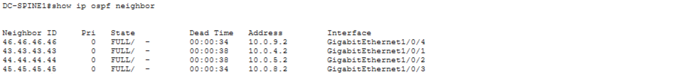

**<a id="p-03"></a> [P-03] · Border Leaf adjacencies + fabric ECMP**: DC-BorderLeaf2, 3 neighbors, then `route 172.16.2.0` via 10.0.9.1 + 10.0.11.1

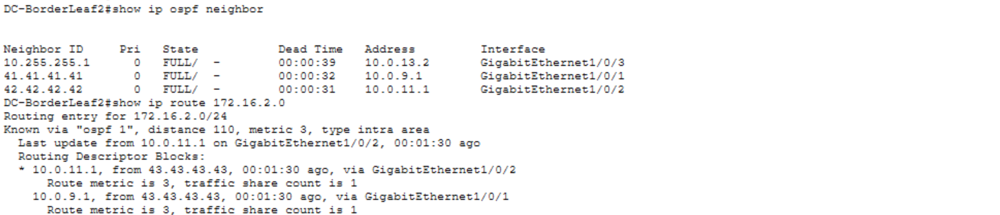

**<a id="p-04"></a> [P-04] · Leaf adjacencies**: DC-Leaf1, 2× `FULL/ -`

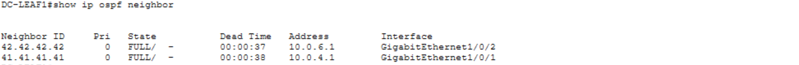

**<a id="p-05"></a> [P-05] · Core adjacencies**: CORE-SW, 5 neighbors (DIST1/2, BL1/2, HQ)

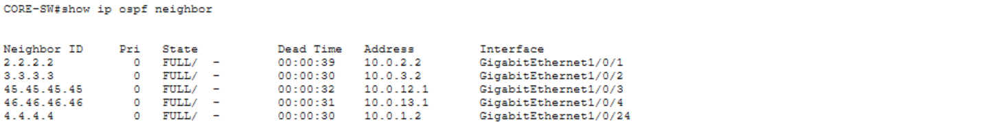

**<a id="p-06"></a> [P-06] · N-S ECMP at the Core**: CORE-SW `route 172.16.2.0` via 10.0.12.1 + 10.0.13.1

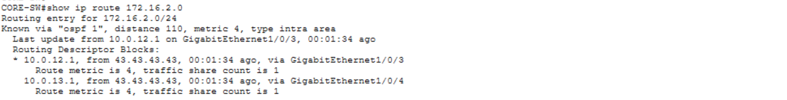

**<a id="p-07"></a> [P-07] · Propagation to the edge**: HQ-Router `O 172.16.2.0` + `O 172.16.3.0`

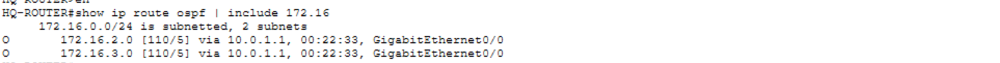

**<a id="p-09"></a> [P-09] · SVI + hardening**: DC-Leaf2 `Vlan220 up/up` + `interface status` (Gi1/0/5=220, rest 998)

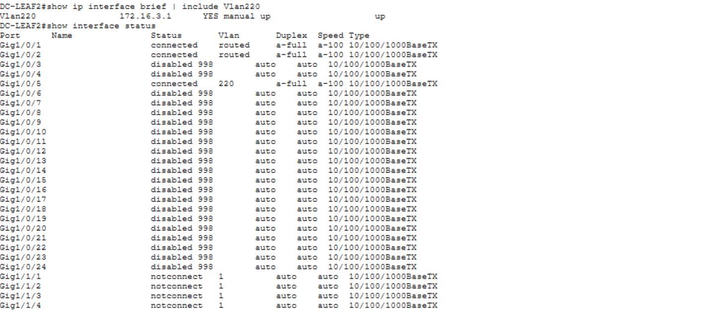

**<a id="p-10"></a> [P-10] · East-West (+ boot timeouts)**: campus PC ping `.2.1` / `.2.12` / `.3.10` (3 timeouts→reply, then 4/4)

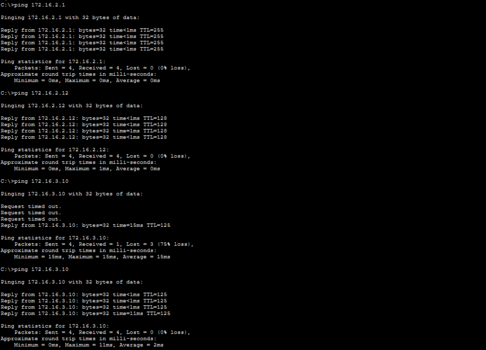

**<a id="p-11"></a> [P-11] · North-South path**: PC1 `tracert .2.11` via 10.0.3.10→10.0.12.1→10.0.9.10→10.0.4.2

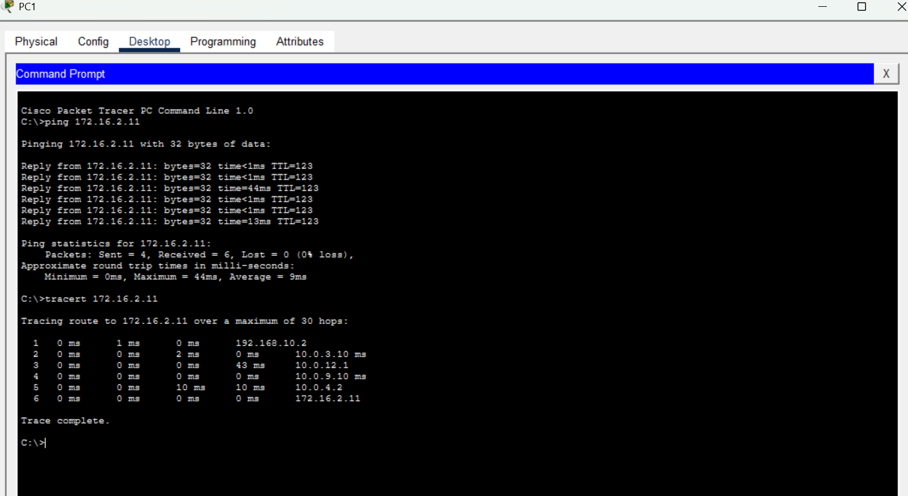

**<a id="p-12"></a> [P-12] · Egress counter**: ASA `show nat`, `DC-NET translate_hits=3, untranslate_hits=2`

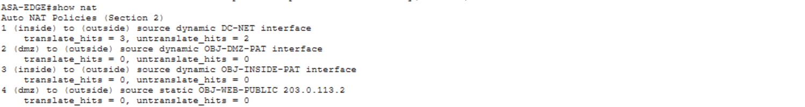

**<a id="p-13"></a> [P-13] · Egress data-plane**: WEB-APP-1 `ping 8.8.8.8` reply `TTL=249`

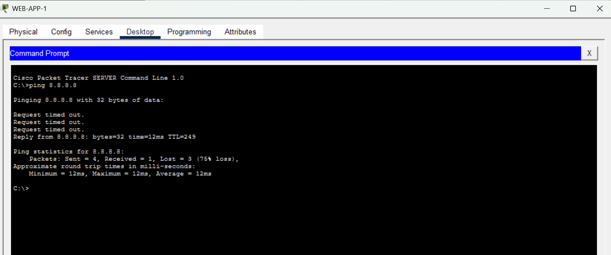

**<a id="p-14"></a> [P-14] · App1 backend**: `http://172.16.2.11` = "Web-App 1"

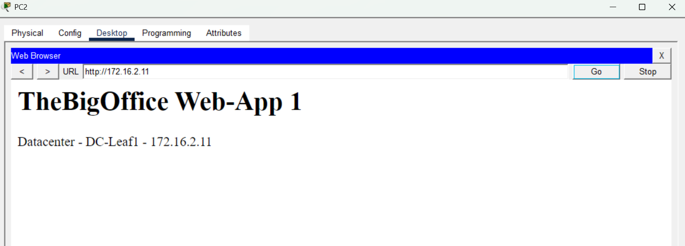

**<a id="p-15"></a> [P-15] · App2 backend (distinct)**: `http://172.16.2.12` = "Web-App 2"

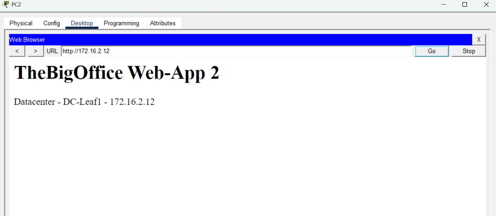

**<a id="p-16"></a> [P-16] · LB (self-documents the debt)**: `http://172.16.2.10` = LB page

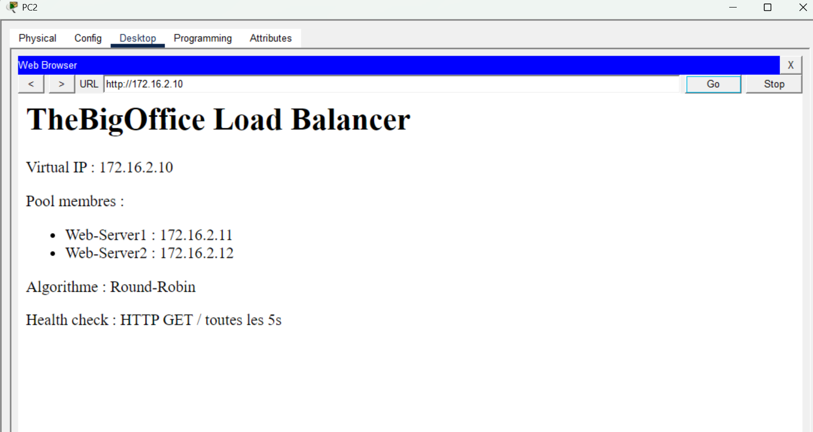

**<a id="p-17"></a> [P-17] · DMZ→APP isolation**: ASA `DMZ-RESTRICT line 5 deny … hitcnt=4`

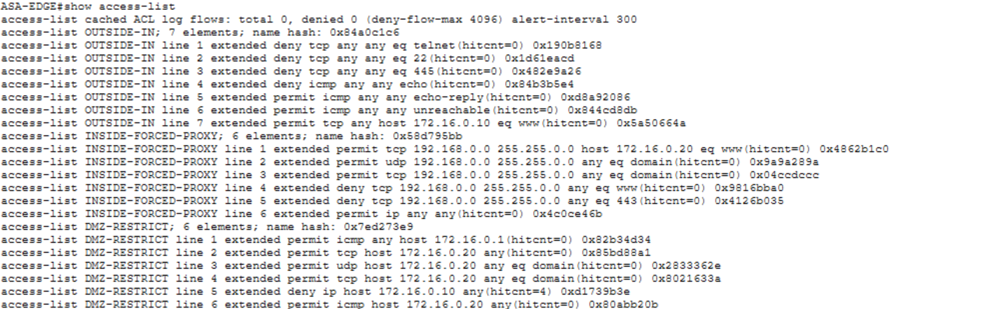

**<a id="p-18"></a> [P-18] · Incident 3: config-mode trap**: `DC-LEAF2(config)# show run interface` → `% Invalid input` ×3

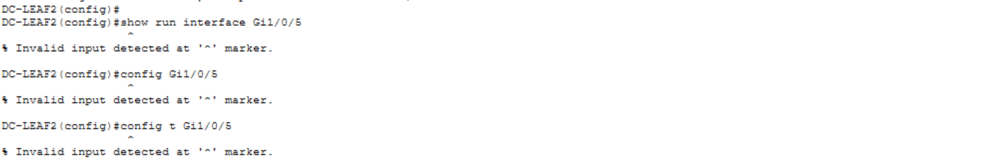

**<a id="p-19"></a> [P-19] · Incident 4: amber/PortFast**: ACC-SW1 `spanning-tree … fa0/3 detail` → "portfast mode", msg age 16

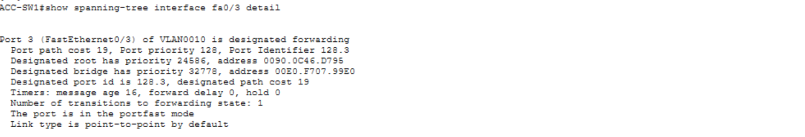

**<a id="p-20"></a> [P-20] · Edge reachability to the DC**: ASA `show route`, `3 subnets`, `S 172.16.2.0` + `S 172.16.3.0`

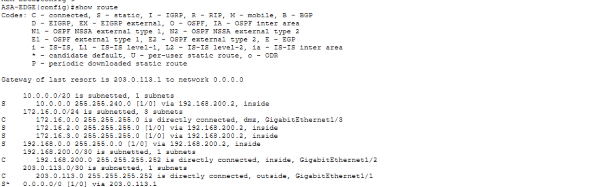

**<a id="p-21"></a> [P-21] · NAT xlate table (context)**: ASA `show xlate`, static WEB-PUBLIC only; the dynamic `DC-NET` entry ages out (egress proven by the counter [P-12])

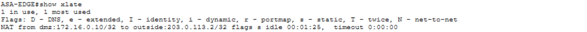

---

⬅️ [Workflow P3](../P3/WORKFLOW.md) · ⬆️ [Contents](#sommaire) · [Part README](./README.md) · [Project overview](../README.md) · **Next: [Workflow P5](../P5/WORKFLOW.md)** – Telephony: CME, DHCP Option 150, QoS.
