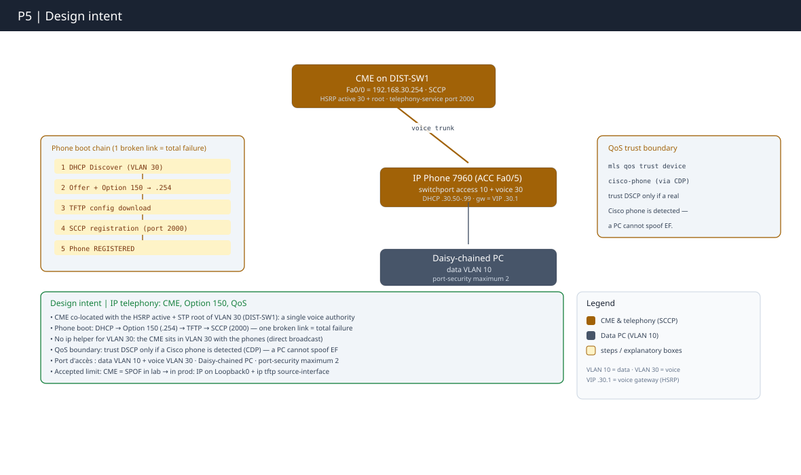

# Partie 5 : Téléphonie IP 

 **Concepts clés** : VOIP; CME, DHCP Option 150, QoS voix · **Certification :** CompTIA Network+  · **Outil :** Cisco Packet Tracer 9.0

- Plan d'adressage complet → [`IPAM.md`](../IPAM.md)
- Progression étape par étape → [`WORKFLOW P5`](./WORKFLOW.md)

---
## Objectif

Déployer la téléphonie IP sur le **VLAN 30 (voix)** avec **Cisco CallManager Express**, en couvrant le cycle de vie complet d'un poste : 

- Provisioning DHCP
- Config par TFTP (Option 150)
- Enregistrement SCCP
- Priorisation QoS

Chaque maillon **prouvé par une commande d'état ou un appel réel**, pas par un écran. 

Le fil directeur est une **chaîne** : DHCP → TFTP → SCCP → registration ; un maillon manquant casse tout, et le symptôme apparaît souvent trois étapes après la cause.

**Contrainte structurante :** 

- Le CME vit sur **DIST-SW1**, déjà HSRP Active + root STP du VLAN 30. Le service suit son Active. 
- Depuis que P4 a passé le Core en full-L3, **le VLAN 30 n'existe plus sur le Core** : la voix est ancrée sur la Distribution, ce qui rend ce placement non négociable. 
- Second pilier : **une seule autorité DHCP par domaine**. HQ-Router pour VLAN 10/20, **CME pour VLAN 30**. La preuve n'est pas que le CME distribue des baux, c'est qu'**aucun autre serveur** ne répond sur le VLAN 30.

**Décision de continuité (héritée de P3):** 

- La boucle ASA est déjà tuée en P3 (résumé `/20` + Null0). 
- P5 **vérifie**, ne reconfigure pas.

---
## Topologie logique

---

## Couverture CompTIA Network+

| Domaine            | Concept                                       | Statut                                    |
| ------------------ | --------------------------------------------- | ----------------------------------------- |
| 🌐 Services réseau | VoIP - appels inter-switch                    | ✅ 1001↔1002 `Connected`                   |
| 🌐 Services réseau | DHCP Option 150 (TFTP)                        | ✅ baux `.50/.51` + opt.150 `.254`         |
| 🌐 Services réseau | Autorité DHCP unique par domaine de broadcast | ✅ HQ (10/20) / CME (30)                   |
| 🌐 Services réseau | IPAM - segmentation du pool                   | ✅ exclusions `.1-.49` + `.100-.254`       |
| 🔌 Commutation     | Voice VLAN + annonce CDP                      | ✅ `Voice VLAN: 30` sur ACC                |
| 🔌 Commutation     | Tag 802.1Q voix / data untagged (un câble)    | ✅                                         |
| 🎚️ QoS            | DSCP EF (46) + latence/gigue/perte            | ✅ marquage voix                           |
| 🎚️ QoS            | Frontière de confiance conditionnelle         | ✅ `trust device cisco-phone`              |
| 📜Protocoles       | SCCP (Skinny) TCP 2000 · TFTP · CDP           | ✅ `REGISTERED in SCCP`                    |
| 🧭 Routage         | Routes alignées sur l'espace alloué           | ✅ résumé `/20` sûr                        |
| 🛡️ Sécurité       | `ip tftp source-interface` (asymétrie TFTP)   | 📋 Documenté (réf. prod, non testable PT) |

---

## Test & validation ✅

- Chaque `✅` cite un `[P-##]` de l'**[Annexe — Captures de preuve du WORKFLOW P5](./WORKFLOW.md#annexe--captures-de-preuve)**
- Un appel est prouvé par un **état** (`Connected`, `REGISTERED`), une joignabilité par un **résultat** (`ping`), jamais par un timeout

| **📞 Voix (ToIP)**            | Résultat / état                                                                     | Preuve                                                                                                                                                  |
| ----------------------------- | ----------------------------------------------------------------------------------- | ------------------------------------------------------------------------------------------------------------------------------------------------------- |
| Appel inter-poste 1001 → 1002 | **`Connected`** (`Ring Out` → `From:1001 ringing` → `Connected`)                    | [P-01](https://claude.ai/chat/WORKFLOW.md#p-01), [P-02](https://claude.ai/chat/WORKFLOW.md#p-02), [P-03](https://claude.ai/chat/WORKFLOW.md#p-03)       |
| Enregistrement SCCP           | `show ephone` = **`REGISTERED in SCCP`**, IP `.50`/`.51`, `button 1: dn 1/2 … IDLE` | [P-04](https://claude.ai/chat/WORKFLOW.md#p-04)                                                                                                         |
| Liaison bouton → DN           | `show run \| section ephone` = `button 1:1` / `1:2` (corrige I-2)                   | [P-05](https://claude.ai/chat/WORKFLOW.md#p-05)                                                                                                         |
| Voice VLAN + tag              | ACC-SW1 `Fa0/5 switchport` = `Access 10 / Voice 30`                                 | [P-10](https://claude.ai/chat/WORKFLOW.md#p-10), [P-10c](https://claude.ai/chat/WORKFLOW.md#p-10c)                                                      |
| Liaison CME                   | `Fa0/0 .254` up/up, `ping .1` 5/5, `show arp` `.1` résolu                           | [P-12a](https://claude.ai/chat/WORKFLOW.md#p-12a), [P-12b](https://claude.ai/chat/WORKFLOW.md#p-12b), [P-12c](https://claude.ai/chat/WORKFLOW.md#p-12c) |

| **🎚️ QoS**        | Résultat / état                                                      | Preuve                                          |
| ------------------ | -------------------------------------------------------------------- | ----------------------------------------------- |
| Trust conditionnel | ACC-SW1 `show mls qos interface Fa0/5` = `trust device: cisco-phone` | [P-11](https://claude.ai/chat/WORKFLOW.md#p-11) |

| **🌐 Services (DHCP)**       | Résultat / état                                                        | Preuve                                                                                             |
| ---------------------------- | ---------------------------------------------------------------------- | -------------------------------------------------------------------------------------------------- |
| DHCP mono-autorité (VLAN 30) | `show ip dhcp binding` (CME) = baux `.50`/`.51` uniquement             | [P-06](https://claude.ai/chat/WORKFLOW.md#p-06), [P-06b](https://claude.ai/chat/WORKFLOW.md#p-06b) |
| Absence d'un 2ᵉ serveur      | HQ-Router `section dhcp` = pools 10/20 seulement, aucun `192.168.30.x` | [P-07](https://claude.ai/chat/WORKFLOW.md#p-07)                                                    |

| **🔁 Haute disponibilité** | Résultat / état                                       | Preuve                                          |
| -------------------------- | ----------------------------------------------------- | ----------------------------------------------- |
| Placement du service       | DIST-SW1 `show standby brief` = `Vl30 … 110 P Active` | [P-08](https://claude.ai/chat/WORKFLOW.md#p-08) |

| **🧭 Routage** | Résultat / état                                                                 | Preuve                                          |
| -------------- | ------------------------------------------------------------------------------- | ----------------------------------------------- |
| Audit résumé   | ASA `show route` = `S 10.0.0.0 255.255.240.0` (un seul `/20`, aucun `/8`/`/16`) | [P-09](https://claude.ai/chat/WORKFLOW.md#p-09) |

### ⚠️ Configuré / limité par PT

|Point|Limite|Réf.|
|---|---|---|
|LB / media stream avancé|hors périmètre (téléphonie basique)|—|
|`ip tftp source-interface Loopback0`|non supporté par PT (réf. prod)|dette D1/D2|

> Un ou plusieurs `Request timed out` sur le **premier** paquet d'un flux frais (ARP/build) ne sont pas une faute. Un poste plus long sur `Configuring CM List` après `reset all` est un délai d'inscription (30-60 s), à distinguer du blocage permanent de I-2 (`button` manquant).

---

## Conclusion

La VoIP m'a appris le raisonnement en chaîne de dépendances : DHCP → Option 150 → TFTP → SCCP est une chaîne où un seul maillon manquant casse tout le poste/.

Comprendre cet ordre, c'est ~90 % du dépannage VoIP. 

Second acquis, plus large que la voix : « une seule autorité DHCP » ne veut pas dire _un_ serveur pour tout le réseau (ce serait un SPOF), mais **une autorité par domaine de broadcast**, et la preuve n'est pas que le serveur distribue des baux, c'est qu'**aucun autre** ne répond sur le segment

---

⬅️ [Partie 4 — Datacenter](../P4/README.md) · ⬆️ **Suivant : [Partie 6 — Wi-Fi](../P6/README.md)** — WLC + APs lightweight (CAPWAP), SSID WPA2 Corp/Guest, HSRPv2 VLAN 300, architecture hybride assumée (data plane par AP autonome). · [Vue d'ensemble du projet](../README.md)
