# Partie 5 — Workflow :

 **Concepts clés** : VOIP; CME, DHCP Option 150, QoS voix · **Certification :** CompTIA Network+  · **Outil :** Cisco Packet Tracer 9.0

Implantation et configurations réalisées :  

- CME sur **DIST-SW1** (Active + root VLAN 30) 
- `Fa0/0 = 192.168.30.254` · DHCP `VOIP_PHONES` baux `.50-.99` + `option 150 → .254` 
- `telephony-service` `ip source-address .254 port 2000` 
- `ephone-dn 1001/1002` liés par `button 1:1` / `1:2` 
- Postes 7960 sur ACC `Fa0/5` en data 10 + voice 30 · QoS `trust dscp` + `trust device cisco-phone`.

Plan d'adressage complet → [`IPAM.md`](../IPAM.md).

---
## Topologie As-Built

Schéma PT : téléphonie - CME, VLAN voix, IP phones

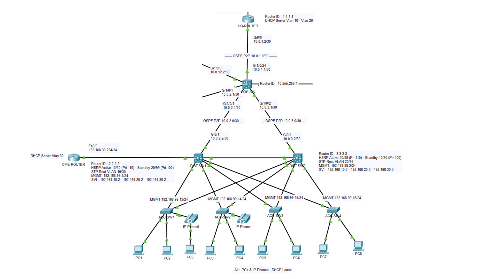

---

## Niveaux & équipements

| Rôle | Équipement | Rôle dans la partie |
|---|---|---|
| Agent d'appel + DHCP + TFTP | **CME-Router** (2811) — *nouveau* | `telephony-service` (SCCP), pool DHCP VLAN 30, serveur TFTP (option 150) — un seul boîtier pour les trois fonctions |
| Distribution (hôte du service) | **DIST-SW1** (3560-24PS) | Reçoit le CME sur `Fa0/10` (access VLAN 30). Déjà HSRP Active + root STP du VLAN 30. **Inchangé sinon.** |
| Access (postes) | **ACC-SW1 / ACC-SW2** | Port `Fa0/5` en data VLAN 10 + voice VLAN 30 + QoS trust conditionnel |
| Postes | **IP Phone 1001 / 1002** (7960) — *nouveaux* | S'enregistrent en SCCP, un PC se branche derrière (un câble, deux VLAN) |
| Périmètre (contrôle) | **ASA / HQ-Router** | Non reconfigurés — on **vérifie** seulement le résumé `/20` sûr et l'absence de pool VLAN 30 sur le HQ |

Tout le campus P1/P2, le périmètre P3 et le datacenter P4 sont **inchangés** — P5 n'ajoute que le CME, deux postes et la config voix des ports.

---

## Étapes de configuration

```
[0] Pré-P5 — VÉRIFIER (ne pas reconfigurer) : boucle ASA déjà tuée en P3 (résumé /20 + Null0 AD 254)
[1] Rattacher le CME-Router à DIST-SW1 (port access VLAN 30)
[2] Config de base du CME (interface + route par défaut)
[3] DHCP + Option 150 sur le CME (autorité UNIQUE du VLAN 30)
[4] telephony-service + ephone-dn + ephone/button (extensions 1001-1002)
[5] Ports téléphones sur les Access (data VLAN 10 + voice VLAN 30)
[6] QoS — trust conditionnel (trust dscp + trust device cisco-phone)
```

---

### Step 0 — Vérifier le routage ASA (aucune reconfiguration)

**Intention :** confirmer que le résumé `/20` de P3 est toujours sûr. Vérification seule.

```cisco
! ===== ASA =====
show route | include inside
! Attendu : S 10.0.0.0 255.255.240.0  (un seul résumé /20 ; PAS de /8, PAS de /16)
! ===== HQ-Router =====
show run | include Null0
! Attendu : ip route 10.0.0.0 255.255.240.0 Null0 254  (verrou des trous du /20)
```

> 📷 **[P-09](#p-09)** ASA `show route` : `S 10.0.0.0 255.255.240.0`, aucun `/8`/`/16`.

---

### Step 1 — Rattacher le CME au VLAN 30 (sur DIST-SW1)

**Intention :** brancher le CME sur le switch qui est root STP + HSRP Active du VLAN 30.

```cisco
! ===== DIST-SW1 =====
enable
configure terminal
interface FastEthernet0/10
 description CME-Router_VLAN30
 switchport mode access
 switchport access vlan 30
 spanning-tree portfast
 no shutdown
end
write memory
```

> ⚠️ **Incident I-1 :** le port peut rester `Down` **malgré** cette config si l'interface d'en face (CME `Fa0/0`) est en `shutdown`. Configurer un port ne crée pas le lien physique.

**Vérif :** `show interfaces status Fa0/10` → `connected`, VLAN `30`. Placement confirmé par `show standby brief` → `Vl30 … Active` sur DIST-SW1.

> 📷 **[P-08](#p-08)** DIST-SW1 `show standby brief` : `Vl30 30 110 P Active`.

---

### Step 2 — Config de base du CME (interface + route par défaut)

**Intention :** IP du service sur `Fa0/0`, route par défaut vers la VIP HSRP.

```cisco
! ===== CME-Router =====
enable
configure terminal
hostname CME-Router
interface FastEthernet0/0
 description VLAN30_VoIP
 ip address 192.168.30.254 255.255.255.0
 no shutdown                              ! ← les interfaces routeur naissent SHUTDOWN
exit
ip route 0.0.0.0 0.0.0.0 192.168.30.1     ! passerelle = VIP HSRP (survit au failover DIST1→DIST2)
end
write memory
```

**Vérif :**

```cisco
show ip interface brief      ! Fa0/0 = 192.168.30.254 up/up
ping 192.168.30.1            ! atteint la VIP HSRP (DIST-SW1 vivant)
show arp                     ! .1 résolu = VLAN 30 présent sur la Distribution
```

> 📷 **[P-12a](#p-12a)** `Fa0/0 .254 up/up` · **[P-12b](#p-12b)** `ping .1` = 5/5 · **[P-12c](#p-12c)** `show arp` (`.1` résolu).

---

### Step 3 — DHCP + Option 150 (autorité UNIQUE du VLAN 30)

**Intention :** pool voix confiné en `.50-.99`, option 150 = IP propre du CME.

```cisco
! ===== CME-Router =====
configure terminal
ip dhcp excluded-address 192.168.30.1 192.168.30.49
ip dhcp excluded-address 192.168.30.100 192.168.30.254
ip dhcp pool VOIP_PHONES
 network 192.168.30.0 255.255.255.0
 default-router 192.168.30.1        ! = VIP HSRP (pas l'IP du CME) → passerelle des phones survit à un failover
 option 150 ip 192.168.30.254       ! adresse TFTP = IP PROPRE du CME
end
write memory
```

> **Ce que tu NE fais PAS** (garantit « une seule autorité DHCP sur le VLAN 30 ») : aucun `ip helper-address` sur le SVI 30 des DIST (le CME est **dans** le VLAN 30, broadcast direct) ; aucun `ip dhcp pool 192.168.30.x` sur le HQ-Router (sinon 2 serveurs sur le même domaine → conflit).

**Vérif (une fois les phones bootés) :**

```cisco
show ip dhcp pool            ! pool VOIP_PHONES, exclusions
show ip dhcp binding         ! baux .50 / .51, "Automatic", tous issus du CME
```

Preuve d'absence de 2e serveur, côté HQ-Router : `show run | section dhcp` = pools `VLAN10`/`VLAN20` seulement, aucun `192.168.30.x`.

> 📷 **[P-06](#p-06)** baux `.50`/`.51` · **[P-06b](#p-06b)** pool `VOIP_PHONES` · **[P-07](#p-07)** HQ-Router : pools 10/20 seulement.

---

### Step 4 — Call-control + numéros + boutons (telephony-service)

**Intention :** déclarer les DN, les ephones, et **lier** un bouton à un DN — l'étape dont l'oubli bloque le poste (Incident I-2).

```cisco
! ===== CME-Router =====
configure terminal
telephony-service
 max-ephones 10
 max-dn 10
 ip source-address 192.168.30.254 port 2000    ! IP DU CME, jamais la VIP .1
 auto assign 1 to 10                            ! DOIT exister AVANT la 1re inscription des postes
 exit
! --- Directory numbers (les extensions) ---
ephone-dn 1
 number 1001
 exit
ephone-dn 2
 number 1002
 exit
! --- ephones + LIAISON bouton→DN (l'étape oubliée) ---
ephone 1
 mac-address 0001.42BC.87D4
 button 1:1                                     ! bouton 1 du poste → ephone-dn 1 (1001)
 exit
ephone 2
 mac-address 0001.C925.A973
 button 1:2                                     ! bouton 1 du poste → ephone-dn 2 (1002)
 exit
telephony-service
 reset all                                      ! force les postes à se ré-enregistrer proprement
end
write memory
```

> ⚠️ **Piège `ip source-address` :** le mettre sur la VIP `.1` → le poste ouvre TCP 2000 vers un switch de Distribution qui ne fait pas de SCCP → jamais enregistré. Le SCCP écoute sur l'IP réelle du CME (`.254`).
> ⚠️ **Piège `button` (I-2) :** sans `button 1:X`, `show ephone` affiche `UNREGISTERED / IP:0.0.0.0 / button 1: dn CH1 DOWN` et l'écran boucle sur « Configuring CM List ». `auto assign` ne rattrape **pas** des ephones déjà auto-créés sans bouton → assignation **explicite** obligatoire, puis `reset all`.

**Vérif :**

```cisco
show run | section ephone    ! ephone-dn 1001/1002 + ephone 1/2 avec "button 1:1" / "button 1:2"
show ephone                  ! REGISTERED in SCCP, IP .50/.51, "button 1: dn 1 number 1001 ... IDLE"
```

> 📷 **[P-05](#p-05)** `show run | section ephone` (button 1:1/1:2, corrige I-2) · **[P-04](#p-04)** `show ephone` (`REGISTERED in SCCP`).

---

### Step 5 — Ports téléphones sur les Access (data 10 + voice 30)

**Intention :** un câble, deux VLAN — PC en data 10 (untagged), poste en voice 30 (tagué 802.1Q via CDP).

> **Note quarantaine (Incident I-3) :** `Fa0/5` a été trouvé en VLAN 998 + `shutdown` (quarantaine appliquée plus large que le plan `0/20-24`). Pas d'étape séparée : `switchport access vlan 10` **écrase** le 998 et `no shutdown` annule la quarantaine.

```cisco
! ===== ACC-SW1 (idem ACC-SW2) =====
configure terminal
interface FastEthernet0/5
 description IP-Phone
 switchport mode access
 switchport access vlan 10          ! data — REMPLACE le VLAN 998 (PC derrière le phone, untagged)
 switchport voice vlan 30           ! voix (phone, tagué 802.1Q 30 via CDP)
 spanning-tree portfast
 spanning-tree bpduguard enable
 no shutdown                        ! réveille le port (était éteint en quarantaine)
end
write memory
```

> ⚠️ **Ne recopie PAS `no cdp enable` ici.** Un port **phone** a besoin du CDP **allumé** : c'est lui qui annonce le voice-VLAN au poste et arme `trust device cisco-phone` (Step 6). CDP coupé = poste bloqué sur « Configuring vlan ».
> ⚠️ **Sans `switchport voice vlan 30`** : pas d'annonce voice-VLAN → écran bloqué sur « Configuring vlan », binding DHCP vide. Le symptôme apparaît **trois étapes après** la cause.

**Vérif :**

```cisco
show interfaces Fa0/5 switchport | include Access|Voice   ! Access VLAN 10, Voice VLAN 30
show vlan brief                                           ! Fa0/5 en 10 et 30, plus en 998
```

> 📷 **[P-10](#p-10)** ACC-SW1 `switchport` (Access 10 / Voice 30) · **[P-10b](#p-10b)** `vlan brief` (preuve D6) · **[P-10c](#p-10c)** symétrie ACC-SW2.

---

### Step 6 — QoS : trust conditionnel (frontière liée au CDP)

**Intention :** ne croire le DSCP EF que si un vrai phone Cisco est détecté par CDP.

```cisco
! ===== ACC-SW1 (idem ACC-SW2) =====
configure terminal
mls qos                              ! moteur QoS global — PRÉREQUIS souvent oublié
interface FastEthernet0/5
 mls qos trust dscp                  ! sans ceci : aucun type de trust à appliquer
 mls qos trust device cisco-phone    ! DSCP EF cru SEULEMENT si vrai phone Cisco détecté par CDP
end
write memory
```

| Scénario | `trust dscp` seul | `trust dscp` + `trust device cisco-phone` |
|---|---|---|
| Vrai phone Cisco | Trust DSCP ✅ | Trust DSCP ✅ (après CDP) |
| PC branché direct | Trust DSCP ❌ (falsifiable) | **Non trusté** ✅ |
| PC derrière le phone | Trust DSCP ❌ (falsifiable) | **Non trusté** ✅ |

**Vérif :** `show mls qos interface Fa0/5` → `trust device: cisco-phone`, `trust state: trust dscp`.

> 📷 **[P-11](#p-11)** ACC-SW1 `show mls qos interface Fa0/5` : `trust device: cisco-phone`.

---

## Séquence de boot d'un poste (où l'écran LCD bloque)

| Écran LCD | Signification | Cause si bloqué ici |
|---|---|---|
| `Configuring vlan` | Attend l'annonce voice-VLAN en CDP | `switchport voice vlan 30` manquant, ou CDP coupé (Step 5) |
| `Configuring IP` | DHCP en cours | Pool / Option 150 (Step 3) ou joignabilité VLAN 30 |
| `Updating` | Téléchargement config par TFTP | Option 150 mauvaise, ou asymétrie TFTP (dette D2, réf. prod) |
| `Configuring CM List` | Ouverture session SCCP (TCP 2000) | `ip source-address` = VIP au lieu de l'IP CME **OU** `button` manquant (I-2) |

---

## Validation de bout en bout (gate final)

La chaîne complète, de l'héritage P3 à l'appel — chaque maillon prouvé par un état ou un appel.

| Maillon | Commande clé | Attendu | Preuve |
|---|---|---|---|
| Routage (héritage P3) | ASA `show route \| include inside` | `S 10.0.0.0/20`, aucun `/8`/`/16` | [P-09](#p-09) |
| Placement du service | DIST-SW1 `show standby brief` | `Vl30 … Active` | [P-08](#p-08) |
| Liaison CME | CME `show ip int brief` + `ping .1` + `show arp` | `Fa0/0 .254 up/up`, `.1` résolu | [P-12a](#p-12a), [P-12b](#p-12b), [P-12c](#p-12c) |
| DHCP mono-autorité | CME `show ip dhcp binding` + HQ `show run \| sect dhcp` | baux `.50`/`.51` (CME seul), aucun pool 30 sur HQ | [P-06](#p-06), [P-07](#p-07) |
| Voice VLAN + tag | ACC `show int Fa0/5 switchport` | Access 10 / Voice 30 | [P-10](#p-10), [P-10c](#p-10c) |
| QoS trust conditionnel | ACC `show mls qos interface Fa0/5` | `trust device: cisco-phone` | [P-11](#p-11) |
| Enregistrement SCCP | CME `show ephone` + `show run \| section ephone` | `REGISTERED in SCCP`, `button 1:1`/`1:2` | [P-04](#p-04), [P-05](#p-05) |
| **Appel bout-en-bout** | 1001 → 1002 | `Ring Out` → `ringing` → `Connected` | [P-01](#p-01), [P-02](#p-02), [P-03](#p-03) |

> Un ou plusieurs `Request timed out` sur le **premier** paquet (ARP/build) ne sont pas une faute. Un poste qui reste sur `Configuring CM List` après un `reset all` est un simple délai d'inscription (30-60 s), **pas** le blocage permanent de l'incident I-2 (qui, lui, vient d'un `button` manquant).

---

## Dépannage (incidents de session)

> Incidents réellement rencontrés, avec le diagnostic qui a attrapé chacun. **Pas** des dettes ; chacun corrigé le jour même.

| # | Symptôme | Cause racine | Diagnostic | Correctif |
|---|---|---|---|---|
| **I-1** | DIST-SW1 `Fa0/10` reste `Down` alors que la CLI a été tapée | Interface `Fa0/0` du CME laissée en `shutdown` (les interfaces **routeur** naissent éteintes) | `show ip interface brief` sur le CME | `no shutdown` sur CME `Fa0/0` — le lien monte des deux côtés |
| **I-2** | Postes bloqués sur « Configuring CM List » [P-14](#p-14) ; `show ephone` = `UNREGISTERED`, `IP:0.0.0.0` [P-13](#p-13) | ephones auto-créés **sans ligne `button`** [P-15](#p-15) → aucun DN présenté | `show run \| section ephone` → pas de `button 1:X` | Ajouter `button 1:1` / `1:2` explicites, puis `reset all` — corrigé = [P-05](#p-05) |
| **I-3** | `Fa0/5` trouvé en VLAN 998 + `shutdown` | Quarantaine appliquée plus large (`0/5-24`) que le plan (`0/20-24`) | `show vlan brief` → `Fa0/5` sous 998 | Réaffecté en `access 10` + `voice 30` ; sans impact — voir dette **D6** |

> **Point de conception clarifié (pas un incident) :** « tout centraliser sur un seul DHCP au HQ-Router » écarté. Un DHCP global = SPOF de tout l'adressage (data + voix) sur le boîtier le plus exposé. La voix reste locale au CME pour booter sans dépendre du routage campus. Décision : **une autorité par domaine**.

**Commandes de référence :**

```cisco
! CME       : show ip interface brief · show ip dhcp binding · show ip dhcp pool
!             show run | section telephony-service · show run | section ephone · show ephone
! Access    : show interfaces Fa0/5 switchport · show vlan brief · show mls qos interface Fa0/5
! Dist      : show standby brief          (VLAN 30 = DIST-SW1 Active)
! ASA / HQ  : show route | include inside · show run | section dhcp  (pools 10/20 seulement)
```

---

## 5. Registre d'erreurs & dette technique (état final) — SOURCE UNIQUE

> État final. Identifiants **stables et cités ailleurs** (`A1` référencée par README_P5/P6, `D1–D6`, `I-1..I-3`) — ne pas renuméroter.

**Décisions de conception & pièges navigués**

| Réf. | Décision retenue (et le piège qu'elle évite) | Statut |
|---|---|---|
| A1 | CME sur DIST-SW1 (Active + root VLAN 30), pas sur un Access → évite le SPOF matériel | ✅ |
| A2 | Trust QoS conditionnel : `trust device cisco-phone` → DSCP EF cru seulement pour un vrai phone Cisco | ✅ |
| B1 | Résumé ASA `/20` audité sûr : aucun `/8`/`/16`, verrou Null0 posé en P3 | ✅ |
| B2 | Pool DHCP restreint à `.50-.99` (exclusions `.1-.49` et `.100-.254`) | ✅ |
| B3 | PortFast = port access uniquement (pas un anti-flap de trunk) | ✅ |
| B4 | Aucun `ip helper-address` sur le VLAN 30 : le CME est dans le VLAN, broadcast direct | ✅ |

**Incidents de session — résolus**

| Réf. | Description | Domaine | Statut |
|---|---|---|---|
| I-1 | CME `Fa0/0` laissé en `shutdown` → lien down | 🟠 Physique | ✅ `no shutdown` |
| I-2 | `button` bouton→DN manquant → postes UNREGISTERED (le piège central) | 🟠 SCCP | ✅ `button 1:1` / `1:2` + `reset all` |
| I-3 | `Fa0/5` parqué en 998 (quarantaine trop large) | 🟢 Plan | ✅ Réaffecté ; débordement noté en D6 |

**Dettes assumées — documentées, non corrigées**

| Réf. | Dette | Domaine | Statut |
|---|---|---|---|
| D1 | CME sur DIST-SW1 = SPOF résiduel (Loopback + `ip tftp source-interface Loopback0` non supportés en PT) | 🟠 Haute disponibilité | 📋 Dette PT — prod = service sur Loopback |
| D2 | Service TFTP unique, pas de backup | 🟢 Services | 📋 Documenté |
| D3 | VLAN 30 étendu en L2 → flap de trunk (hors périmètre PortFast) | 🟢 STP | 📋 Atténué par RSTP |
| D4 | Postes 1003/1004 non déployés (2 sur 4) | 🟢 Scope | 🔜 Extension possible |
| D5 | Résumés `192.168.0.0/16` et `172.16.0.0/20` = exposition résiduelle | 🟠 Routage | 📋 OSPF sur l'ASA = correctif définitif |
| D6 | Quarantaine 998 appliquée à `Fa0/5-24` au lieu de `0/20-24` | 🟢 Plan | 📋 Écart — auditer `show interfaces status \| include 998` |

> **Réf. prod (le piège « Updating » hors PT) :** IP du service CME sur `Loopback0` + `ip tftp source-interface Loopback0`. Sans ça, le routeur peut répondre au TFTP depuis l'IP de son interface physique de sortie ; un poste qui attend `.254` rejette le paquet asymétrique et reste bloqué sur « Updating ».

---

## Annexe — Captures de preuve

> Une capture **canonique** par affirmation ; les vérifs par step et le gate citent le `[P-##]`. Fichiers `Captures_P5_##.png`. Embeds Obsidian.

**Validation**

**<a id="p-01"></a> [P-01] · Appel émis** — Phone 1001 `To: 1002 / Ring Out`

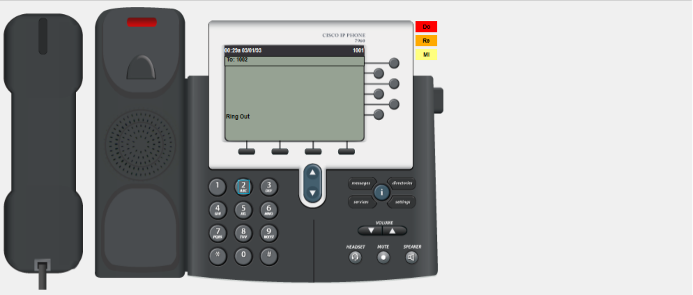

**<a id="p-02"></a> [P-02] · Appel reçu (SCCP)** — Phone 1002 `From: 1001 / ringing`

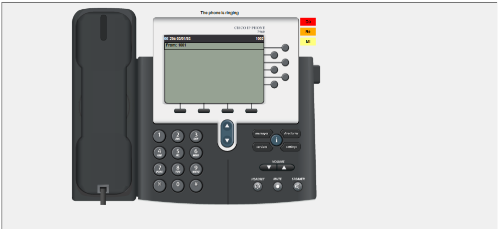

**<a id="p-03"></a> [P-03] · Média établi** — Phone 1002 `Connected`

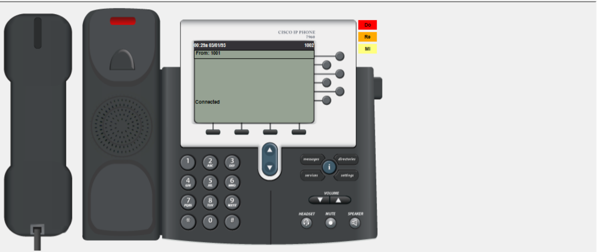

**<a id="p-04"></a> [P-04] · Enregistrement SCCP** — CME `show ephone` : `REGISTERED in SCCP`, IP `.50`/`.51`, `button 1: dn 1/2 … IDLE`

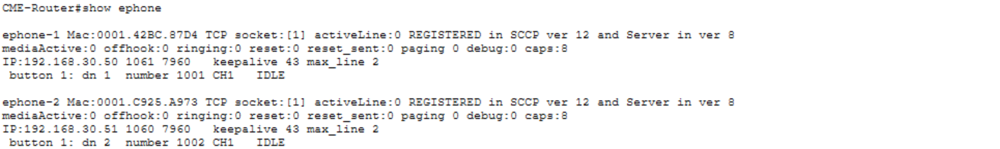

**<a id="p-05"></a> [P-05] · button→DN (corrige I-2) + telephony-service** — CME `show run | section ephone` : `ip source-address .254`, `max 10`, `ephone 1/2` avec `button 1:1`/`1:2`, `type 7960`

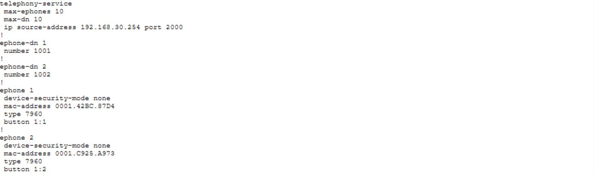

**<a id="p-06"></a> [P-06] · DHCP baux** — CME `show ip dhcp binding` : `.50`/`.51` `Automatic`

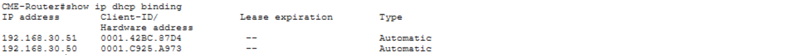

**<a id="p-06b"></a> [P-06b] · DHCP pool** — CME `show ip dhcp pool` : `VOIP_PHONES`

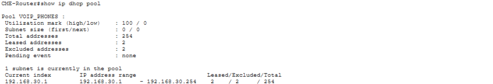

**<a id="p-07"></a> [P-07] · Absence de 2e serveur DHCP** — HQ-Router `show run | section dhcp` : `VLAN10`/`VLAN20` seulement

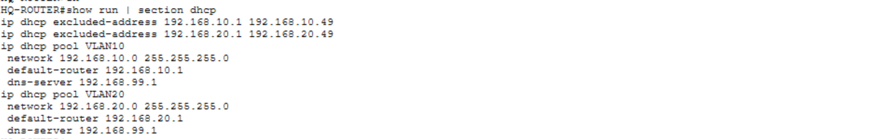

**<a id="p-08"></a> [P-08] · Placement du service** — DIST-SW1 `show standby brief` : `Vl30 30 110 P Active`

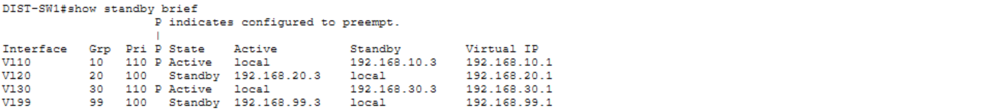

**<a id="p-09"></a> [P-09] · Audit résumé clos** — ASA `show route` : `S 10.0.0.0 255.255.240.0`, aucun `/8`/`/16`

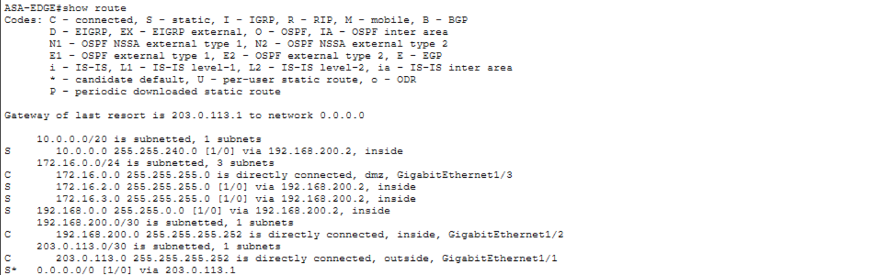

**<a id="p-10"></a> [P-10] · Voice VLAN (ACC-SW1)** — `show interfaces Fa0/5 switchport` : `Access 10 / Voice 30`

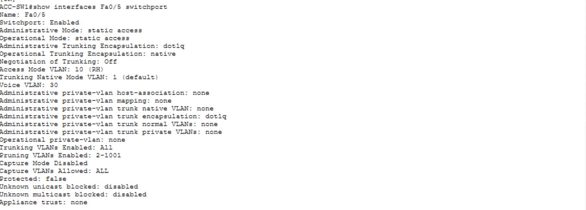

**<a id="p-10b"></a> [P-10b] · VLAN brief + preuve D6** — ACC-SW1 `show vlan brief` : `Fa0/5` en 10 et 30

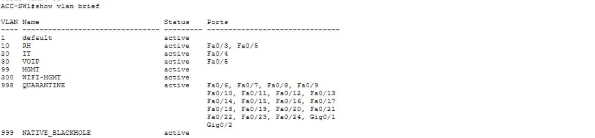

**<a id="p-10c"></a> [P-10c] · Symétrie 2e poste (ACC-SW2)** — `show interfaces Fa0/5 switchport` : `Access 10 / Voice 30`

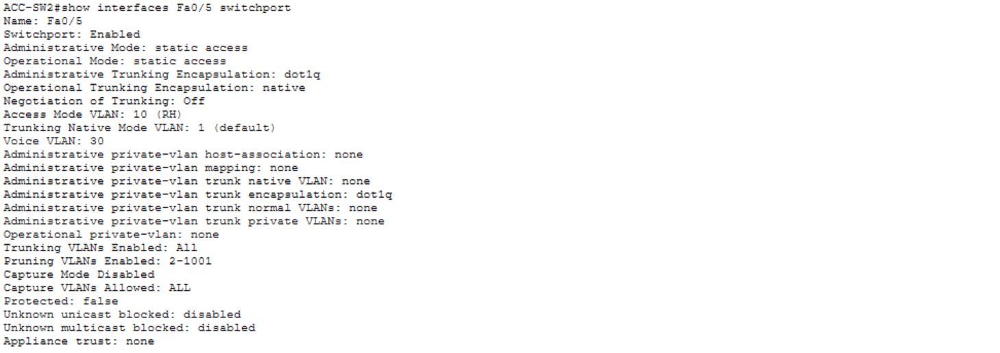

**<a id="p-11"></a> [P-11] · QoS trust conditionnel** — ACC-SW1 `show mls qos interface Fa0/5` : `trust device: cisco-phone`

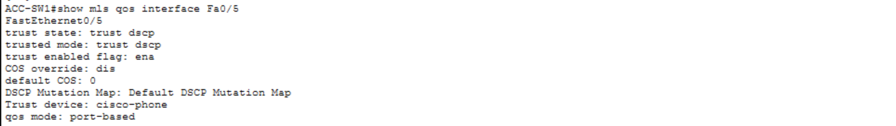

**<a id="p-12a"></a> [P-12a] · Liaison CME (interface)** — CME `show ip interface brief` : `Fa0/0 .254 up/up`

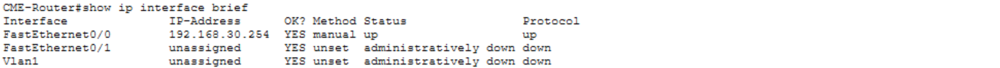

**<a id="p-12b"></a> [P-12b] · Liaison CME (ping)** — CME `ping 192.168.30.1` = 5/5

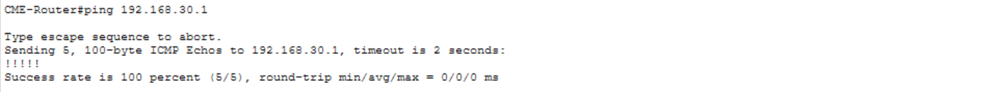

**<a id="p-12c"></a> [P-12c] · Liaison CME (ARP)** — CME `show arp` : `.1` et `.254` résolus

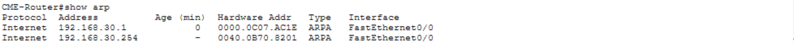

**Incidents (état *avant* correction — jamais en validation)**

**<a id="p-13"></a> [P-13] · I-2 symptôme (SCCP)** — CME `show ephone` : `UNREGISTERED`, `IP:0.0.0.0`, `button 1: dn CH1 DOWN`

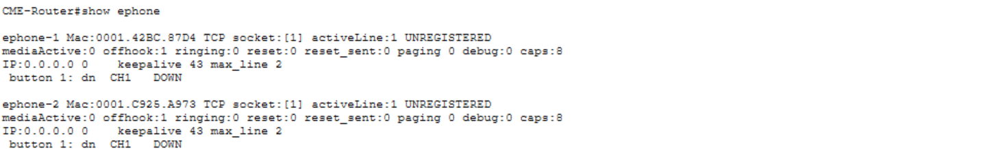

**<a id="p-14"></a> [P-14] · I-2 symptôme (LCD)** — Phone bloqué sur `Configuring CM List`

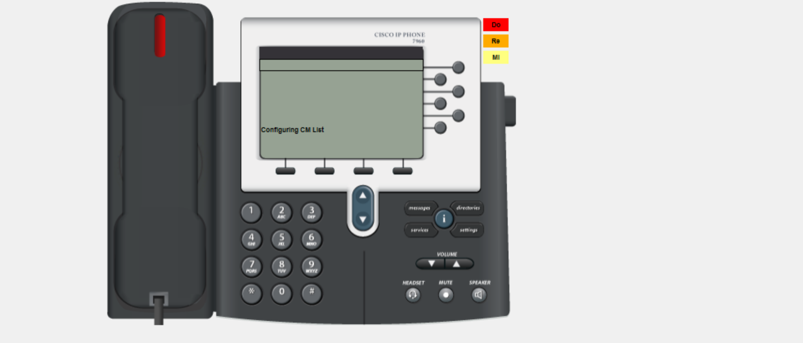

**<a id="p-15"></a> [P-15] · I-2 cause** — CME `show run | section ephone` **sans** ligne `button`

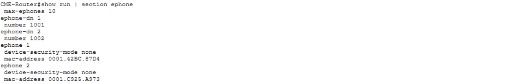

> **Écartées au triage :** `Captures_P5_26` (doublon de 27), `_17` (doublon de 10), `_24` (ping 4/5 dégradé), `_16` (redondant avec 21), `_12` (telephony-service tronqué), `_8`/`_9` (postes au repos).

---

⬆️ [README de la partie](./README.md) · [Vue d'ensemble du projet](../README.md) — Suivant : [WORKFLOW Partie 6](../P6/WORKFLOW.md) (Wi-Fi : WLC, APs, HSRPv2 VLAN 300, DHCP 300 sur DIST-SW1).
