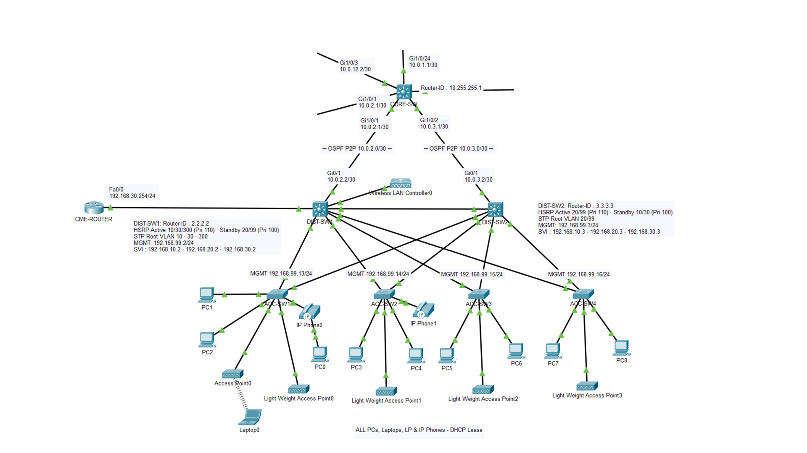

# Part 6: Workflow 

 **Key concepts**: WLC · lightweight APs · CAPWAP · WPA2 Corp/Guest SSID · HSRPv2 VLAN 300

- 💻 **Tool**: Cisco Packet Tracer 9.0
- 🏷️ Full addressing plan → [IPAM](../IPAM.md)
- 📄 Part 6 overview → [README P6](./README.md)
- 🎓 **Certification:** CompTIA Network+


## <a id="sommaire"></a>Contents

**1. Scope**

- [As-Built Topology](#topologie-as-built)
- [Tiers & equipment](#niveaux--équipements)

**2. Configuration steps**

- [Step 1: Wi-Fi VLANs](#step-1--vlans-wi-fi)
- [Step 2: Trunk extension](#step-2--extension-des-trunks)
- [Step 3: VLAN 300 SVIs + HSRPv2](#step-3--svis-vlan-300--hsrpv2)
- [Step 4: VLAN 300 STP](#step-4--stp-vlan-300)
- [Step 5: VLAN 300 DHCP](#step-5--dhcp-vlan-300)
- [Step 6: WLC 3504 (reference)](#step-6--wlc-3504)
- [Step 7: Generic WLC port](#step-7--port-du-generic-wlc)
- [Step 8: WLANs (Corp + Guest)](#step-8--wlans)
- [Step 9: LAP: CAPWAP + hardening](#step-9--lap-capwap-hardening)
- [Step 10: Autonomous AP](#step-10--ap-autonome)
- [Step 11: Client validation](#step-11--validation-client)

**3. Evidence & closure**

- [End-to-end validation](#validation-de-bout-en-bout-gate-final)
- [Troubleshooting (session incidents)](#dépannage-incidents-de-session)
- [Error log & technical debt](#registre-derreurs--dette-technique)
- [Appendix: Evidence captures](#annexe--captures-de-preuve)

# 1. Scope

## <a id="topologie-as-built"></a>As-Built Topology

PT diagram: wireless – WLC + LWAP, VLAN 300



## <a id="niveaux--équipements"></a>Tiers & equipment

| Role                      | Equipment                             | Role in this part                                                                                    |
| ------------------------- | ------------------------------------- | ---------------------------------------------------------------------------------------------------- |
| Wi-Fi controller          | **Generic WLC** - *new*               | Registers the 4 LAPs over CAPWAP, broadcasts Corp/Guest. Mgmt `.200`. **100% GUI** config.           |
| Distribution (host)       | **DIST-SW1** (3560)                   | WLC on `Fa0/5` (300). SVI 300 Active + root. `VLAN300` DHCP pool. **VLAN 30 unchanged.**             |
| Distribution (redundancy) | **DIST-SW2** (3560)                   | SVI 300 Standby. **Otherwise unchanged.**                                                            |
| Access (APs)              | **ACC-SW1 → ACC-SW4**                 | `Fa0/7` = LAP (300 + hardening). `Fa0/6` (SW1) = autonomous AP. `Fa0/5` = **P5 voice phone, untouched.** |
| Lightweight APs           | **4× LAP** (3702i-class): *new*       | CAPWAP to the WLC `.200`. Leases `.10-.13`.                                                          |
| Autonomous AP             | **Access Point0** (AP-PT): *new*      | `TheBigOffice-Corp-Auto`, 2.4 GHz ch.6, WPA2-PSK. **Only working client data plane in PT.**          |
| Test client               | **Laptop0** (WPC300N, 2.4 GHz)        | DHCP `.14`, proves Wi-Fi → wired.                                                                    |

The whole P1/P2 campus, the P3 perimeter, the P4 datacenter and the P5 voice are **unchanged**: P6 only adds VLANs 300/301/310, the WLC, the APs and the client.

**As-built cabling** (subnets → [`IPAM.md`](../IPAM.md)): 

- WLC `Gi0` → **DIST-SW1 `Fa0/5`** (access 300, *deviation DV1: plan aimed at `Fa0/6`*)
- LAP-0→3 → **ACC-SW1→4 `Fa0/7`** (*fixed I-1: original plan `Fa0/5` = voice-phone collision*) 
- Autonomous AP `Port 0` → **ACC-SW1 `Fa0/6`** 
- Laptop0 (WLAN) → autonomous AP (bridge). Each ACC's `Fa0/5` stays the 7960 phone (data 10 + voice 30), never overwritten
- DIST-SW1's `Fa0/10` stays the CME.

# 2. Configuration steps

### <a id="step-1--vlans-wi-fi"></a>Step 1: Wi-Fi VLANs

**Intent:** VLAN 300 everywhere; 301/310 **only on the Distribution** (logical VLANs for WLC interfaces: no physical Access port will carry them).

```cisco
! DIST-SW1 and DIST-SW2

enable
configure terminal

 vlan 300
  name WIFI-AP-MGMT
 vlan 301
  name WIFI-CORP
 vlan 310
  name WIFI-GUEST
  
 end
write memory
```

```cisco
! ACC-SW1 → ACC-SW4 (VLAN 300 only)

enable
configure terminal

 vlan 300
  name WIFI-AP-MGMT
  
 end
write memory
```

**Validation:** `show vlan brief` → 300 active everywhere, 301/310 on DIST only.

> 📷 **[P-02](#p-02)/[P-03](#p-03)** DIST · **[P-01](#p-01)** ACC.

---
### <a id="step-2--extension-des-trunks"></a>Step 2: Trunk extension (⚠️ pitfall 1: `add` forbidden)

**Intent:** rewrite the **full list** (`add` rejected in PT 9.0). Forgetting a single VLAN on the inter-Distribution = **immediate HSRP split-brain**.

```cisco
! Inter-Distribution, DIST-SW1 & DIST-SW2 Gi0/2 (also carries 301/310)

configure terminal

 interface gigabitEthernet 0/2
  switchport trunk allowed vlan 10,20,30,99,300,301,310,999
  
 end
write memory
```

```cisco
! DIST → ACC, Fa0/1-4 (without 301/310)

configure terminal

 interface range fastEthernet 0/1 - 4
  switchport trunk allowed vlan 10,20,30,99,300,999
  
 end
write memory
```

```cisco
! ACC → DIST, Gi0/1-2

configure terminal

 interface range gigabitEthernet 0/1 - 2
  switchport trunk allowed vlan 10,20,30,99,300,999
  
 end
write memory
```

**Validation:** `show interfaces trunk` → `Gi0/2` = `10,20,30,99,300-301,310,999`; `Fa0/1-4` = `…300,999`.

> **PVST+ load-balancing note:** on the ACCs, `Fa0/1` forwards 10/30, `Fa0/2` forwards 20/99/300: per-VLAN split inherited from P2, preserved.
> 📷 **[P-07](#p-07)** DIST-SW1 · **[P-08](#p-08)** DIST-SW2 · **[P-09](#p-09)** ACC.

---

### <a id="step-3--svis-vlan-300--hsrpv2"></a>Step 3: VLAN 300 SVIs + HSRPv2 (⚠️ pitfall 2: `version 2` mandatory)

**Intent:** group 300 > HSRPv1 ceiling (255) → `standby version 2` on **both** (v1 and v2 don't interoperate).

```cisco
! DIST-SW1 (Active, priority 110)

configure terminal

 interface vlan 300
  ip address 192.168.100.2 255.255.255.0
  no shutdown
  standby version 2
  standby 300 ip 192.168.100.1
  standby 300 priority 110
  standby 300 preempt
  
 end
write memory
```

```cisco
! DIST-SW2 (Standby, priority 100)

configure terminal

 interface vlan 300
  ip address 192.168.100.3 255.255.255.0
  no shutdown
  standby version 2
  standby 300 ip 192.168.100.1
  standby 300 priority 100
  
 end
write memory
```

**Validation:** `show standby brief` → DIST-SW1 `Vl300 300 110 P Active … .100.1`; DIST-SW2 `Vl300 300 100 Standby … .100.1` (see incident I-3: transient pass through `Listen`).

> 📷 **[P-12](#p-12)** DIST-SW1 Active · **[P-13](#p-13)** DIST-SW2 Standby.

---

### <a id="step-4--stp-vlan-300"></a>Step 4: VLAN 300 STP (⚠️ pitfall 3: execute, don't document: DO NOT touch VLAN 30)

**Intent:** root aligned to the HSRP Active (DIST-SW1) to avoid an L2 detour through the inter-Distribution.

```cisco
! DIST-SW1

configure terminal

 spanning-tree vlan 300 root primary
 
 end
write memory
```

```cisco
! DIST-SW2

configure terminal

 spanning-tree vlan 300 root secondary
 
 end
write memory
```

> ⚠️ **Never type `spanning-tree vlan 30 …` in P6.** P5's decision A1 anchors the VLAN 30 root on DIST-SW1. Verified: `Vl30 … 110 P Active` **unchanged**.

**Validation:** DIST-SW1 `show spanning-tree vlan 300` → `This bridge is the root`.

> 📷 **[P-15](#p-15)** VLAN 300 root · **[P-12](#p-12)** VLAN 30 not regressed.

---

### <a id="step-5--dhcp-vlan-300"></a>Step 5: VLAN 300 DHCP (⚠️ pitfall 4: MAC reservations ignored in PT)

**Intent:** single pool on **DIST-SW1**, the WLC's internal DHCP **disabled** (anti double-server).

```cisco
! DIST-SW1

configure terminal

 ip dhcp excluded-address 192.168.100.1 192.168.100.9
 ip dhcp excluded-address 192.168.100.51 192.168.100.254
 
 ip dhcp pool VLAN300
  network 192.168.100.0 255.255.255.0
  default-router 192.168.100.1
  dns-server 192.168.99.1
  
 end
write memory
```

> `default-router` = the VIP `.1` (survives a failover). `lease` unsupported in PT. **Debt D-HA:** the pool lives only on DIST-SW1 → if it goes down, HSRP moves the gateway but new leases stop. Prod = mirrored split scope on DIST-SW2. MAC reservations not honored in PT → shared pool `.10-.50` (APs + client).

**Validation:** `show ip dhcp binding` → leases `.10-.14`.

> 📷 **[P-04](#p-06)** leases `.10-.14`, WLC DHCP off.

---

### <a id="step-6--wlc-3504"></a>Step 6: WLC 3504 (reference, ⚠️ never connected)

**Intent:** set the mgmt IP of the prod reference, without ever cabling it.

GUI → Config → INTERFACE → Management: IPv4 `192.168.100.201` / GW `192.168.100.1`. The WLC 3504 **has no WLAN config interface in PT** → reference only. **Never cable it at the same time as the Generic WLC** (double AP registration).

---

### <a id="step-7--port-du-generic-wlc"></a>Step 7: Generic WLC port (⚠️ pitfall 5: access, not trunk)

**Intent:** set the active WLC's access VLAN 300 port.

```cisco
! DIST-SW1

configure terminal

 interface fastEthernet 0/5
  switchport mode access
  switchport access vlan 300
  no shutdown
  
 end
write memory
```

WLC GUI → Management: IPv4 `192.168.100.200` / GW `192.168.100.1`.

**Validation:** `ping 192.168.100.200` from DIST-SW1 = 5/5.

> **Deviation DV1:** real port = `Fa0/5` (not the plan's `Fa0/6`). No impact: `Fa0/10` = CME.
> 
> **Documented prod gap:** in prod the WLC port is a **trunk** 300/301/310. PT's Generic WLC sends its mgmt **untagged**; with native 999 (black hole), it would be unreachable → access VLAN 300 port = workaround (L8). **Cost:** 301/310 never reach the wire through this port → hence the autonomous AP for the data plane.
> 📷 **[P-16](#p-16)** config · **[P-17](#p-17)** ping.

---

### <a id="step-8--wlans"></a>Step 8: WLANs (⚠️ pitfall 6: Local switching, not Central)

**Intent:** create both SSIDs in Local switching (Central breaks broadcasting in PT).

GUI → Config → GLOBAL → Wireless LANs → New:

| | Corp | Guest |
|---|---|---|
| SSID | `TheBigOffice-Corp` | `TheBigOffice-Guest` |
| VLAN | 301 | 310 |
| Auth | WPA2-PSK | WPA2-PSK |
| Encryption | AES | AES |
| Switching | **Local** | **Local** |

> **Central switching breaks in PT:** correct prod mode, but in PT it makes VLAN 301 get injected through the WLC's access port and the SSID stops broadcasting (L7).

**Validation:** WLC → AP Groups → default-group: the 2 WLANs listed.

> 📷 **[P-18](#p-18)** WLANs + CAPWAP.

---

### <a id="step-9--lap-capwap-hardening"></a>Step 9: LAP: ports, CAPWAP registration, hardening

**Intent:** enable the AP ports (VLAN 300 + PortFast + BPDU Guard) and register the LAPs to the WLC.

```cisco
! ACC-SW1 → ACC-SW4, AP port = Fa0/7

configure terminal

 interface fastEthernet 0/7
  no shutdown
  switchport mode access
  switchport access vlan 300
  spanning-tree portfast
  spanning-tree bpduguard enable
  
 end
write memory
```

> PortFast and BPDU Guard are **inseparable**: PortFast speeds up the boot, BPDU Guard cancels the rogue-switch risk it introduces.

On each LAP: Config → GLOBAL → Settings → DHCP enabled; WLC → Primary Controller `192.168.100.200`. CAPWAP sequence: DHCP `.10-.13` → Discovery (UDP 5246) → Join → tunnel (UDP 5247) → push SSID/radio → broadcast.

**Validation:** WLC → default-group → **4 LAPs `Online`** (MACs `.10-.13`).

> 📷 **[P-18](#p-18)** 4 LAPs `Online`.

---

### <a id="step-10--ap-autonome"></a>Step 10: Autonomous AP: the only working client data plane (⚠️ pitfall 8: CAPWAP data plane KO in PT)

**Intent:** bring up the autonomous AP (direct bridge) on `ACC-SW1 Fa0/6` (access 300 + hardening like Step 9).

GUI → Config → INTERFACE → Port 1 (radio): SSID `TheBigOffice-Corp-Auto` · **2.4 GHz Channel = 6** · WPA2-PSK/AES.

> ⚠️ **Don't confuse the channel with "Coverage Range = 36.00"** (incident I-2). Non-overlapping = 1/6/11.
>
> **Why it and not the LAPs:** the autonomous AP does a **direct bridge** (client → radio → Port 0 → ACC → DIST → wire), no controller in the path. The LAP must send back through the CAPWAP tunnel to the WLC, which PT can't re-inject → **100% drop** (L5).
>
> **⚠️ Accepted objective regression (L14):** this AP-PT exposes only a *2.4 GHz Channel* field. The plan's "5 GHz channel 36" is not reachable with this model + the WPC300N card (2.4 GHz). The lab demonstrates "2.4 GHz non-overlapping channel 6": true and honest, but downgraded vs the 5 GHz ambition.

**Validation:** radio config confirmed.

> 📷 **[P-19](#p-19)** autonomous AP 2.4 GHz ch.6.

---

### <a id="step-11--validation-client"></a>Step 11: Client validation (end-to-end)

**Intent:** associate Laptop0 to `TheBigOffice-Corp-Auto` and prove Wi-Fi → wired.

> **Deviation DV2:** DHCP **worked** for the laptop (`.14`): the static IP `.250` wasn't needed. The autonomous AP path is a direct bridge (no CAPWAP tunnel), so DHCP goes through. The APIPA limitation (L6) applies only to the lightweight path.

```cisco
! From the laptop
ping 192.168.100.1      ! HSRP VIP VLAN 300                              -> 4/4
ping 192.168.10.52      ! wired PC VLAN 10 (inter-VLAN routing, TTL 127 = 1 L3 hop) -> 4/4
```

> ⚠️ Ping **`.52`** (the PC's real DHCP IP since P2), **not `.10`** (pitfall 8). A `Request timed out` on the first packet (ARP/build) is normal.

**Full path proven:** Laptop0 (`.14`) → Access Point0 (bridge) → ACC-SW1 `Fa0/6` (300) → DIST-SW1 SVI Vl300 → inter-VLAN routing → SVI Vl10 (VIP) → ACC `Fa0/3` → PC (`192.168.10.52`).

> 📷 **[P-20](#p-20)** client → VIP · **[P-21](#p-21)** client → wired (TTL 127).

---
# 3. Evidence & closure

## <a id="validation-de-bout-en-bout-gate-final"></a>End-to-end validation 

| Domain | Check | Key command | Expected | Evidence |
|---|---|---|---|---|
| 🔌 Switching | Wi-Fi VLANs | `show vlan brief` | 300 everywhere, 301/310 on DIST | [P-01](#p-01), [P-02](#p-02), [P-03](#p-03) |
| 🔌 Switching | Trunks (301/310 confined) | `show interfaces trunk` | full lists, 301/310 confined to inter-DIST | [P-07](#p-07), [P-08](#p-08), [P-09](#p-09) |
| 🔁 High avail. | HSRPv2 (Vl30 intact) | `show standby brief` | DIST1 Active Vl300 + **Vl30 intact** | [P-12](#p-12), [P-13](#p-13) |
| 🌳 STP | VLAN 300 root | `show spanning-tree vlan 300` | `This bridge is the root` (DIST1) | [P-15](#p-15) |
| 📡 Services | Single-authority DHCP | DIST1 `show ip dhcp binding` | leases `.10-.14`, WLC DHCP off | [P-06](#p-06) |
| 📶 Wi-Fi | WLC reachable | `ping 192.168.100.200` | 5/5 | [P-16](#p-16), [P-17](#p-17) |
| 📶 Wi-Fi | CAPWAP + SSID | WLC AP Groups | **4 LAPs `Online`**, 2 WLANs | [P-18](#p-18) |
| 📶 Wi-Fi | Autonomous AP (radio) | radio config | 2.4 GHz ch.6, WPA2-PSK | [P-19](#p-19) |
| 📦 Connectivity | Client data plane | Laptop `ping .100.1` + `.10.52` | 4/4; **TTL 127** | [P-20](#p-20), [P-21](#p-21) |

## <a id="dépannage-incidents-de-session"></a>Troubleshooting (session incidents)

| # | Symptom | Cause | Diagnosis | Fix |
|---|---|---|---|---|
| **I-1** | P5 voice phone unreachable after adding AP (risk) | Original plan put the LAP on `ACC Fa0/5` = **overwriting the 7960 phone** | `show vlan brief` (`Fa0/5` = 10+30) | **LAP moved to `Fa0/7`**; collision avoided upfront |
| **I-2** | "5 GHz channel 36" objective wrong; **overlapping** channel | The "36" read was the **Coverage Range** field, not the channel. Real setting = `2.4 GHz Channel = 5` (overlaps 1/6/11) | Autonomous AP radio capture | Channel moved to **6** (non-overlapping) |
| **I-3** | DIST-SW2 `Vl300` stuck in `Listen/unknown` | Transient HSRP state after SVI `no shutdown` (waiting for VIP hellos) | `show standby brief` | Stabilized to `Standby` on its own: convergence delay, not a fault |

**Incident captures** (state *before* fix: never in validation): I-2 "before" (AP overlapping channel 5) `Captures_P6_6.png` · I-3 "before" (DIST-SW2 `Listen`) `Captures_P6_20.png`.

### PT 9.0 pitfalls 

| #   | Symptom                                       | Fix                                                       |
| --- | --------------------------------------------- | --------------------------------------------------------- |
| 1   | `HSRP version 2 is required`                  | `standby version 2` on both                               |
| 2   | WLC unreachable (native 999 swallows the untagged) | `switchport mode access` + `access vlan 300`         |
| 3   | Corp SSID not broadcast                       | Corp in Local switching                                   |
| 4   | Wi-Fi client on APIPA                         | Autonomous AP (DHCP OK) or static `.250`                  |
| 5   | LAP → 100% timeout on client ping             | Autonomous AP (direct data plane)                         |
| 6   | `Invalid IP address for DNS Server`           | Placeholder `192.168.100.1` (empty field accepted this build) |
| 7   | `ping .10` fails                              | Ping the real DHCP IP (`.52`)                             |
| 8   | STP root = an Access switch                   | Type `root primary/secondary` on the right switches       |

**Reference commands:**

```cisco
show vlan brief                    show interfaces trunk           show spanning-tree vlan 300
show standby brief                 show ip dhcp binding            show interfaces fa0/x switchport
show ip route                      ping 192.168.100.200            ping 192.168.10.52
```

---

## <a id="registre-derreurs--dette-technique"></a>Error log & technical debt

> Final state of each item (closed / carried / deferred). Session troubleshooting is above. 
> ⚠️ **Cross-part numbering.** These numbers are identifiers referenced by other docs


| Ref.    | Item                                                                   | Severity | Domain              | Status                                                |
| ------- | ---------------------------------------------------------------------- | -------- | ------------------- | ----------------------------------------------------- |
| I-1     | `Fa0/5` port collision (AP vs P5 voice phone)                          | 🟠       | Switching           | ✅ Fixed: LAP on `Fa0/7`                               |
| I-2     | Overlapping 2.4 GHz channel (5) taken for "ch.36"                      | 🟠       | Wi-Fi (RF)          | ✅ Fixed: non-overlapping channel 6                    |
| I-3     | DIST-SW2 `Vl300` in `Listen`                                           | 🟢       | High availability   | ✅ Resolved: stabilized `Standby`                      |
| DV1     | WLC on `Fa0/5` (plan aimed at `Fa0/6`)                                 | 🟢       | Switching           | ✅ Accepted: real port documented                      |
| DV2     | DHCP served the laptop (`.14`): static `.250` unnecessary              | 🟢       | Services            | ✅ Accepted: gain, autonomous path                     |
| DV3     | AP configured 100% GUI (no PT CLI)                                     | 🟢       | Tool (PT)           | 📋 Tool limitation                                    |
| DV4     | "SSID broadcast" proves the control plane, not the client data via WLC | 🟠       | Wi-Fi               | 📋 Documented: client goes through the autonomous AP  |
| DV5     | WLC DNS field left empty (the GUI accepted it)                        | 🟢       | Services            | ✅ Accepted: pitfall 7 not triggered                   |
| L14     | 5 GHz ch.36 objective unreachable (AP-PT 2.4 GHz + WPC300N NIC)       | 🟠       | Wi-Fi (RF)          | 📋 Requalified 2.4 GHz ch.6: prod: AP-AC + 5 GHz NIC  |
| D-HA    | VLAN 300 DHCP pool single-DIST-SW1 (lease SPOF)                        | 🟠       | High availability   | 📋 Prod: split scope DIST-SW2                          |
| D-GUEST | Guest isolation not tested in the data plane                          | 🟠       | Security            | 📋 PT limitation (captive portal ❌)                   |

### Packet Tracer 9.0 limitations & workarounds (L1–L14 catalog)

| # | Limitation | Workaround |
|---|---|---|
| L1 | WLC 3504 with no SSID config | Generic WLC |
| L2 | WPA3 unsupported | Documented in theory |
| L3 | 6 GHz unsupported | Documented in theory |
| L4 | Band steering not simulable | Documented in theory |
| L5 | CAPWAP data plane (LAP) | Autonomous AP |
| L6 | Wi-Fi DHCP via WLC (APIPA) | Autonomous AP (DHCP OK) / static `.250` as fallback |
| L7 | Central switching → Corp not broadcast | Local switching |
| L8 | Native 999 vs WLC untagged | Access VLAN 300 port |
| L9 | HSRPv1 limited to group 255 | `standby version 2` |
| L10 | `lease` unsupported (pool) | Default PT lease |
| L11 | DNS required (WLC DHCP GUI) | Placeholder `192.168.100.1` |
| L12 | `allowed vlan add` rejected | Full list without `add` |
| L13 | MAC-based DHCP reservations ignored | Single shared pool `.10-.50` |
| L14 | 5 GHz ch.36 radio not held (AP-PT 2.4 GHz) | Non-overlapping 2.4 GHz ch.6; prod = AP-AC |

## <a id="annexe--captures-de-preuve"></a>Appendix: Evidence captures

**<a id="p-01"></a> [P-01] · AP cabling + voice non-regression (ACC-SW1)**: `show vlan brief`: VLAN 300 = `Fa0/6` (autonomous AP) + `Fa0/7` (LAP-0); `Fa0/5` = voice phone (proves I-1)


**<a id="p-01b"></a> [P-01b] · ACC-SW2 symmetry (same as SW3/SW4)**: `show vlan brief`: VLAN 300 = `Fa0/7` (LAP-1); `Fa0/5` in 10/30


**<a id="p-02"></a> [P-02] · Wi-Fi VLANs (DIST-SW1)**: `show vlan brief`: 300/301/310 active, `Fa0/5` = WLC, `Fa0/10` = CME


**<a id="p-03"></a> [P-03] · Wi-Fi VLANs (DIST-SW2)**: `show vlan brief`: 300/301/310 active, no access port


**<a id="p-06"></a> [P-04] · Single-authority VLAN 300 DHCP**: DIST-SW1 `show ip dhcp binding`: `.10-.13` (LAP) + `.14` (laptop), all `Automatic`


**<a id="p-07"></a> [P-07] · DIST-SW1 trunk (full list)**: `show interfaces trunk`: `Gi0/2` = `10,20,30,99,300-301,310,999`; `Fa0/1-4` = `…300,999`


**<a id="p-08"></a> [P-08] · DIST-SW2 trunk**: `show interfaces trunk`: inter-Distribution symmetry


**<a id="p-09"></a> [P-09] · ACC-SW1 trunk + PVST+ load-balancing**: `show interfaces trunk`: `Fa0/1` forwards 10/30, `Fa0/2` forwards 20/99/300. ACC-SW3/SW4: `Captures_P6_22.png` / `Captures_P6_21.png`


**<a id="p-12"></a> [P-12] · HSRPv2 Active + VLAN 30 not regressed**: DIST-SW1 `show standby brief`: `Vl300 … 110 P Active` **and** `Vl30 … 110 P Active` (decision A1 held)


**<a id="p-13"></a> [P-13] · HSRPv2 Standby stabilized**: DIST-SW2 `show standby brief`: `Vl300 … 100 Standby … .100.1` (resolves I-3)


**<a id="p-15"></a> [P-15] · VLAN 300 STP root (executed)**: DIST-SW1 `show spanning-tree vlan 300`: `This bridge is the root`, protocol `rstp`


**<a id="p-16"></a> [P-16] · WLC management**: GUI: IPv4 `192.168.100.200`, GW `.1`, DNS left empty (accepted: DV5)


**<a id="p-17"></a> [P-17] · WLC reachable**: DIST-SW1 `ping 192.168.100.200` = 5/5


**<a id="p-18"></a> [P-18] · CAPWAP + SSID**: WLC default-group: **4 LAPs `Online`** (`.10-.13`), WLANs `TheBigOffice-Corp` (301) + `-Guest` (310)


**<a id="p-18b"></a> [P-18b] · SSID broadcast on the client side**: Linksys `Connect`: `TheBigOffice-Corp` visible, WPA2-PSK. ⚠️ Proves the **LAPs broadcast** (control plane), **not** the data-plane association (see [P-19]/[P-20])


**<a id="p-19"></a> [P-19] · Autonomous AP (radio, fixed I-2)**: Config Port 1: SSID `TheBigOffice-Corp-Auto`, **2.4 GHz channel 6**, WPA2-PSK/AES


**<a id="p-20"></a> [P-20] · Client → VLAN 300 VIP**: Laptop `ping 192.168.100.1` = 4/4 (**proves by elimination** the autonomous AP path)


**<a id="p-21"></a> [P-21] · Client → wired inter-VLAN**: Laptop `ping 192.168.10.52` = 4/4, **TTL 127** (one L3 hop, routing 300 → 10)


---

⬅️ [Workflow P5](../P5/WORKFLOW.md) · ⬆️ [Contents](#sommaire) · [Part README](./README.md) · [Project overview](../README.md)


