# Partie 6 — Workflow : Wi-Fi d'entreprise (WLC, CAPWAP, HSRPv2 VLAN 300)

**Bloc :** TheBigOffice · Services Wi-Fi · **Outil :** Cisco Packet Tracer 9.0 (Generic WLC, 4× LAP 3702i-class, 1× AP autonome, WLC 3504 = réf.) · **Certification :** CompTIA Network+
**Statut :** ✅ Validé — **4 APs `Online` en CAPWAP**, **HSRPv2 VLAN 300 opérationnel** (DIST-SW1 Active + root, DIST-SW2 Standby stabilisé), **DHCP VLAN 300 mono-autorité** (DIST-SW1, WLC DHCP off), **data plane client prouvé de bout en bout par l'AP autonome** (Wi-Fi → filaire VLAN 10, TTL 127), **VLAN 30 (voix P5) non régressé** · 3 incidents corrigés · 5 déviations actées · 14 limitations PT documentées

> **TheBigOffice — Partie 6 · Wi-Fi**
> Generic WLC `192.168.100.200` sur **DIST-SW1 `Fa0/5`** (access VLAN 300) · VIP HSRPv2 `192.168.100.1` · pool DHCP `VLAN300` baux `.10-.50` · 4× LAP sur **ACC-SW1→4 `Fa0/7`** (access 300 + PortFast + BPDU Guard) · AP autonome sur **ACC-SW1 `Fa0/6`** (SSID `TheBigOffice-Corp-Auto`, 2.4 GHz ch.6, WPA2-PSK) · WLANs `TheBigOffice-Corp` (301) + `-Guest` (310), WPA2-PSK/AES, **Local switching**.
> Plan d'adressage complet → [`IPAM.md`](../IPAM.md).

---

## Objectif

Poser une couche Wi-Fi d'entreprise sur la fondation filaire P1–P5 : architecture à contrôleur (WLC + APs lightweight), segmentation SSID/VLAN, WPA2, et passerelle redondée par **HSRPv2 sur le VLAN 300** — en **prouvant chaque maillon par un état ou un trafic réel**. C'est cette partie qui introduit le VLAN 300 sur le réseau.

**Contrainte structurante.** Packet Tracer 9.0 **ne simule pas le data plane CAPWAP centralisé**. Le WLC enregistre bien les APs (control plane prouvé), mais ne sait pas ré-injecter le trafic client par son port access. D'où une **architecture hybride assumée** : le contrôle est prouvé par le WLC (4 APs `Online`), le data plane client par un **AP autonome** (pont direct, sans contrôleur dans le chemin). C'est le seul moyen honnête de démontrer les deux plans dans l'outil.

**Décision de continuité (héritée de P5).** DIST-SW1 est déjà HSRP Active + root STP des VLANs 10/30 ; le VLAN 300 suit cette logique. **On ne touche jamais au VLAN 30** : rejouer un side-fix qui basculerait son root vers DIST-SW2 casserait la co-localisation CME/Active de la décision A1. Vérifié après coup.

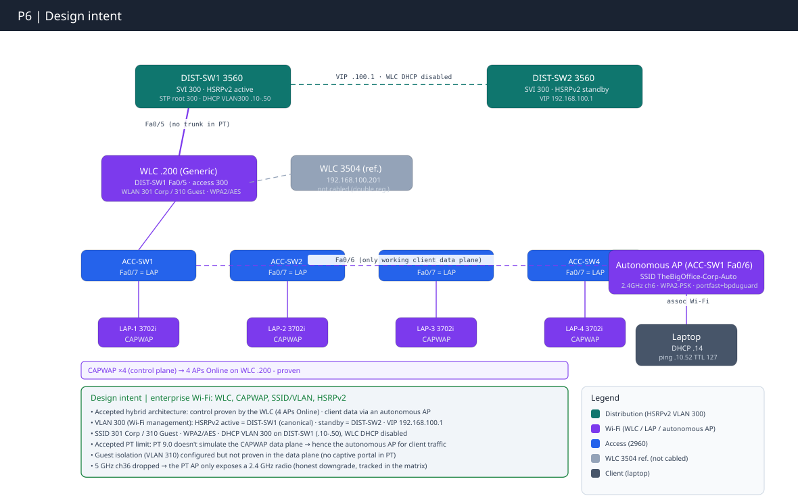

---

## Niveaux & équipements

| Rôle | Équipement | Rôle dans la partie |
|---|---|---|
| Contrôleur Wi-Fi | **Generic WLC** — *nouveau* | Enregistre les 4 LAP en CAPWAP, diffuse Corp/Guest. Mgmt `.200`. Config **100 % GUI**. |
| Contrôleur (réf.) | **WLC 3504** — *nouveau, déconnecté* | Référence prod (`.201`). Pas de config WLAN en PT → **jamais câblé** (double registration). |
| Distribution (hôte) | **DIST-SW1** (3560) | WLC sur `Fa0/5` (300). SVI 300 Active + root. Pool DHCP `VLAN300`. **VLAN 30 inchangé.** |
| Distribution (redondance) | **DIST-SW2** (3560) | SVI 300 Standby. **Inchangé sinon.** |
| Access (APs) | **ACC-SW1 → ACC-SW4** | `Fa0/7` = LAP (300 + hardening). `Fa0/6` (SW1) = AP autonome. `Fa0/5` = **poste voix P5, intouché.** |
| APs lightweight | **4× LAP** (3702i-class) — *nouveaux* | CAPWAP au WLC `.200`. Baux `.10-.13`. |
| AP autonome | **Access Point0** (AP-PT) — *nouveau* | `TheBigOffice-Corp-Auto`, 2.4 GHz ch.6, WPA2-PSK. **Seul data plane client fonctionnel en PT.** |
| Client de test | **Laptop0** (WPC300N, 2.4 GHz) | DHCP `.14`, prouve Wi-Fi → filaire. |

Tout le campus P1/P2, le périmètre P3, le datacenter P4 et la voix P5 sont **inchangés** — P6 n'ajoute que les VLANs 300/301/310, le WLC, les APs et le client.

**Câblage as-built** (subnets → [`IPAM.md`](../IPAM.md)) : WLC `Gi0` → **DIST-SW1 `Fa0/5`** (access 300, *déviation DV1 : plan visait `Fa0/6`*) ; LAP-0→3 → **ACC-SW1→4 `Fa0/7`** (*corrigé I-1 : plan initial `Fa0/5` = collision poste voix*) ; AP autonome `Port 0` → **ACC-SW1 `Fa0/6`** ; Laptop0 (WLAN) → AP autonome (pont). `Fa0/5` de chaque ACC reste le poste 7960 (data 10 + voice 30), jamais écrasé ; `Fa0/10` de DIST-SW1 reste le CME.

---

## Étapes de configuration

```
[1]  Créer les VLANs Wi-Fi (300 partout ; 301/310 sur Distribution seulement)
[2]  Étendre les trunks (liste COMPLÈTE — PT rejette 'add')
[3]  SVIs VLAN 300 + HSRPv2 (standby version 2 obligatoire : groupe 300 > 255)
[4]  STP VLAN 300 (root aligné sur l'Active = DIST-SW1) — NE PAS toucher VLAN 30
[5]  DHCP VLAN 300 (pool unique sur DIST-SW1, WLC DHCP off)
[6]  WLC 3504 — IP mgmt (référence, gardé déconnecté)
[7]  Generic WLC — port access VLAN 300 dédié
[8]  Generic WLC — WLANs Corp + Guest (GUI, Local switching)
[9]  LAP — ports Fa0/7, enregistrement CAPWAP, hardening
[10] AP autonome — data plane (2.4 GHz ch.6, WPA2-PSK)
[11] Validation client (bout en bout)
```

---

### Step 1 — VLANs Wi-Fi

**Intention :** VLAN 300 partout ; 301/310 **uniquement sur la Distribution** (VLANs logiques d'interfaces WLC — aucun port Access physique ne les portera).

```cisco
! DIST-SW1 et DIST-SW2
enable
configure terminal
 vlan 300
  name WIFI-AP-MGMT
 vlan 301
  name WIFI-CORP
 vlan 310
  name WIFI-GUEST
 end
write memory
```

```cisco
! ACC-SW1 → ACC-SW4 (VLAN 300 seulement)
enable
configure terminal
 vlan 300
  name WIFI-AP-MGMT
 end
write memory
```

**Validation :** `show vlan brief` → 300 actif partout, 301/310 sur DIST uniquement.

> 📷 **[P-02](#p-02)/[P-03](#p-03)** DIST · **[P-01](#p-01)** ACC.

---

### Step 2 — Extension des trunks (⚠️ piège 1 : `add` interdit)

**Intention :** réécrire la **liste complète** (`add` rejeté en PT 9.0). En oublier un seul VLAN sur l'inter-Distribution = **HSRP split-brain immédiat**.

```cisco
! Inter-Distribution, DIST-SW1 & DIST-SW2 Gi0/2 (porte aussi 301/310)
configure terminal
 interface gigabitEthernet 0/2
  switchport trunk allowed vlan 10,20,30,99,300,301,310,999
 end
write memory
```

```cisco
! DIST → ACC, Fa0/1-4 (sans 301/310)
configure terminal
 interface range fastEthernet 0/1 - 4
  switchport trunk allowed vlan 10,20,30,99,300,999
 end
write memory
```

```cisco
! ACC → DIST, Gi0/1-2
configure terminal
 interface range gigabitEthernet 0/1 - 2
  switchport trunk allowed vlan 10,20,30,99,300,999
 end
write memory
```

**Validation :** `show interfaces trunk` → `Gi0/2` = `10,20,30,99,300-301,310,999` ; `Fa0/1-4` = `…300,999`.

> **Note PVST+ load-balancing :** sur les ACC, `Fa0/1` forwarde 10/30, `Fa0/2` forwarde 20/99/300 — répartition par VLAN héritée de P2, préservée.
> 📷 **[P-07](#p-07)** DIST-SW1 · **[P-08](#p-08)** DIST-SW2 · **[P-09](#p-09)** ACC.

---

### Step 3 — SVIs VLAN 300 + HSRPv2 (⚠️ piège 2 : `version 2` obligatoire)

**Intention :** groupe 300 > plafond HSRPv1 (255) → `standby version 2` sur **les deux** (v1 et v2 n'interopèrent pas).

```cisco
! DIST-SW1 (Active, priorité 110)
configure terminal
 interface vlan 300
  ip address 192.168.100.2 255.255.255.0
  no shutdown
  standby version 2
  standby 300 ip 192.168.100.1
  standby 300 priority 110
  standby 300 preempt
 end
write memory
```

```cisco
! DIST-SW2 (Standby, priorité 100)
configure terminal
 interface vlan 300
  ip address 192.168.100.3 255.255.255.0
  no shutdown
  standby version 2
  standby 300 ip 192.168.100.1
  standby 300 priority 100
 end
write memory
```

**Validation :** `show standby brief` → DIST-SW1 `Vl300 300 110 P Active … .100.1` ; DIST-SW2 `Vl300 300 100 Standby … .100.1` (voir incident I-3 : passage transitoire par `Listen`).

> 📷 **[P-12](#p-12)** DIST-SW1 Active · **[P-13](#p-13)** DIST-SW2 Standby.

---

### Step 4 — STP VLAN 300 (⚠️ piège 3 : exécuter, pas documenter — NE PAS toucher VLAN 30)

**Intention :** root aligné sur l'Active HSRP (DIST-SW1) pour éviter un détour L2 par l'inter-Distribution.

```cisco
! DIST-SW1
configure terminal
 spanning-tree vlan 300 root primary
 end
write memory
```

```cisco
! DIST-SW2
configure terminal
 spanning-tree vlan 300 root secondary
 end
write memory
```

> ⚠️ **Ne jamais taper `spanning-tree vlan 30 …` en P6.** La décision A1 de P5 ancre le root VLAN 30 sur DIST-SW1. Vérifié : `Vl30 … 110 P Active` **inchangé**.

**Validation :** DIST-SW1 `show spanning-tree vlan 300` → `This bridge is the root`.

> 📷 **[P-15](#p-15)** root VLAN 300 · **[P-12](#p-12)** VLAN 30 non régressé.

---

### Step 5 — DHCP VLAN 300 (⚠️ piège 4 : réservations MAC ignorées en PT)

**Intention :** pool unique sur **DIST-SW1**, DHCP interne du WLC **désactivé** (anti double-serveur).

```cisco
! DIST-SW1
configure terminal
 ip dhcp excluded-address 192.168.100.1 192.168.100.9
 ip dhcp excluded-address 192.168.100.51 192.168.100.254
 ip dhcp pool VLAN300
  network 192.168.100.0 255.255.255.0
  default-router 192.168.100.1
  dns-server 192.168.99.1
 end
write memory
```

> `default-router` = la VIP `.1` (survit à un failover). `lease` non supporté en PT. **Dette D-HA :** le pool ne vit que sur DIST-SW1 → si elle tombe, HSRP déplace la passerelle mais les nouveaux baux s'arrêtent. Prod = split scope miroir sur DIST-SW2. Réservations par MAC non honorées en PT → pool partagé `.10-.50` (APs + client).

**Validation :** `show ip dhcp binding` → baux `.10-.14`.

> 📷 **[P-04](#p-06)** baux `.10-.14`, WLC DHCP off.

---

### Step 6 — WLC 3504 (référence, ⚠️ jamais connecté)

**Intention :** poser l'IP mgmt de la référence prod, sans jamais la câbler.

GUI → Config → INTERFACE → Management : IPv4 `192.168.100.201` / GW `192.168.100.1`. Le WLC 3504 **n'a aucune interface de config WLAN en PT** → référence seule. **Ne jamais le câbler en même temps que le Generic WLC** (double registration des APs).

---

### Step 7 — Port du Generic WLC (⚠️ piège 5 : access, pas trunk)

**Intention :** poser le port access VLAN 300 du WLC actif.

```cisco
! DIST-SW1
configure terminal
 interface fastEthernet 0/5
  switchport mode access
  switchport access vlan 300
  no shutdown
 end
write memory
```

GUI WLC → Management : IPv4 `192.168.100.200` / GW `192.168.100.1`.

**Validation :** `ping 192.168.100.200` depuis DIST-SW1 = 5/5.

> **Déviation DV1 :** port réel = `Fa0/5` (pas `Fa0/6` du plan). Sans impact — `Fa0/10` = CME.
> **Gap prod documenté :** en prod le port WLC est un **trunk** 300/301/310. Le Generic WLC de PT envoie son mgmt **untagged** ; avec native 999 (trou noir), il serait injoignable → port access VLAN 300 = contournement (L8). **Coût :** 301/310 n'atteignent jamais le fil par ce port → d'où l'AP autonome pour le data plane.
> 📷 **[P-16](#p-16)** config · **[P-17](#p-17)** ping.

---

### Step 8 — WLANs (⚠️ piège 6 : Local switching, pas Central)

**Intention :** créer les deux SSID en Local switching (Central casse la diffusion en PT).

GUI → Config → GLOBAL → Wireless LANs → New :

| | Corp | Guest |
|---|---|---|
| SSID | `TheBigOffice-Corp` | `TheBigOffice-Guest` |
| VLAN | 301 | 310 |
| Auth | WPA2-PSK | WPA2-PSK |
| Encryption | AES | AES |
| Switching | **Local** | **Local** |

> **Central switching casse en PT :** mode prod correct, mais en PT il fait injecter le VLAN 301 par le port access du WLC et le SSID cesse de diffuser (L7).

**Validation :** WLC → AP Groups → default-group : les 2 WLANs listés.

> 📷 **[P-18](#p-18)** WLANs + CAPWAP.

---

### Step 9 — LAP : ports, enregistrement CAPWAP, hardening

**Intention :** activer les ports AP (VLAN 300 + PortFast + BPDU Guard) et enregistrer les LAP au WLC.

```cisco
! ACC-SW1 → ACC-SW4, port AP = Fa0/7
configure terminal
 interface fastEthernet 0/7
  no shutdown
  switchport mode access
  switchport access vlan 300
  spanning-tree portfast
  spanning-tree bpduguard enable
 end
write memory
```

> PortFast et BPDU Guard sont **indissociables** : PortFast accélère le boot, BPDU Guard annule le risque rogue-switch introduit.

Sur chaque LAP : Config → GLOBAL → Settings → DHCP enabled ; WLC → Primary Controller `192.168.100.200`. Séquence CAPWAP : DHCP `.10-.13` → Discovery (UDP 5246) → Join → tunnel (UDP 5247) → push SSID/radio → diffusion.

**Validation :** WLC → default-group → **4 LAP `Online`** (MACs `.10-.13`).

> 📷 **[P-18](#p-18)** 4 LAP `Online`.

---

### Step 10 — AP autonome : le seul data plane client fonctionnel (⚠️ piège 8 : CAPWAP data plane KO en PT)

**Intention :** monter l'AP autonome (pont direct) sur `ACC-SW1 Fa0/6` (access 300 + hardening comme Step 9).

GUI → Config → INTERFACE → Port 1 (radio) : SSID `TheBigOffice-Corp-Auto` · **2.4 GHz Channel = 6** · WPA2-PSK/AES.

> ⚠️ **Ne pas confondre le canal avec « Coverage Range = 36,00 »** (incident I-2). Non-recouvrants = 1/6/11.
> **Pourquoi lui et pas les LAP :** l'AP autonome fait un **pont direct** (client → radio → Port 0 → ACC → DIST → fil), aucun contrôleur dans le chemin. Le LAP doit renvoyer par le tunnel CAPWAP au WLC, que PT ne sait pas ré-injecter → **drop 100 %** (L5).
> **⚠️ Régression d'objectif assumée (L14) :** cet AP-PT n'expose qu'un champ *2.4 GHz Channel*. Le « 5 GHz canal 36 » du plan n'est pas atteignable avec ce modèle + la carte WPC300N (2.4 GHz). Le lab démontre « 2.4 GHz canal 6 non-recouvrant » — vrai et honnête, mais downgradé vs l'ambition 5 GHz.

**Validation :** config radio confirmée.

> 📷 **[P-19](#p-19)** AP autonome 2.4 GHz ch.6.

---

### Step 11 — Validation client (bout en bout)

**Intention :** associer Laptop0 à `TheBigOffice-Corp-Auto` et prouver Wi-Fi → filaire.

> **Déviation DV2 :** le DHCP a **fonctionné** pour le laptop (`.14`) — l'IP statique `.250` n'a pas été nécessaire. Le chemin AP autonome est un pont direct (pas de tunnel CAPWAP), donc le DHCP passe. La limitation APIPA (L6) ne s'applique qu'au chemin lightweight.

```cisco
! Depuis le laptop
ping 192.168.100.1      ! VIP HSRP VLAN 300                              -> 4/4
ping 192.168.10.52      ! PC filaire VLAN 10 (routage inter-VLAN, TTL 127 = 1 saut L3) -> 4/4
```

> ⚠️ Pinger **`.52`** (IP réelle DHCP du PC depuis P2), **pas `.10`** (piège 8). Un `Request timed out` sur le premier paquet (ARP/build) est normal.

**Chemin complet prouvé :** Laptop0 (`.14`) → Access Point0 (pont) → ACC-SW1 `Fa0/6` (300) → DIST-SW1 SVI Vl300 → routage inter-VLAN → SVI Vl10 (VIP) → ACC `Fa0/3` → PC (`192.168.10.52`).

> 📷 **[P-20](#p-20)** client → VIP · **[P-21](#p-21)** client → filaire (TTL 127).

---

## Validation de bout en bout (gate final)

| Couche | Commande clé | Attendu | Preuve |
|---|---|---|---|
| VLANs Wi-Fi | `show vlan brief` | 300 partout, 301/310 sur DIST | [P-01](#p-01), [P-02](#p-02), [P-03](#p-03) |
| Trunks | `show interfaces trunk` | listes complètes, 301/310 confinés inter-DIST | [P-07](#p-07), [P-08](#p-08), [P-09](#p-09) |
| HSRPv2 | `show standby brief` | DIST1 Active Vl300 + **Vl30 intact** | [P-12](#p-12), [P-13](#p-13) |
| Root STP 300 | `show spanning-tree vlan 300` | `This bridge is the root` (DIST1) | [P-15](#p-15) |
| DHCP mono-autorité | DIST1 `show ip dhcp binding` | baux `.10-.14`, WLC DHCP off | [P-06](#p-06) |
| WLC joignable | `ping 192.168.100.200` | 5/5 | [P-16](#p-16), [P-17](#p-17) |
| CAPWAP + SSID | WLC AP Groups | **4 LAP `Online`**, 2 WLANs | [P-18](#p-18) |
| AP autonome | config radio | 2.4 GHz ch.6, WPA2-PSK | [P-19](#p-19) |
| **Data plane client** | Laptop `ping .100.1` + `.10.52` | 4/4 ; **TTL 127** | [P-20](#p-20), [P-21](#p-21) |

> Un `Request timed out` sur le **premier** paquet d'un flux frais (ARP/build) n'est pas une faute. Le succès du ping laptop **prouve par élimination** le chemin AP autonome : via un LAP, PT dropperait le data plane.

---

## Dépannage (incidents de session)

| # | Symptôme | Cause | Diagnostic | Correction |
|---|---|---|---|---|
| **I-1** | Poste voix P5 injoignable après ajout AP (risque) | Plan initial mettait le LAP sur `ACC Fa0/5` = **écrasement du poste 7960** | `show vlan brief` (`Fa0/5` = 10+30) | **LAP déplacé sur `Fa0/7`** ; collision évitée en amont |
| **I-2** | Objectif « 5 GHz canal 36 » faux ; canal **recouvrant** | Le « 36 » lu était le champ **Coverage Range**, pas le canal. Vrai réglage = `2.4 GHz Channel = 5` (recouvre 1/6/11) | Capture radio AP autonome | Canal passé à **6** (non-recouvrant) |
| **I-3** | DIST-SW2 `Vl300` bloqué en `Listen/unknown` | État HSRP transitoire post-`no shutdown` SVI (attente hellos VIP) | `show standby brief` | Stabilisé de lui-même en `Standby` — délai de convergence, pas un défaut |

**Captures d'incident** (état *avant* correction — jamais en validation) : I-2 « avant » (AP canal 5 recouvrant) `Captures_P6_6.png` · I-3 « avant » (DIST-SW2 `Listen`) `Captures_P6_20.png`.

### Pièges PT 9.0 (référence rapide)

| # | Symptôme | Fix |
|---|---|---|
| 1 | `^` après `allowed vlan add` | Liste complète sans `add` |
| 2 | `HSRP version 2 is required` | `standby version 2` sur les deux |
| 3 | WLC injoignable (native 999 avale l'untagged) | `switchport mode access` + `access vlan 300` |
| 4 | SSID Corp non diffusé | Corp en Local switching |
| 5 | Client Wi-Fi en APIPA | AP autonome (DHCP OK) ou statique `.250` |
| 6 | LAP → 100 % timeout au ping client | AP autonome (data plane direct) |
| 7 | `Invalid IP address for DNS Server` | Placeholder `192.168.100.1` (champ vide accepté ce build) |
| 8 | `ping .10` échoue | Pinger l'IP réelle DHCP (`.52`) |
| 9 | STP root = un switch Access | Taper `root primary/secondary` sur les bons switches |

**Commandes de référence :**

```cisco
show vlan brief                    show interfaces trunk           show spanning-tree vlan 300
show standby brief                 show ip dhcp binding            show interfaces fa0/x switchport
show ip route                      ping 192.168.100.200            ping 192.168.10.52
```

---

## 5. Registre d'erreurs & dette technique (état final) — SOURCE UNIQUE

> Incidents résolus, déviations actées, dettes portées. Palette sanctionnée `🟢/🟠`. Numérotation `I-`/`DV`/`L`/`D-` stable inter-parties. Le catalogue exhaustif des limitations PT est en section suivante.

| Réf. | Point | Domaine | Statut |
|---|---|---|---|
| I-1 | Collision port `Fa0/5` (AP vs poste voix P5) | 🟠 | ✅ Corrigé — LAP sur `Fa0/7` |
| I-2 | Canal 2.4 GHz recouvrant (5) pris pour « ch.36 » | 🟠 | ✅ Corrigé — canal 6 non-recouvrant |
| I-3 | DIST-SW2 `Vl300` en `Listen` | 🟢 | ✅ Résolu — stabilisé `Standby` |
| DV1 | WLC sur `Fa0/5` (plan visait `Fa0/6`) | 🟢 | ✅ Acté — port réel documenté |
| DV2 | DHCP a servi le laptop (`.14`) — statique `.250` inutile | 🟢 | ✅ Acté — gain, chemin autonome |
| DV3 | AP configuré 100 % GUI (pas de CLI PT) | 🟢 | 📋 Limitation outil |
| DV4 | « SSID broadcast » prouve le control plane, pas le data client via WLC | 🟠 | 📋 Documenté — client passe par l'AP autonome |
| DV5 | Champ DNS du WLC laissé vide (GUI l'a accepté) | 🟢 | ✅ Acté — piège 7 non déclenché |
| L14 | Objectif 5 GHz ch.36 non atteignable (AP-PT 2.4 GHz + NIC WPC300N) | 🟠 | 📋 Requalifié 2.4 GHz ch.6 — prod : AP-AC + NIC 5 GHz |
| D-HA | Pool DHCP VLAN 300 mono-DIST-SW1 (SPOF baux) | 🟠 | 📋 Prod : split scope DIST-SW2 |
| D-GUEST | Isolation Guest non testée en data plane | 🟠 | 📋 Limitation PT (captive portal ❌) |

### Limitations Packet Tracer 9.0 & contournements (catalogue L1–L14)

| # | Limitation | Contournement |
|---|---|---|
| L1 | WLC 3504 sans config SSID | Generic WLC |
| L2 | WPA3 non supporté | Documenté en théorie |
| L3 | 6 GHz non supporté | Documenté en théorie |
| L4 | Band steering non simulable | Documenté en théorie |
| L5 | Data plane CAPWAP (LAP) | AP autonome |
| L6 | DHCP Wi-Fi via WLC (APIPA) | AP autonome (DHCP OK) / statique `.250` en secours |
| L7 | Central switching → Corp non diffusé | Local switching |
| L8 | Native 999 vs WLC untagged | Port access VLAN 300 |
| L9 | HSRPv1 limité au groupe 255 | `standby version 2` |
| L10 | `lease` non supporté (pool) | Lease PT par défaut |
| L11 | DNS requis (GUI WLC DHCP) | Placeholder `192.168.100.1` |
| L12 | `allowed vlan add` rejeté | Liste complète sans `add` |
| L13 | Réservations DHCP par MAC ignorées | Pool partagé unique `.10-.50` |
| L14 | Radio 5 GHz ch.36 non tenue (AP-PT 2.4 GHz) | 2.4 GHz ch.6 non-recouvrant ; prod = AP-AC |

---

## Annexe — Captures de preuve

> Une capture **canonique** par affirmation ; doublons et états « avant correction » écartés (ces derniers vivent en §Dépannage). Fichiers `Captures_P6_##.png`.

**<a id="p-01"></a> [P-01] · Câblage AP + non-régression voix (ACC-SW1)** — `show vlan brief` : VLAN 300 = `Fa0/6` (AP autonome) + `Fa0/7` (LAP-0) ; `Fa0/5` = poste voix (prouve I-1)
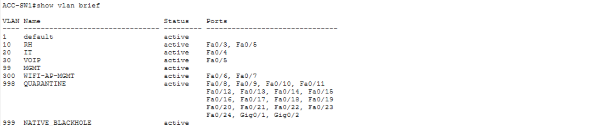

**<a id="p-01b"></a> [P-01b] · Symétrie ACC-SW2 (idem SW3/SW4)** — `show vlan brief` : VLAN 300 = `Fa0/7` (LAP-1) ; `Fa0/5` en 10/30
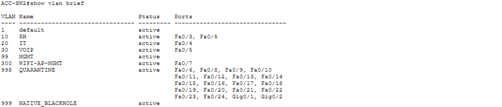

**<a id="p-02"></a> [P-02] · VLANs Wi-Fi (DIST-SW1)** — `show vlan brief` : 300/301/310 actifs, `Fa0/5` = WLC, `Fa0/10` = CME
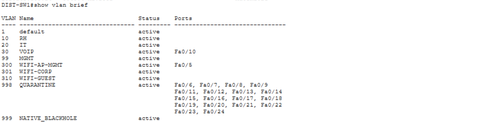

**<a id="p-03"></a> [P-03] · VLANs Wi-Fi (DIST-SW2)** — `show vlan brief` : 300/301/310 actifs, aucun port access
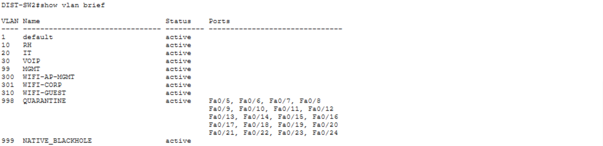

**<a id="p-06"></a> [P-04] · DHCP mono-autorité VLAN 300** — DIST-SW1 `show ip dhcp binding` : `.10-.13` (LAP) + `.14` (laptop), tous `Automatic`
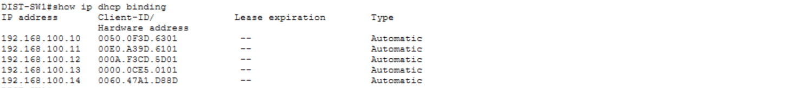

**<a id="p-07"></a> [P-07] · Trunk DIST-SW1 (liste complète)** — `show interfaces trunk` : `Gi0/2` = `10,20,30,99,300-301,310,999` ; `Fa0/1-4` = `…300,999`
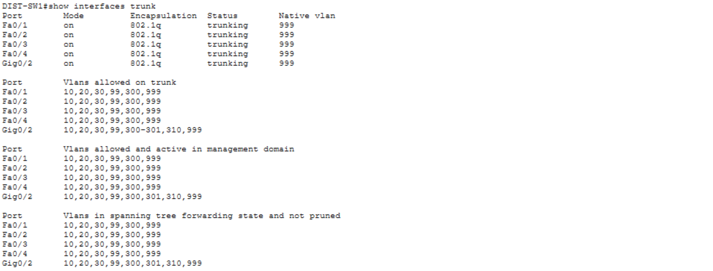

**<a id="p-08"></a> [P-08] · Trunk DIST-SW2** — `show interfaces trunk` : symétrie inter-Distribution
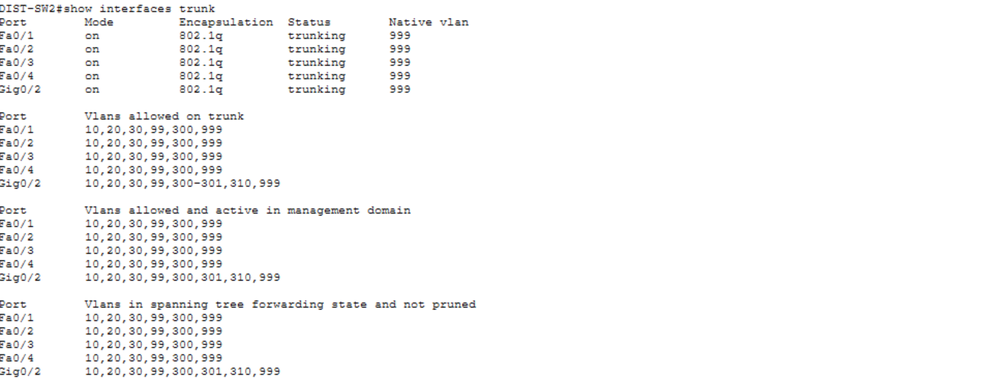

**<a id="p-09"></a> [P-09] · Trunk ACC-SW1 + PVST+ load-balancing** — `show interfaces trunk` : `Fa0/1` forwarde 10/30, `Fa0/2` forwarde 20/99/300. ACC-SW3/SW4 : `Captures_P6_22.png` / `Captures_P6_21.png`
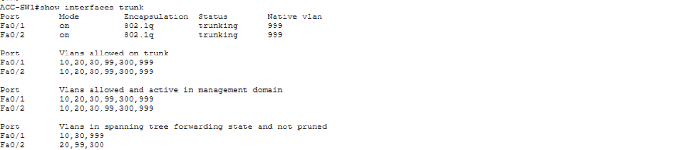

**<a id="p-12"></a> [P-12] · HSRPv2 Active + VLAN 30 non régressé** — DIST-SW1 `show standby brief` : `Vl300 … 110 P Active` **et** `Vl30 … 110 P Active` (décision A1 tenue)
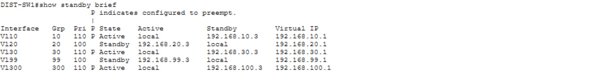

**<a id="p-13"></a> [P-13] · HSRPv2 Standby stabilisé** — DIST-SW2 `show standby brief` : `Vl300 … 100 Standby … .100.1` (résout I-3)
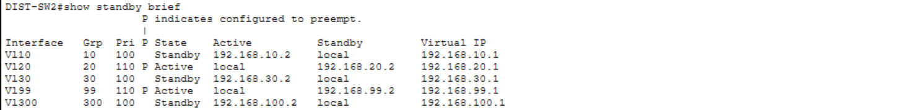

**<a id="p-15"></a> [P-15] · Root STP VLAN 300 (exécuté)** — DIST-SW1 `show spanning-tree vlan 300` : `This bridge is the root`, protocole `rstp`
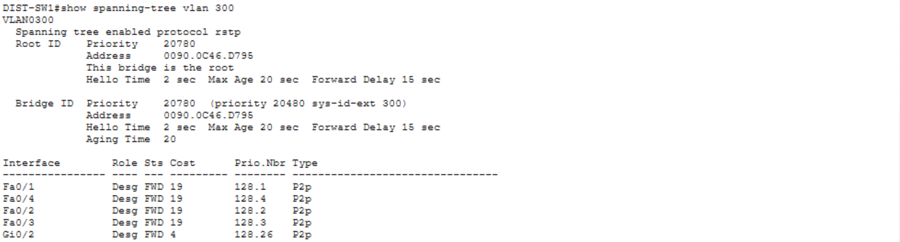

**<a id="p-16"></a> [P-16] · WLC management** — GUI : IPv4 `192.168.100.200`, GW `.1`, DNS laissé vide (accepté — DV5)
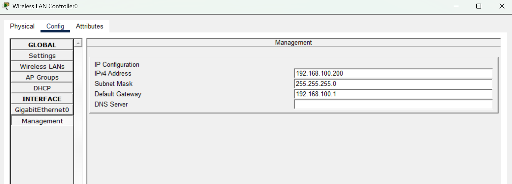

**<a id="p-17"></a> [P-17] · WLC joignable** — DIST-SW1 `ping 192.168.100.200` = 5/5
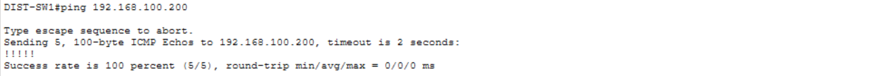

**<a id="p-18"></a> [P-18] · CAPWAP + SSID** — WLC default-group : **4 LAP `Online`** (`.10-.13`), WLANs `TheBigOffice-Corp` (301) + `-Guest` (310)
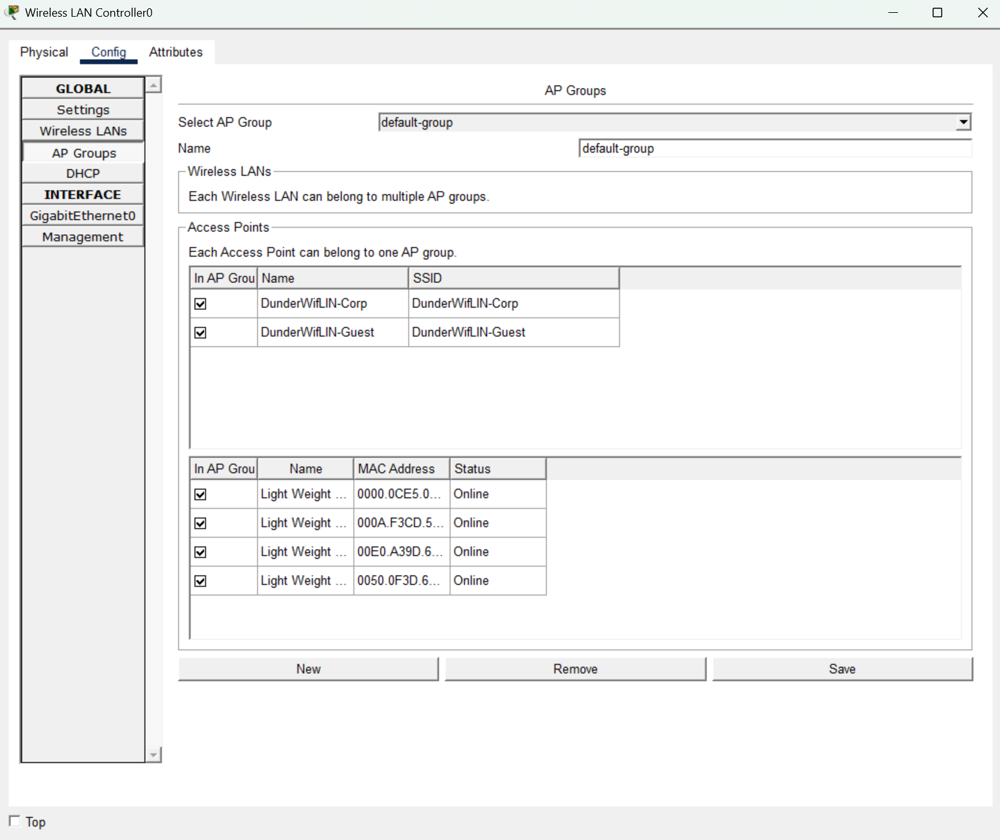

**<a id="p-18b"></a> [P-18b] · Diffusion SSID côté client** — Linksys `Connect` : `TheBigOffice-Corp` visible, WPA2-PSK. ⚠️ Prouve que les **LAP diffusent** (control plane), **pas** l'association au data plane (voir [P-19]/[P-20])
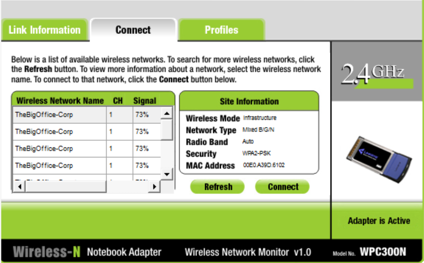

**<a id="p-19"></a> [P-19] · AP autonome (radio, corrigé I-2)** — Config Port 1 : SSID `TheBigOffice-Corp-Auto`, **2.4 GHz canal 6**, WPA2-PSK/AES
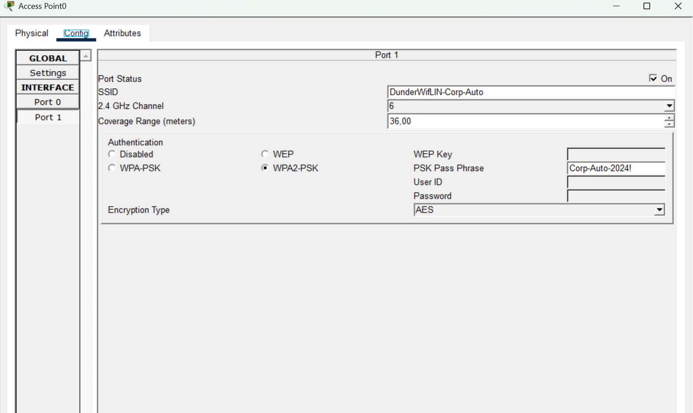

**<a id="p-20"></a> [P-20] · Client → VIP VLAN 300** — Laptop `ping 192.168.100.1` = 4/4 (**prouve par élimination** le chemin AP autonome)
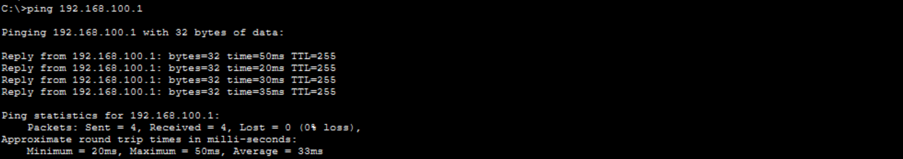

**<a id="p-21"></a> [P-21] · Client → filaire inter-VLAN** — Laptop `ping 192.168.10.52` = 4/4, **TTL 127** (un saut L3, routage 300 → 10)
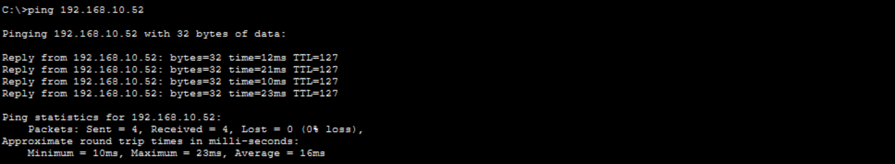

**<a id="p-14"></a> [P-14] · Topologie as-built** — WLC ↔ DIST-SW1 `Fa0/5`, LAP ↔ ACC `Fa0/7`, AP autonome ↔ ACC-SW1 `Fa0/6`, Laptop ↔ AP autonome
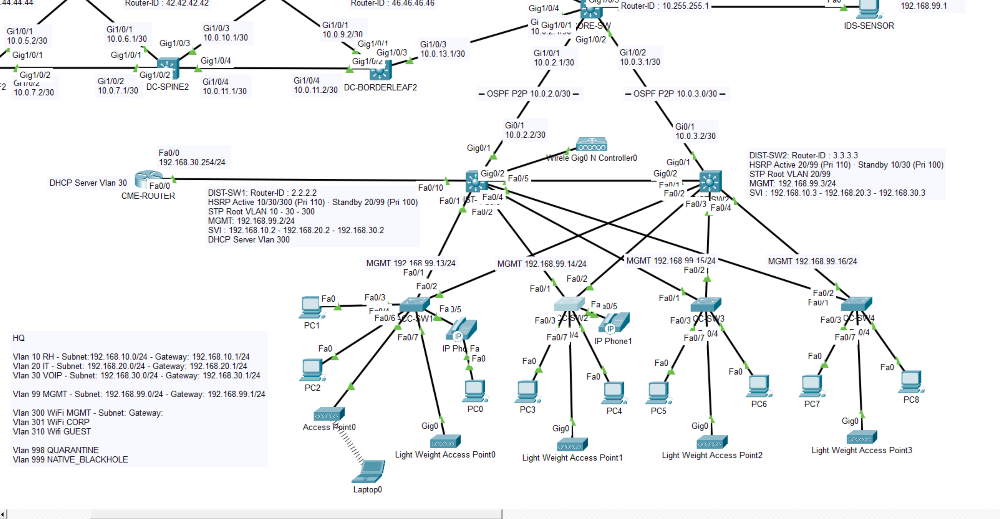

> **Corroborant recommandé (non bloquant) :** `Link Information` du laptop sur canal 6. Non fourni — [P-20]/[P-21] établissent déjà le chemin par élimination.

---

⬅️ [Partie 5 — Téléphonie IP](../P5/README.md) · ⬆️ [Vue d'ensemble du projet](../README.md) · *(fin de la série Packet Tracer — suite sur GNS3 : IPv6 avancé, monitoring, PKI/RADIUS)*
