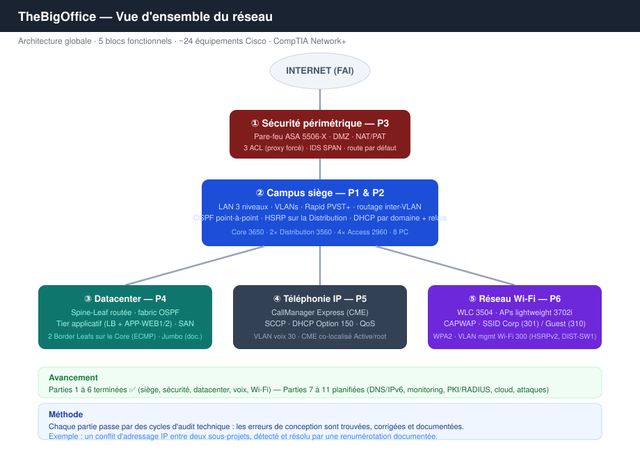

# TheBigOffice - Packet Tracer 
## Portfolio réseau junior / CompTIA Network+

Ce dépôt présente **TheBigOffice**, un laboratoire réseau simulant une infrastructure d'entreprise sous Cisco Packet Tracer en 6 parties.

- [🏗️ Partie 1 : Fondations LAN 3 niveaux](./P1/) 
- [🧭 Partie 2 : Routage & redondance](./P2/) 
- [🛡️ Partie 3 : DMZ & Pare-feu](./P3/) 
- [🖥️ Partie 4 : Datacenter](./P4/)
- [📞  Partie 5 : VoIP](./P5/) 
- [📶 Partie 6 : WiFi](./P6/)

Ce laboratoire a été construit de manière autodidacte pour mettre en pratique les compétences couvertes par la **CompTIA Network+**, tout en explorant des notions plus avancées. 

Ce projet n'a pas vocation à représenter une architecture de production clé en main. Il s'agit avant tout d'un **portfolio technique junior,** les erreurs de conception font partie du processus d'apprentissage et sont traitées comme des opportunités d'analyse et d'amélioration.

La documentation du laboratoire est structurée autour de ressources globales :

- 🏷️ [IPAM](../IPAM.md)
- 📘 [TECHNICAL_OVERVIEW](./TECHNICAL_OVERVIEW.md) 

Chaque partie du laboratoire dispose ensuite de son propre espace documentaire contenant : 

- 📄 **README**
- 🪜 **WORKFLOW** 
- 🧪 **Fichier Cisco Packet Tracer (.pkt)**

Cette organisation permet de suivre l'ensemble du cycle de vie d'une implémentation réseau :

- 🏛️ Conception de l'architecture réseau 
- 🧩 Segmentation et organisation logique du réseau
- ⚙️ Configuration des équipements 
- ✅ Validation du fonctionnement
- 🔎 Diagnostic et résolution d'incidents
- 📈 Analyse des limites de conception et amélioration de l'architecture

## Périmètre du projet

| Partie               | Sujet                   | Résultat principal                                                                                        |
| -------------------- | ----------------------- | --------------------------------------------------------------------------------------------------------- |
| [P1](./P1/README.md) | Fondations LAN du siège | VLANs, trunks 802.1Q, VLAN de management, **Rapid PVST+ avec roots sur la Distribution**                  |
| [P2](./P2/README.md) | Routage & redondance    | **HSRP sur la Distribution**, OSPF point-à-point, DHCP centralisé + relais unique, Core en transit L3 pur |
| [P3](./P3/README.md) | DMZ & pare-feu          | ASA trois zones, NAT/PAT, 3 ACL, IDS/SPAN, `default-information originate` + verrou résumé/Null0          |
| [P4](./P4/README.md) | Datacenter              | Spine-Leaf routée, **2 Border Leafs sur le Core (ECMP N-S)**, tiers app + stockage, VIP de load balancer  |
| [P5](./P5/README.md) | VoIP                    | CME co-localisé avec l'Active/root du VLAN 30, DHCP Option 150, SCCP, TFTP, frontière QoS                 |
| [P6](./P6/README.md) | Wi-Fi                   | WLC + APs lightweight (CAPWAP), SSID WPA2 Corp/Guest, **HSRPv2 VLAN 300 sur DIST-SW1**                    |

## Ce que ce portfolio démontre

| Domaine de compétence | Preuve dans le projet |
|---|---|
| Conception réseau | Lab connecté type entreprise : siège, périmètre, datacenter, voix, Wi-Fi |
| Commutation | VLANs, trunks 802.1Q, **Rapid PVST+ sur tous les switches**, natif 999 trou noir, PortFast + BPDU Guard |
| Routage | Inter-VLAN, OSPF aire 0 sur `/30` routés, origination du défaut, résumé + verrou Null0 |
| Haute disponibilité | Passerelles **HSRP sur la Distribution** (réparties Active/Standby), alignées sur les roots STP |
| Sécurité | ASA trois zones, DMZ, 3 ACL aux philosophies opposées, NAT/PAT, proxy forcé, port-security, SPAN/IDS |
| Services | Autorité DHCP par domaine + relais, NAT, VoIP/CME (Option 150, SCCP), TFTP, Wi-Fi à base de WLC |
| Dépannage | Collision de Router-ID, chaîne de boot VoIP, confinement de boucle à l'ASA, limites du simulateur WLC |
| Documentation | Chaque partie : notes de conception, CLI annotée, workflow, matrice de validation honnête, registre de dette |
## Topologie du projet




- → Vue consolidée (architecture, décisions transverses, écarts de production) : [TECHNICAL_OVERVIEW.md](./TECHNICAL_OVERVIEW.md)
- →  Schémas de topologie dans chaque partie.

## Principes transverses

Quelques règles de conception qui traversent tout le dépôt :

- **Prouver par un état ou un trafic réel, jamais par un écran de config.** Un flux bloqué se prouve par le compteur d'ACL, pas par un timeout.

- **Une seule autorité DHCP par domaine de broadcast** — pas un serveur unique pour tout (ce serait un SPOF), mais une autorité par segment (HQ-Router, CME, DIST-SW1). La preuve : **aucun** autre serveur ne répond.

- **Un résumé de routes est dangereux dès qu'il inclut de l'espace non alloué.** L'ASA décrit l'intérieur par des résumés compacts, sécurisés par des **routes Null0 (AD 254)** ; le *longest-prefix match* fait toujours gagner une vraie route OSPF.

- **La chaîne de boot VoIP casse silencieusement** (DHCP → TFTP → SCCP → enregistrement) : le symptôme apparaît souvent trois étapes après la cause.

- **Nommer les limites du simulateur, ne jamais les cacher.** Le data plane CAPWAP n'étant pas simulé, contrôle et données sont prouvés séparément — limite documentée, pas défaut caché.

## Carte du dépôt


```
TheBigOffice - Packet Tracer Portfolio /
│
│
├── README.md               ← Vitrine : projet, compétences, périmètre, carte du dépôt
├── TECHNICAL_OVERVIEW.md   ← Architecture, prod, décisions, apprentissages  
├── IPAM.md                 ← Plan d'adressage, VLAN/zones, Router-IDs, autorité DHCP) 
│
│
├── P1/ … P6/               ← Une partie par dossier
│   ├── README.md           ← Cadre : objectif, périmètre, compétences, matrice de validation   
│   ├── WORKFLOW.md         ← reproduit : CLI annotée, validation par étape, 
│   └── TBO-Part_X.pkt/     ← fichiers .pkt du lab
│ 
├── assets/
│   ├── topologies/           ← topology_pX.svg + topology_global.svg
│   ├── network-overview/     ← Captures topologie dans Packet Tracer : N0_pX.png
│   └── captures/  P1/ … P6/  ← captures de preuve : Capture_PX_NN.png 
└──

P1 LAN 3 niveaux · P2 HSRP/OSPF/DHCP · P3 ASA/DMZ/NAT · P4 Spine-Leaf · P5 VoIP/CME · P6 Wi-Fi/WLC

```

Pour chaque partie : le **README** cadre (objectif, périmètre, compétences, matrice de validation) ; le **WORKFLOW** reproduit (CLI annotée, validation par étape, registre de dette, annexe de captures).

## Usage de l'IA dans ce projet

L'assistance par IA a été utilisée comme **outil d'apprentissage et de revue**, pas comme une autorité ni comme un substitut à la compréhension du réseau. 

Je m'en suis surtout servi pour :

- Clarifier la syntaxe Cisco et les concepts réseau pendant la construction du lab ;
- Challenger des choix de conception et faire remonter des incohérences avant qu'elles ne deviennent des bugs ;
- Relire des extraits de configuration à la recherche d'erreurs courantes (`no shutdown` oublié, mauvais type de réseau OSPF, documentation contradictoire) ;
- Structurer mes prompts et itérer pour obtenir des réponses précises et vérifiables plutôt que des explications vagues.

L'essentiel était la **supervision**. Les sorties de l'IA n'étaient pas tenues pour automatiquement correctes : plusieurs points ont demandé une revue et une correction humaines. le risque de boucle lié au résumé de routes à l'ASA, l'ordre de la chaîne de boot VoIP, ou les limites du WLC dans Packet Tracer. 

Ce projet démontre donc aussi une compétence qui compte dans le travail technique réel : **piloter un assistant IA par un prompting clair et itératif, tout en gardant la responsabilité d'ingénierie, la vérification et le jugement final du côté humain.**

## Plan initial

Le plan initial incluait 11 parties avec d'avantages de sujets pour couvrir la majorité des objectifs de la CompTIA Network+ comme :  IPv6, monitoring, PKI/RADIUS, notions de cloud, simulation d'attaques. 

Le projet s'arrête à la Partie 6 parce que **Packet Tracer devient le facteur limitant**. 

**L'observation :** À mesure que le réseau grandit, le ratio s'inverse : chaque nouvelle partie demande plus de temps à contourner les limites du simulateur (data plane CAPWAP, VXLAN, iSCSI, SNAT, NAT par port…) qu'à produire de la configuration représentative. 

Packet Tracer est un excellent outil d'**apprentissage** pour comprendre la logique réseau, mais il reste un **simulateur** : il modélise le comportement des protocoles sans exécuter un vrai IOS. Au-delà d'un certain niveau de complexité, le travail se réduit à documenter ce que l'outil *ne peut pas* faire.

**La décision:** Continuer les sujets restants sur **GNS3 / Cisco CML** ou un autre logiciel de virtualisation, qui émulent de vraies images IOS et permettent de tester réellement ce que Packet Tracer ne peut que représenter. 

L'objectif : passer du simulateur à l'émulateur, un standard plus exigeant quand le sujet l'impose, et au passage, monter en compétence sur des outils professionnels.

## 🏁 Conclusion


L'objectif initial de l'apprentissage est largement dépassé. 

Au-delà de la théorie CompTIA Network+, ce projet a imposé une pratique de terrain : concevoir une architecture cohérente, la mettre en œuvre et, surtout, la déboguer. 

Le débogage a produit l'apprentissage le plus réel : boucles de routage, conflits d'adressage, asymétries TFTP et collisions de Router-ID ne s'apprennent pas dans un cours ; ils se comprennent en les résolvant. 

Le pari de l'apprentissage par la pratique a payé, et il dépasse la simple préparation à la certification obtenue à ce jour avec succès. 
